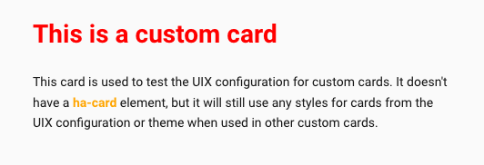

# Developers - Custom cards

Generally UIX should work with all custom cards.

!!! hint "Where UIX will work out of the box"
    - Custom card loaded by Home Assistant and not child of another custom card. In this case UIX patches via `<hui-card>`.
    - Custom card includes `<ha-card>` and stores card config in either `config` or `_config` property. In this case UIX patches via `<ha-card>`.

!!! warning "Where UIX will NOT work without further code or styling from parent card"
    - Custom card loaded by another custom card that does NOT use modern `<hui-card>` method AND
      - Custom card does NOT use `<ha-card>` OR
      - Custom card uses `<ha-card>` but does NOT use `config` or `_config` property to store config. In this case UIX cannot find the `uix:` config for styling and does not apply.

If your custom card's use falls into the case where it is not working with other custom cards, you can apply UIX directly using `uix.applyToElement()`.

```js
customElements.whenDefined("uix-node").then((uix) => {
  uix.applyToElement(
    el, // The root element
    "type", // Determines which theme variables should apply (uix-<type>, uix-<type>-yaml)
    config, // The UIX configuration. See below
    variables, // Any variables passed on to jinja templates, preferably { config: <element configuration> }. Default: {}
    shadow // whether the styles should be based in the #shadow-root of el. Default: true
    cls // An extra class to apply to the element. Default: undefined
  )
}
```

The UIX configuration is an object with the following optional properties:

- `style` - UIX style definition (string or object)
- `theme` - Home Assistant theme name applied only to this styled element subtree (`uix.theme` takes precedence over inherited/current theme)
- `class` - string or array of classes to apply to the element
- `debug` - boolean to enable debugging mode for the element (default `false`)

When `theme` is set, UIX applies Home Assistant frontend-style `applyThemesOnElement()` logic directly on the target element before processing UIX theme styles/macros.

## Example

Custom card javascript:

```js
const LitElement = customElements.get("ha-panel-lovelace")
  ? Object.getPrototypeOf(customElements.get("ha-panel-lovelace"))
  : Object.getPrototypeOf(customElements.get("hc-lovelace"));
const html = LitElement.prototype.html;

class MyAwesomeCard extends LitElement {
  setConfig(config) {
    this._config = config;
  }

  firstUpdated() {
    customElements
      .whenDefined("uix-node")
      .then((uix) =>
        uix.applyToElement(
          this,
          "card",
          this._config.uix,
          { config: this._config },
          true,
          "type-custom-my-awesome-card"
        )
      );
  }

 render() {
    return html`
      <div class="content">
        <h1> This is a custom card</h1>
        <div class="my-class">
          This card is used to test the UIX configuration for custom cards.
          It doesn't have a <b>ha-card</b> element,
          but it will still use any styles for cards from the UIX configuration or theme
          when used in other custom cards.
        </div>
      </div>
    `;
  }
}

customElements.define("my-awesome-card", MyAwesomeCard);
```

With the following dashboard configuration:

```yaml
type: custom:my-awesome-card
uix:
  style: |
    .content {
      padding: 0 20px 20px 20px;
    }
    h1 {
      color: red;
    }
```

And this theme:

```yaml
UIX Test:
  uix-theme: UIX Test
  uix-card: |
    b {
      color: orange;
    }
  dark:
```


