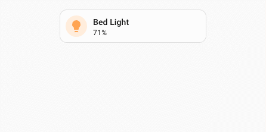

# UIX actions

UIX has several custom actions which can be used on Home Assistant Frontend dashboards. These are invoked using `action: fire-dom-event` with a `uix:` object to set the action and any parameters set in the `data:` object. UIX actions can be used on any card that supports the `fire-dom-event` action which includes all standard Home Assistant cards.

!!! info
    UIX action `data:` object parameters are as required by the Home Assistant event called and are not chosen by UIX. This gives rise to multiple `action` config items which may be confusing. However, each has their place. If you have any issues make sure to follow the documented config for each UIX action.

```yaml
# ... card config
  tap_action:
    action: fire-dom-event
    uix:
      action: <action>
      data:
        <action-data>
```

!!! info
    `action: clear_cache` and `action: more_info` are also valid config and translate to `action: clear-cache` and `action: more-info` respectively.

## `clear-cache` - clearing Home Assistant Frontend cache

Clears the Home Assistant Frontend Application cache and reloads the Browser - localStorage remains untouched. This can be very convenient especially for devices where the option is hidden in a debugging menu and will also clear more than just the Frontend Application cache (e.g. localStorage which clears out many stored items like Browser Mod Browser ID).

| config | setting | default | description |
| --- | --- | --- | --- |
| `action: clear-cache` | - | - | Clears the Home Assistant Application cache and reloads the Browser. |
| `data:` | - | - | not used |

Example button to clear cache and reload.

```yaml
show_name: true
show_icon: true
type: button
name: Clear Frontend Cache
tap_action:
  action: fire-dom-event
  uix:
    action: clear-cache
```

## `event` - dispatch a browser event

Dispatches a [`CustomEvent`](https://developer.mozilla.org/en-US/docs/Web/API/CustomEvent) on `window`. This is useful for connecting a button action to a UIX Broker interaction in the `browser` realm without adding a `fire-dom-event` listener that unwraps another event.

| config | setting | default | description |
| --- | --- | --- | --- |
| `action: event` | - | - | Dispatches a browser `CustomEvent` on `window`. |
| `name` | **REQUIRED** | - | Event name. |
| `data` | - | `{}` | Event `detail`. |

For a normal dashboard action, the event is dispatched on `window`. For a UIX Broker `button` directive, UIX automatically dispatches from the button's placement reference — its `after` target, `before` target, or directive anchor — with `bubbles: true` and `composed: true`. The receiving Broker interaction can therefore use an event-path anchor such as `target`, `<`, or `<$`; it does not need to re-search from an absolute `select_tree` path.

For example, this Broker button dispatches `toggle-yaml-mode` from its placement reference:

```yaml
- type: button
  before: $ ha-automation-sidebar $$ ha-automation-sidebar-card $ ha-dialog-header slot:nth-of-type(3) ha-dropdown
  icon: mdi:code-braces
  tap_action:
    action: fire-dom-event
    uix:
      action: event
      name: toggle-yaml-mode
      data:
        source: sidebar-button
```

## `more-info` - show Home Assistant more-info for an entity with starting view

Shows the Home Assistant more-info dialog with the option to set the starting view of the more-info dialog.

| config | setting | default | description |
| --- | --- | --- | --- |
| `action: more-info` | - | - | Shows the Home Assistant more-info dialog with entity and view options set with `data:` |
| `data:` | - | - | More-info entity and view options. |
| | `entity` | - | Entity Id of the entity for which to show more-info. |
| | `view` | `info` | Initial view of the more-info dialog. Can be set to `info`, `history`, `settings`, `related`, `add_to` , `details` |

Example showing more-info with history view.

```yaml
type: tile
entity: light.bed_light
tap_action:
  action: fire-dom-event
  uix:
    action: more-info
    data:
      entity: light.bed_light
      view: history
```

## `toast` - show Home Assistant toast notification

Shows a Home Assistant toast notification.

| config | setting | default | description |
| --- | --- | --- | --- |
| `action: toast` | - | - | Shows the Home Assistant toast notification with options set with `data:` |
| `data:` | - | - | Toast options. |
| | `id` | - | `id` of the toast message. Provide the same `id` to replace any existing toast message with the same `id` |
| | `message` | **REQUIRED** | String or object. Provide string for a message without translation. Provide an object with `translationKey` and optional `args` to use a translated message from the Home Assistant translation collection. |
| | `duration` | `4000` | Duration in ms for which to show the toast. Any duration less than 4000 will be set to 4000 (4 seconds). Use `-1` to have the toast to show indefinitely - will be replaced if another toast is shown. |
| | `dismissable` | `false` | Shows a close icon to allow the toast message to be immediately dismissed by the user. |
| | `bottomOffset` | `0` | A positive offset to add to the vertical position above the bottom of the Browser window. toast messages show at a position `--ha-space-4` (Default: 16px) above the bottom of safe area of the Browser window. |
| | `action` | - | If provided shows a button which will execute the configured `action.tap_action` when clicked. |
| | `action.primary` | - | If `true` renders the `action` button in primary style which is filled appearance to make it stand out against the toast background. Button variant is always brand. |
| | `action.text` | **REQUIRED** | String or object. Provide string for a message without translation. Provide an object with `translationKey` and optional `args` to use a translated message from the Home Assistant translation collection. |
| | `action.tap_action` | **REQUIRED** | Home Assistant action config |
| | `secondary_action` | - | If provided shows a button to the left of the `action` button which will execute the configured `secondary_action.tap_action` when clicked. |
| | `secondary_action.primary` | - | If `true` renders the `secondary_action` button in primary style which is filled appearance to make it stand out against the toast background. Button variant is always brand. |
| | `secondary_action.text` | **REQUIRED** | String or object. Provide string for a message without translation. Provide an object with `translationKey` and optional `args` to use a translated message from the Home Assistant translation collection. |
| | `secondary_action.tap_action` | **REQUIRED** | Home Assistant action config |

Example toast with action with translated action text.

```yaml
type: tile
entity: light.bed_light
tap_action:
  action: fire-dom-event
  uix:
    action: toast
    data:
      message: "Bed Light"
      duration: 10000
      dismissable: true
      bottomOffset: 550
      action:
        primary: true
        text:
          translationKey: ui.dialogs.more_info_control.light.toggle
        tap_action:
          action: perform-action
          perform_action: light.toggle
          target:
            entity_id: light.bed_light
      secondary_action:
        text: Custom
        tap_action:
          action: perform-action
          perform_action: light.toggle
          target:
            entity_id: light.ceiling_lights
```



## `javascript` - run javascript code in Browser session

Runs JavaScript code in the browser session with `hass` provided and an optional `variables` object.

!!! warning
    This action executes arbitrary JavaScript in the current Home Assistant frontend session. Only use trusted code/config and be aware it can access data available to the browser session.

| config | setting | default | description |
| --- | --- | --- | --- |
| `action: javascript` | - | - | Runs javascript code with options set with `data:` |
| `data:` | - | - | Javascript options. |
| | `code` | **REQUIRED** | Javascript code to run. |
| | `variables` | `{}` | Optional variables object. Each named variable is available in javascript as `variables.<name>`. Named variables can be of any type. |

Example javascript action with variable and using hass object to turn off a light.

```yaml
type: tile
entity: light.bed_light
tap_action:
  action: fire-dom-event
  uix:
    action: javascript
    data:
      variables:
        entity_id: light.bed_light
      code: |
        console.log("UIX: Custom javascript action executed!");
        hass.callService("light", "turn_off", {}, { entity_id: variables.entity_id });
```

## `locked_action` - require a code or confirmation before an action

Runs a normal Home Assistant action only after the current user passes the configured lock. It is useful for actions such as restarts, opening gates, or changing a critical setting without needing to wrap the entire card in a Forge lock.

```yaml
type: button
name: Restart Home Assistant
tap_action:
  action: fire-dom-event
  uix:
    action: locked_action
    data:
      locks:
        - code: 1234
          admins: true
      locked_action:
        action: perform-action
        perform_action: homeassistant.restart
```

!!! warning
    `locked_action` is a frontend interaction guard, not an authorization boundary. Anyone who can edit the dashboard or inspect its loaded configuration can see the code and the protected action. Use Home Assistant permissions and server-side controls for access control.

### Configuration reference

| Key | Type | Default | Description |
| --- | --- | --- | --- |
| `locked_action` | object | — | **Required.** The Home Assistant action to run after the lock is passed. |
| `locks` | list | `[]` | Ordered list of lock entries. See [Lock matching](#lock-matching) and [Lock entry keys](#lock-entry-keys). |
| `permissive` | boolean | `false` | When `true`, users who do not match a lock entry may run the action. |
| `entity` | string | — | Entity ID supplied to the nested action, for action types that use the card entity. |
| `code_dialog` | object | — | Labels for the code/passphrase dialog. See [Code dialog](#code-dialog). |
| `id` | string or number | — | Stable identifier for retry and lockout tracking. Strongly recommended when using `retry_delay` or `max_retries`; use a distinct ID for each protected action. |

`locked_action` accepts any ordinary Home Assistant action object, including `perform-action`, `toggle`, `more-info`, `navigate`, and `fire-dom-event`.

### Lock matching

`locks` is an ordered list. The first matching active entry determines the challenge. If no active entry matches, the first matching `active: false` entry allows the action without a challenge.

| Configuration | Who it matches |
| --- | --- |
| `users` list present | Users whose name is in the list. With `admins: true`, all admins also match. |
| No `users` list | All non-admin users except users in `except`. |
| No `users` list with `admins: true` | All users except users in `except`. |

`admins` is additive: without it, admins are excluded from an entry unless listed in `users`. When no lock entry matches, `permissive: true` permits the action; with the default `permissive: false`, admins bypass the action guard and non-admins cannot run the action.

### Lock entry keys

| Key | Type | Default | Description |
| --- | --- | --- | --- |
| `active` | boolean | `true` | Set to `false` to explicitly allow matching users without a challenge. |
| `code` | string or number | — | Code to enter. An all-numeric code shows the Home Assistant number pad; other values use a password field. |
| `pin` | string or number | — | Alias for `code`. |
| `confirmation` | string, boolean, or object | — | A confirmation after any code. `true` uses Home Assistant's default text; a string supplies custom text; an object may provide `title` and `text`. |
| `users` | list of strings | — | Usernames this entry applies to. |
| `admins` | boolean | `false` | Extends the entry to admins. On an entry without `users`, this makes it apply to all users. |
| `except` | list of strings | — | Usernames exempt from an entry without `users`. |
| `retry_delay` | number or string | — | Delay after a wrong code before another attempt. Numbers are milliseconds; strings accept units such as `"10s"`. |
| `max_retries` | number | — | Wrong-code attempts allowed before the extended lockout. |
| `max_retries_delay` | number or string | `30000` | Lockout duration after `max_retries`. Numbers are milliseconds; strings accept units such as `"30s"` or `"5m"`. |

### Code dialog

Use `code_dialog` to customise the code or passphrase prompt.

| Key | Type | Default | Description |
| --- | --- | --- | --- |
| `title` | string | Home Assistant default | Dialog title. |
| `submit_text` | string | Home Assistant default | Confirm button label. |
| `cancel_text` | string | Home Assistant default | Cancel button label. |

### Retry tracking

Retry state is retained in the current browser session. Set `id` whenever a retry delay or lockout matters, especially if dashboard configuration can be regenerated by a template or another custom card: an explicit ID survives control recreation. The same ID shares a retry count, so different protected actions should use different IDs.

```yaml
tap_action:
  action: fire-dom-event
  uix:
    action: locked_action
    data:
      id: restart-home-assistant
      code_dialog:
        title: Enter administrator PIN
        submit_text: Restart
      locks:
        - code: 1234
          admins: true
          max_retries: 3
          max_retries_delay: 5m
      locked_action:
        action: perform-action
        perform_action: homeassistant.restart
```
