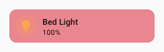
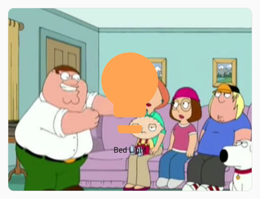
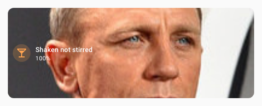
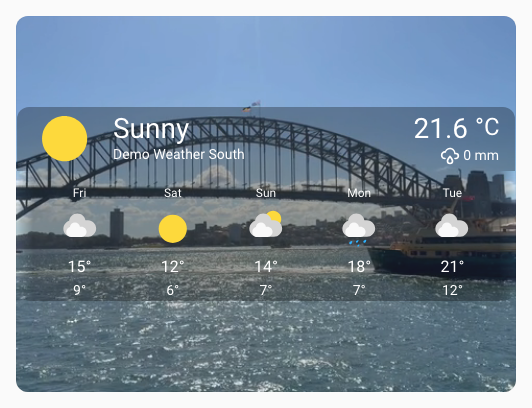
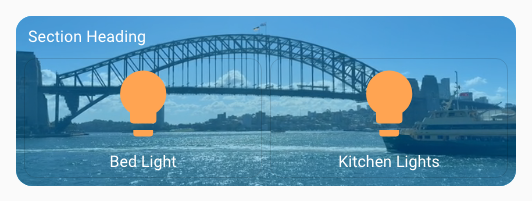

# :material-image-outline: Background spark

The `background` spark places a styled background layer behind a target element inside a [UIX Forge](../index.md) forged element. The background container sits at `z-index: -1` so it is rendered below all sibling content without disrupting layout.

Supported background sources (first non-empty value wins):

| Source | Key | Description |
| ------ | --- | ----------- |
| Camera | `camera_entity` | Live `ha-camera-stream` stream. Supports zoom, pan, and position. Shows a spinner while loading. |
| Entity picture | `image_entity` | Reads `entity_picture` from any entity and signs the URL. Shows a spinner while loading. |
| Video | `video_url` | `<video>` element (autoplay, muted, loop). Supports `media-source://` URIs. |
| Image URL | `image_url` | Static image applied as `background-image`. Shows a spinner while loading. Supports `media-source://` URIs. |
| Solid colour or CSS shorthand | `background` | Any CSS `background` value, or a mapping of sub-properties. |

!!! tip
    When the background spark targets a `hui-section` (i.e. `mold: section`), UIX automatically zeros out the `div.section-container` padding so there is no double-padding effect if a standard HA section background is also active. You can use a standard Home Assistant section background to add a color behind the spark background and set the spark `opacity` to less than 1 to let the color show through.

---

## Basic usage

```yaml
type: custom:uix-forge
forge:
  mold: card
  sparks:
    - type: background
      for: hui-tile-card $ ha-card
      background:
        color: "rgba(220, 53, 69, 0.6)"
element:
  type: tile
  entity: light.bed_light
```



The `for` value accepts the same [DOM navigation syntax](../../concepts/dom.md) as UIX styles, including `$` for shadow-root crossings. Use `hui-tile-card $ ha-card` to target the card surface inside a tile card — the [ha-card adapter](#card-ha-card-adapter) then automatically applies matching `border-radius` and `margin` so the background follows the card's rounded corners.

---

## Configuration

| Key | Type | Default | Description |
| --- | ---- | ------- | ----------- |
| `type` | string | — | Must be `background`. |
| `for` | string | When the UIX Forge element is using [Blank card config](../forge.md#blank-card-config), the default is `uix-forge-blank-card $ div.content`. Otherwise, the default of `element` refers to the root of the forged element. | UIX selector for the target element. |
| `camera_entity` | string | — | Entity ID of a `camera.*` entity to stream live as the background. |
| `camera_zoom` | string or number | — | CSS zoom/scale value applied to the stream (e.g. `1.5`, `"150%"`). |
| `camera_pan_x` | string or number | — | CSS translate X applied to the stream (e.g. `"10%"`, `"-20px"`). |
| `camera_pan_y` | string or number | — | CSS translate Y applied to the stream. |
| `camera_position` | string | `center` | Alignment of the stream inside the container. One of `center`, `top`, `bottom`, `left`, `right`, `top-left`, `top-right`, `bottom-left`, `bottom-right`. |
| `camera_stream_cache_ms` | number | `20000` | How long (ms) to keep a `ha-camera-stream` element in the cache after it is removed from the background container. While cached, the element remains **connected** to an off-screen holder so its internal stream (MPEG/HLS/WebRTC session and auth tokens) stays alive. On the next rebuild with the same entity at the same dimensions the cached element is moved directly into the new background container without re-negotiating the stream. |
| `image_entity` | string | — | Entity ID whose `entity_picture` attribute provides the background image. |
| `video_url` | string | — | URL of a video to autoplay muted as the background. Accepts `media-source://` URIs (see [Media source URIs](#media-source-uris)). |
| `image_url` | string | — | URL of a static background image. Accepts `media-source://` URIs (see [Media source URIs](#media-source-uris)). |
| `background` | string or object | — | CSS `background` shorthand string, or a mapping of sub-properties (see below). When used alongside `image_entity` or `image_url`, object sub-properties (e.g. `position`, `size`) are applied as overrides on top of the image — this lets you control how the image is positioned or sized. A plain string value replaces the entire `background` shorthand (including `background-image`). |
| `opacity` | number | — | CSS `opacity` applied to the background container (0–1). Use this to dim the background without affecting the foreground element. |
| `dissolve_target` | string or list | — | Make the `for` element transparent so the background shows through (see below). |
| `class` | string | — | Extra CSS class(es) added to the background container `<div>`. |

!!! tip
    Use the [`uix_forge_path()`](../../concepts/dom.md#uix_forge_path0-forge-helper) browser console helper to find the exact `for` selector path to any element inside the forged element.

### `background` sub-property mapping

When `background` is a mapping, each key is translated to its CSS property counterpart:

| Key | CSS property |
| --- | ------------ |
| `color` | `background-color` |
| `image` | `background-image` |
| `position` | `background-position` |
| `size` | `background-size` |
| `repeat` | `background-repeat` |
| `attachment` | `background-attachment` |
| `origin` | `background-origin` |
| `clip` | `background-clip` |

### `dissolve_target`

`dissolve_target` modifies the `for` element so that the background behind it becomes visible. Two forms are supported:

- **String `opacity_<0-100>`** — sets `opacity` on the `for` element (e.g. `opacity_50` for 50% opacity).
- **List of CSS property objects** — each object's key/value pair is applied as an inline style on the `for` element. Property names may use underscores in place of hyphens.

`dissolve_target` is made available for use cases where an element background is set on the target. In many cases it is not required and is not used in any example shown here.

```yaml
# Remove the card's own background using a CSS property list
dissolve_target:
  - background: "none"

# Make the card 50% transparent
dissolve_target: opacity_50
```

### Media source URIs

`video_url` and `image_url` accept Home Assistant [media source](https://www.home-assistant.io/integrations/media_source/) URIs in the form `media-source://media_source/local/<filename>`. UIX resolves these automatically before setting the background using the HA WebSocket `media_source/resolve_media` command — no manual URL signing is needed.

Files placed in the `/media` directory of your HA instance are accessible as `media-source://media_source/local/<filename>`.

```yaml
# Image from the local media library
- type: background
  for: hui-tile-card $ ha-card
  image_url: "media-source://media_source/local/kitchen.jpg"

# Video from the local media library
- type: background
  for: hui-tile-card $ ha-card
  video_url: "media-source://media_source/local/ambient.mp4"
```

---

## Card (ha-card) adapter

When `for` resolves to an `ha-card` element, UIX automatically activates the **ha-card adapter**, which:

- Sets `border-radius: var(--ha-card-border-radius, var(--ha-border-radius-lg))` on the background container so it follows the card's rounded corners.
- Sets `margin: calc(-1 * var(--ha-card-border-width, 1px))` to compensate for the card border and ensure the background fills the full card area.
- Inserts the container into `ha-card`'s shadow root so it participates in the correct stacking context.

No extra configuration is needed — the adapter activates automatically when the resolved `for` element is `ha-card`.

---

## Section (hui-section) adapter

When `for` resolves to a `hui-section` element — which happens automatically when `mold: section` is used with no explicit `for` — UIX activates the **hui-section adapter**, which:

- Sets `border-radius: var(--ha-section-border-radius, var(--ha-border-radius-xl))` on the background container so it follows the section's rounded corners.
- Sets `padding: var(--ha-space-2)` on the `hui-grid-section` child element (light DOM of `hui-section`) to inset the cards from the section edges, matching the same padding given if you use Frontend color background settings.  The previous padding is restored when the spark disconnects.
- Applies `--ha-card-background: none` to the section element itself so that all cards within the section inherit a transparent card background, allowing the section background to show through.
- Sets `padding: 0` on the nearest `div.section-container` ancestor (Home Assistant's own section wrapper element) to neutralise any padding it carries, preventing a double-padding effect when a Home Assistant section background is also active.  The previous padding is restored when the spark disconnects.

```yaml
type: custom:uix-forge
forge:
  mold: section
  sparks:
    - type: background
      background:
        color: "rgba(0, 100, 200, 0.2)"
cards: []
```

No `for` is needed — when `mold: section` the default `for: element` resolves to the `hui-section` element and the adapter activates automatically.

---

## Examples

### Live camera background

!!! tip
    As `for` target is `ha-card`, the `ha-card` adapter will be used applying card radius and margin to styling to the live camera background.

```yaml
type: custom:uix-forge
forge:
  mold: card
  grid_options:
    columns: 12
    rows: 6
  sparks:
    - type: background
      for: hui-button-card $ ha-card
      camera_entity: camera.demo_camera
      camera_zoom: 1.3
      camera_position: bottom-left
element:
  type: button
  entity: light.bed_light
```



### Entity picture as background

!!! tip
    As `for` target is `ha-card`, the `ha-card` adapter will be used applying card radius and margin to styling to the entity picture background.

```yaml
type: custom:uix-forge
forge:
  mold: card
  grid_options:
    rows: 3
  sparks:
    - type: background
      for: hui-tile-card $ ha-card
      image_entity: person.james_bond_007
element:
  type: tile
  entity: light.bed_light
  name: Shaken not stirred
  icon: mdi:glass-cocktail
```



### Video background

!!! tip
    As `for` target is `ha-card`, the `ha-card` adapter will be used applying card radius and margin to styling to the video background.

```yaml
type: custom:uix-forge
forge:
  mold: card
  grid_options:
    columns: 12
    rows: 6
  sparks:
    - type: background
      for: hui-weather-forecast-card $ ha-card
      video_url: /local/media/sydney_ferry.mp4
      opacity: 0.9
element:
  show_current: true
  show_forecast: true
  type: weather-forecast
  entity: weather.demo_weather_south
  forecast_type: daily
  uix:
    style: |
      :host {
        --primary-text-color: white;
        --secondary-text-color: smokewhite;
        --content-border-radius: var(--ha-card-border-radius, 12px);
      }
      .content {
        background: rgba(0,0,0,0.3);
        border-top-left-radius: var(--content-border-radius);
        border-top-right-radius: var(--content-border-radius);
      }
      .forecast {
        background: rgba(0,0,0,0.3);
        border-bottom-left-radius: var(--content-border-radius);
        border-bottom-right-radius: var(--content-border-radius);
      }
```



### Static image background

!!! tip
    As `for` target is `ha-card`, the `ha-card` adapter will be used applying card radius and margin to styling to the static image background.

```yaml
type: custom:uix-forge
forge:
  mold: card
  sparks:
    - type: background
      for: hui-alarm-panel-card $ ha-card
      image_url: https://picsum.photos/id/582/600/600
      opacity: 0.5
element:
  type: alarm-panel
  states:
    - arm_home
    - arm_away
  entity: alarm_control_panel.security
  uix:
    style: |
      ha-control-button {
        --control-button-background-color: white;
        --control-button-background-opacity: 0.3;
      }
```


#### Controlling image position and size

The `background` key can be combined with `image_url` (or `image_entity`) to override how the image is rendered. Use an object with sub-properties to adjust positioning, sizing, and other CSS background properties while keeping the image intact:

```yaml
type: custom:uix-forge
forge:
  mold: card
  sparks:
    - type: background
      for: hui-tile-card $ ha-card
      image_url: https://picsum.photos/id/582/600/600
      background:
        position: "top center"
        size: contain
        repeat: "no-repeat"
element:
  type: tile
  entity: light.bed_light
```

!!! note
    When `background` is used alongside `image_url` or `image_entity`, only **object sub-properties** (e.g. `position`, `size`) are applied as overrides on top of the image. Using a plain string value (e.g. `background: red`) will replace the entire `background` shorthand, which also removes `background-image`. Use a plain string only when you want to completely replace the image with a different background, such as a solid color or gradient.

### Background using full CSS background

!!! tip
    As `for` target is `ha-card`, the `ha-card` adapter will be used applying card radius and margin to styling to the full CSS background.

```yaml
type: custom:uix-forge
forge:
  mold: card
  sparks:
    - type: background
      for: hui-tile-card $ ha-card
      background: linear-gradient(90deg,rgba(131, 58, 180, 1) 0%, rgba(253, 29, 29, 1) 50%, rgba(252, 176, 69, 1) 100%)
element:
  type: tile
  entity: light.bed_light
  uix:
    style: |
      :host {
        --primary-text-color: white;
      }
```


### Image from media library

!!! tip
    As `for` target is `ha-card`, the `ha-card` adapter will be used applying card radius and margin to styling to the full CSS background. Here also the `background:` has `position: top` set to move the background image to top.

```yaml
type: custom:uix-forge
forge:
  mold: card
  grid_options:
    columns: 12
    rows: 3
  sparks:
    - type: background
      for: hui-button-card $ ha-card
      image_url: "media-source://media_source/local/kitchen.jpg"
      background:
        position: top
element:
  type: button
  entity: light.kitchen_lights
```


### State-driven background color using a template

All `forge` config values support Jinja2 templates. Use the `background` key together with a template to drive the color from entity state:

```yaml
type: custom:uix-forge
forge:
  mold: card
  sparks:
    - type: background
      for: hui-tile-card $ ha-card
      background:
        color: >-
          
            rgba(255, 200, 0, 0.4)
          
            rgba(100, 100, 100, 0.2)
          
element:
  type: tile
  entity: light.bed_light
```


### Section background

Here the standard section background is used to give a stronger light-blue background to the video. The section (hui-section) adapter automatically zeros out the `section-container` padding so there is no double-padding effect.

!!! tip
    The YAML is for a complete section of a sections dashboard. You can edit a section's YAML directly by editing the section, the using `Edit in YAML` from the three dots menu.

```yaml
type: custom:uix-forge
forge:
  mold: section
  sparks:
    - type: background
      video_url: /local/media/sydney_ferry.mp4
      opacity: 0.7
element:
  type: grid
  cards:
    - type: heading
      heading: Section Heading
    - type: button
      entity: light.bed_light
    - type: button
      entity: light.kitchen_lights
  uix:
    style: |
      :host {
        --primary-text-color: white;
      }
column_span: 1
background:
  color: light-blue
  opacity: 100
```



### Styling the background container with UIX Styling

Use the `class` key to add a CSS class to the background container, then target the background div within the background container with a UIX style path:

```yaml
type: custom:uix-forge
forge:
  mold: card
  grid_options:
    rows: 4
  sparks:
    - type: background
      for: hui-tile-card $ ha-card
      image_url: /local/media/kitchen.jpg
      class: my-background
  uix:
    style:
      .: |
        :host {
          --primary-text-color: white;
        }
      "hui-tile-card $ ha-card $": |
        .my-background div {
          filter: blur(2px) brightness(0.8);
        }
element:
  type: tile
  entity: light.bed_light
```


### Adding background to a dashboard header

A sections dashboard header in its entirety (title and badges) cannot be forged with UIX Forge. However the markdown `card` used the in header can be replaced with a forged card. Using cards of your choice along with `custom:badge-horizontal-container-card` in a vertical stack, you can simulate a full header including badges and use the background spark to inject a background behind the 'full' header.

You can replace the heading markdown card by simply using `Show code editor` after clicking the `+ Add title` button in the header area of the dashboard in edit mode.

Border radius needs to be applied to the background as there is no adapter doing this automatically. Likewise, padding needs to be applied to the included vertical stack root.

```yaml
type: custom:uix-forge
forge:
  mold: card
  sparks:
    - type: background
      for: "hui-vertical-stack-card $ #root"
      camera_entity: camera.demo_camera
      opacity: 0.5
      class: heading-background
element:
  type: vertical-stack
  cards:
    - type: markdown
      text_only: true
      content: |-
        # Hello {{ user }}
        Welcome to my awesome dashboard. ✨
    - type: custom:badge-horizontal-container-card
      badges:
        - type: entity
          show_name: false
          show_state: true
          show_icon: true
          entity: light.bed_light
      badges_align: center
  uix:
    style: |
      #root {
        padding: 20px !important;
      }
      .heading-background {
        border-radius: var(--ha-card-border-radius, var(--ha-border-radius-lg));
      }
```

??? example "As full raw dashboard config"
    Place the forged header card under `card:` within `header:`
    ```yaml
    views:
      - type: sections
        max_columns: 4
        title: Test Background
        path: test-background
        header:
          card:
            type: custom:uix-forge
            forge:
              mold: card
              sparks:
                - type: background
                  for: "hui-vertical-stack-card $ #root"
                  camera_entity: camera.demo_camera
                  opacity: 0.5
                  class: heading-background
            element:
              type: vertical-stack
              cards:
                - type: markdown
                  text_only: true
                  content: |-
                    # Hello {{ user }}
                    Welcome to my awesome dashboard. ✨
                - type: custom:badge-horizontal-container-card
                  badges:
                    - type: entity
                      show_name: false
                      show_state: true
                      show_icon: true
                      entity: light.bed_light
                  badges_align: center
              uix:
                style: |
                  #root {
                    padding: 20px !important;
                  }
                  .heading-background {
                    border-radius: var(--ha-card-border-radius, var(--ha-border-radius-lg));
                  }
    ```


