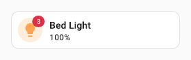
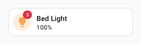
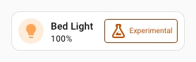
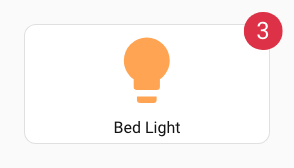

# :material-badge-account-horizontal-outline: Badge-Spark

Der `badge`-Spark fügt ein `uix-badge` als DOM-Geschwisterelement unmittelbar vor oder nach einem Element innerhalb eines Forge-Elements ein. Er verwendet die von Home Assistant angepasste Web-Awesome-Badge-Basis und deren Styles; die Farben folgen daher automatisch dem aktiven Home-Assistant-Theme.

Ist das Ziel ein `ha-button` oder `ha-tile-icon`, zeigt UIX das Badge mit kompaktem Styling automatisch auf diesem Element. Nur diese beiden Ziele besitzen eine automatische Platzierung.

`uix-badge` gehört zum UIX-Namespace. UIX importiert oder registriert die globale Web-Awesome-Komponente `wa-badge` nicht.

## Grundlegende Verwendung

Füge `forge.sparks` einen Eintrag vom Typ `badge` mit `after` oder `before` hinzu, um das Referenzelement zu bestimmen.

```yaml
type: custom:uix-forge
forge:
  mold: card
  sparks:
    - type: badge
      after: hui-tile-card $ ha-tile-icon
      content: 3
      variant: danger
      pill: true
element:
  type: tile
  entity: light.bed_light
```



## Konfiguration

| Schlüssel | Typ | Erforderlich | Standard | Beschreibung |
| --- | --- | --- | --- | --- |
| `type` | Zeichenfolge | ✅ | — | Muss `badge` sein. |
| `after` | Zeichenfolge | eines von `after` / `before` ✅ | Bei [Blank-Card-Konfiguration](../forge.md#blank-card-config) `uix-forge-blank-card $ div.content`, sonst `""`. | UIX-Selektor für das Referenzelement. Normalerweise wird das Badge danach eingefügt. Bei `ha-button` oder `ha-tile-icon` erscheint es stattdessen auf diesem Element. Ist bei jedem anderen Elementtyp `placement` gesetzt, wird das Badge auf dessen Parent positioniert. |
| `before` | Zeichenfolge | eines von `after` / `before` ✅ | — | UIX-Selektor für das Referenzelement. Normalerweise wird das Badge davor eingefügt. Bei `ha-button` oder `ha-tile-icon` erscheint es stattdessen auf diesem Element. Ist bei jedem anderen Elementtyp `placement` gesetzt, wird das Badge auf dessen Parent positioniert. |
| `content` | Zeichenfolge oder Zahl | | `""` | Im Badge angezeigter Text. |
| `variant` | Zeichenfolge | | `brand` | `brand`, `neutral`, `success`, `warning` oder `danger`. |
| `appearance` | Zeichenfolge | | `accent` | `accent`, `filled`, `outlined` oder `filled-outlined`. |
| `pill` | Boolean | | `false` | Verwendet die vollständig abgerundete Pillenform. |
| `attention` | Zeichenfolge | | `none` | `none`, `pulse` oder `bounce`. Bei `pulse` verwenden `accent` und `filled` ihre Füllfarbe, `outlined` und `filled-outlined` ihre Rahmenfarbe. Die Pulsfarbe kann direkt mit `--uix-badge-attention-color` gesetzt werden. |
| `placement` | Zeichenfolge | | — | Wählt bei `ha-button` und `ha-tile-icon` die Badge-Position auf dem Element. Bei jedem anderen Ziel positioniert es das Badge auf dessen Parent statt es als Geschwisterelement einzufügen. Alle Platzierungen nutzen standardmäßig die kompakte Schriftgröße `var(--ha-font-size-xs)` und `0.25em 0.5em` Innenabstand. Möglich sind `top`, `top-start`, `top-end`, `bottom`, `bottom-start`, `bottom-end`, `left`, `left-start`, `left-end`, `right`, `right-start` und `right-end`. |
| `start_icon` / `end_icon` | Zeichenfolge | | — | MDI-Icon vor oder nach dem Badge-Inhalt. |
| `style` | Objekt | | — | Flaches Mapping aus CSS-Eigenschaftsnamen und Zeichenfolgen- oder Zahlenwerten; wird inline auf diesem `uix-badge` gesetzt. |

!!! note
    - Der Spark verwendet das erste durch `after` oder `before` gefundene Element.
    - Das eingefügte Badge ist ein Geschwisterelement des Ziels, kein Kindelement. Ausgenommen sind automatisch auf `ha-button` oder `ha-tile-icon` platzierte Badges.
    - `content` wird als Text eingefügt, nicht als HTML.
    - In einer Tile-Card muss `ha-tile-icon` als Ziel dienen, um das Badge in dessen Ecke zu platzieren. `ha-tile-info` darf dafür nicht verwendet werden, da es die verbleibende Breite der Zeile belegt.

## Automatische Platzierung

UIX platziert Badges automatisch auf genau zwei Home-Assistant-Elementen:

| Ziel | Platzierung | Umsetzung |
| --- | --- | --- |
| `ha-button` | Ecke oben rechts | Das Badge wird innerhalb des Buttons hinzugefügt und folgt dem Web-Awesome-Button-Badge-Muster. Sein Durchmesser richtet sich an der gerenderten oberen und rechten Buttonkante aus. Ein von UIX erzeugter Button-Spark wird ebenfalls erkannt. |
| `ha-tile-icon` | Ecke oben rechts | Das Badge wird im dokumentierten Standard-Slot des Tile-Icons platziert; UIX verwendet dabei die Tile-Badge-Eckenversätze und die kompakte Tile-Badge-Größe von Home Assistant. |

Bei diesen Zielen bestimmen `after` und `before`, welches Element das Badge erhält; sie steuern nicht das Einfügen eines Geschwisterelements. Ohne `placement` behalten alle anderen Zieltypen ihr normales Geschwisterverhalten.

Die eingebaute Home-Assistant-Button-Card (`hui-button-card`) enthält kein `ha-button`, sondern Slots für Icon und Beschriftung. Ohne `placement` verhält sie sich daher wie ein normales Geschwisterelement. Mit `placement` wird das Badge auf ihrem Parent positioniert.

UIX positioniert Badges nicht automatisch auf beliebigen Buttons, Cards oder Custom Elements. Diese besitzen unterschiedliche Slots und Layoutregeln; eine Positionierung auf ihrem Parent erfolgt daher nur bei explizit gesetztem `placement`.

### Platzierung auf anderen Elementen

Bei jedem anderen Ziel positioniert `placement` das Badge an der Kante des Parents dieses Ziels. UIX belässt das Badge außerhalb des Ziels und misst oder verändert das ausgewählte Ziel **nicht**.

Dies ist hilfreich, wenn ein Ziel seinen Parent ausfüllt, beispielsweise eine eingebaute Button-Card in ihrem Card-Container. Enthält der Parent mehrere sichtbare Elemente, bezieht sich die Platzierung auf den gesamten Parent, nicht auf ein einzelnes Kindelement. Mit `--uix-badge-offset-x` und `--uix-badge-offset-y` lässt sie sich abschließend anpassen.

Alle Platzierungsarten nutzen standardmäßig die kompakte Home-Assistant-Schriftgröße `--ha-font-size-xs` und `0.25em 0.5em` Innenabstand, damit die Badge-Größe einheitlich bleibt.

Versätze akzeptieren CSS-Prozentwerte und Längen. Setze bei `right`, `top-end` oder `bottom-end` `--uix-badge-offset-x: -50%`, um die standardmäßige Überlappung um die halbe Breite aufzuheben und jedes Badge unabhängig von seiner Inhaltsbreite an seiner logischen Endkante auszurichten. Bei Bedarf kann dies mit einer Länge kombiniert werden, beispielsweise `calc(-50% - 20px)`. Für `left`, `top-start` oder `bottom-start` wird entsprechend `50%` verwendet, um die logische Startkante auszurichten.

Für `placement` gelten dieselben Werte wie für `wa-tooltip`: `top`, `top-start`, `top-end`, `bottom`, `bottom-start`, `bottom-end`, `left`, `left-start`, `left-end`, `right`, `right-start` und `right-end`. `ha-button` und `ha-tile-icon` verwenden standardmäßig `top-end`. Bei allen anderen Elementen positioniert ein vorhandenes `placement` das Badge auf dem Parent; ohne Angabe bleibt es ein normales Geschwisterelement.

## CSS-Variablen

Setze diese Variablen auf `uix-badge` oder einem Vorfahren. Für ein einzelnes Forge- oder Broker-Badge eignet sich dessen `style`-Mapping. Sie gelten für Forge- und Broker-Badges.

| Variable | Standard | Beschreibung |
| --- | --- | --- |
| `--uix-badge-font-size` | `max(var(--wa-font-size-3xs, var(--ha-font-size-xs)), 0.75em)`; bei aktiver Platzierung `var(--ha-font-size-xs)` | Schriftgröße des Badge-Texts. Der normale Standard ist der kleinste Schrift-Token von Web Awesome oder 75 % der geerbten Schriftgröße, je nachdem, welcher Wert größer ist. |
| `--uix-badge-font-weight` | `var(--wa-font-weight-semibold)` | Schriftstärke für Badge-Text und -Icon. |
| `--uix-badge-padding` | `0.375em 0.625em`; bei aktiver Platzierung `0.25em 0.5em` | Innenabstand des Badges. |
| `--uix-badge-min-width` | bei aktiver Platzierung `calc(1.5em + 2px)` | Mindestbreite des Badges. Sie berücksichtigt den Standardrahmen von je 1 px auf beiden Seiten, damit ein platziertes einzeichigenes Badge wie `!` nicht zu schmal wirkt. |
| `--uix-badge-max-width` | `none` | Maximale gerenderte Badge-Breite. |
| `--uix-badge-overflow` | `visible` | Umgang mit Inhalt außerhalb der Badge-Breite. Mit `hidden` oder `clip` zusammen mit `--uix-badge-max-width` begrenzen. |
| `--uix-badge-color` | Web-Awesome-Füllfarbe der Darstellung | Badge-Hintergrundfarbe. |
| `--uix-badge-content-color` | Web-Awesome-Farbe der Darstellung | Farbe von Badge-Text und -Icon. |
| `--uix-badge-border` | Web-Awesome-Rahmen | Vollständiger CSS-Wert für `border`, beispielsweise `1px solid rgb(255 255 255 / 50%)`. Er enthält Breite, Stil und Farbe. |
| `--uix-badge-border-color` | Web-Awesome-Rahmenfarbe | Rahmenfarbe des Badges. Fällt auf `--uix-badge-color` zurück, falls gesetzt. |
| `--uix-badge-box-shadow` | `none` | Auf das Badge angewendeter CSS-`box-shadow`. |
| `--uix-badge-attention-color` | Web-Awesome-Füll- oder Rahmenfarbe | Farbe des Pulsrings bei `attention: pulse`. Standardmäßig nutzen `accent` und `filled` die Füllfarbe; `outlined` und `filled-outlined` die Rahmenfarbe. |
| `--uix-badge-color-hover` | Hintergrundfarbe ohne Hover | Badge-Hintergrundfarbe beim Hover. |
| `--uix-badge-content-color-hover` | Inhaltsfarbe ohne Hover | Farbe von Badge-Text und -Icon beim Hover. |
| `--uix-badge-border-color-hover` | Rahmenfarbe ohne Hover | Rahmenfarbe des Badges beim Hover. |
| `--uix-badge-attention-color-hover` | Aufmerksamkeitsfarbe ohne Hover | Farbe des Pulsrings beim Hover. |
| `--uix-badge-pointer-events` | bei aktiver Platzierung `auto` | Mit `none` werden Pointer-Ereignisse durch ein platziertes Badge hindurchgereicht. Dadurch ist sein Hover-Zustand deaktiviert. |
| `--uix-badge-z-index` | `auto`; bei aktiver Platzierung `1` | Stapelreihenfolge eines platzierten Badges. |
| `--uix-badge-offset-x` | `0px` | Horizontaler Versatz nach dem Auflösen der Platzierung. Positive Werte verschieben nach rechts. |
| `--uix-badge-offset-y` | `0px` | Vertikaler Versatz nach dem Auflösen der Platzierung. Positive Werte verschieben nach unten. |

Die Farbvariablen einschließlich ihrer Varianten mit `-hover` werden direkt an CSS übergeben. Sie akzeptieren jeden CSS-Farbwert, auch transparente `rgba()`- oder moderne, durch Leerzeichen getrennte `rgb()`-Werte mit Alphakanal.

Bei `attention: pulse` bleibt `--uix-badge-box-shadow` als statische Schattenebene erhalten; UIX ergänzt den sich ausbreitenden Pulsring.

Platzierte Badges akzeptieren Pointer-Eingaben. Ihre Hover-Farben gelten daher nur, wenn sich der Zeiger über dem Badge selbst befindet.

Dieses Beispiel verschiebt ein platziertes Badge zwei Pixel nach innen von seiner aufgelösten Endkante:

```yaml
type: custom:uix-forge
forge:
  mold: card
  sparks:
    - type: badge
      after: hui-tile-card $ ha-tile-icon
      content: 3
      variant: danger
      pill: true
      style:
        "--uix-badge-offset-x": -2px
        "--uix-badge-offset-y": -2px
element:
  type: tile
  entity: light.bed_light
```



## Beispiele

### Status-Badge

`ha-tile-info` erhält `flex: 1`, damit es schrumpft und Raum für das zusätzliche Badge-Geschwisterelement lässt.

```yaml
type: custom:uix-forge
forge:
  mold: card
  sparks:
    - type: badge
      after: hui-tile-card $ ha-tile-info
      content: Experimentell
      variant: warning
      appearance: outlined
      start_icon: mdi:flask-outline
element:
  type: tile
  entity: light.bed_light
  uix:
    style: |
      ha-tile-info {
        flex: 1;
      }
```



### Aufmerksamkeits-Badge

```yaml
type: custom:uix-forge
forge:
  mold: card
  sparks:
    - type: badge
      after: hui-tile-card $ ha-tile-icon
      content: |
        {{ '!' if is_state('cover.hall_window', 'open') else '⎷' }}
      variant: |
        {{ 'danger' if is_state('cover.hall_window', 'open') else 'success' }}
      pill: true
      attention: |
        {{ 'pulse' if is_state('cover.hall_window', 'open') else 'none' }}
element:
  type: tile
  entity: cover.hall_window
```


### Platzierung auf einer allgemeinen Button-Card

Die eingebaute Button-Card besitzt keine automatische Badge-Platzierung. Da sie den Parent dieser Forge-Card ausfüllt, positioniert ein explizites `placement` das Badge dort sicher, ohne das interne DOM der Button-Card anzufassen.

```yaml
type: custom:uix-forge
forge:
  mold: card
  sparks:
    - type: badge
      after: hui-button-card
      content: 3
      variant: danger
      pill: true
      placement: top-end
      style:
        "--uix-badge-offset-x": -6px
        "--uix-badge-offset-y": 6px
        "--uix-badge-font-size": 24px
element:
  type: button
  entity: light.bed_light
```



### Badge auf einem Button-Spark

Ein Forge-`button`-Spark nutzt einen Wrapper mit `display: contents`. Ein nachfolgender Badge-Spark kann diesen Wrapper ansprechen; UIX erkennt ihn und hängt das Badge an das enthaltene `ha-button`, statt es neben dem Wrapper zu platzieren.

```yaml
type: custom:uix-forge
forge:
  mold: card
  sparks:
    - type: button
      after: hui-tile-card $ ha-tile-icon
      label: Wohnzimmer
    - type: badge
      after: "hui-tile-card $ div[data-uix-forge-button-id]"
      content: 3
      variant: danger
      pill: true
element:
  type: tile
  entity: light.bed_light
```


### UIX-Blank-Card-Badge

Mit einer UIX-Forge-Blank-Card lässt sich ein Badge als Card anzeigen. UIX Styling setzt Card-Rahmen und -Hintergrund zurück, damit das Badge das zentrale Element bleibt. Das UIX-Styling von `ha-card` im Shadow Root von `uix-forge-blank-card` zentriert das Badge horizontal.

```yaml
type: custom:uix-forge
forge:
  mold: card
  grid_options:
    columns: 3
  sparks:
    - type: badge
      after: uix-forge-blank-card $ div.content
      content: Badge-Spark
      variant: brand
      start_icon: mdi:badge-account-horizontal-outline
  uix:
    style:
      .: |
        :host {
          --ha-card-border-width: 0px;
          --ha-card-background: none;
        }
      uix-forge-blank-card $: |
        ha-card {
          display: flex;
          justify-content: center;
        }
```


