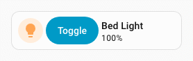
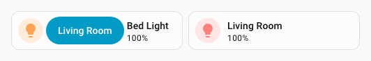
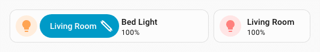
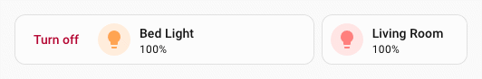
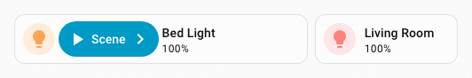
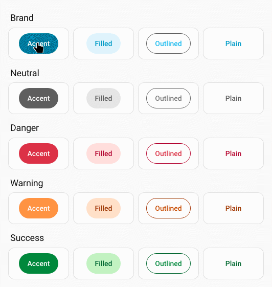

# :material-button-cursor: Button spark

The `button` spark inserts a Home Assistant [`ha-button`](https://github.com/home-assistant/frontend/tree/dev/src/components/ha-button.ts) element as a DOM sibling immediately **before** or **after** a target element inside a forged element.

The button can display:

- a text label (`label`)
- an icon in the label position (`icon`)
- a leading icon (`start_icon`)
- a trailing icon (`end_icon`)

`icon` and `label` are mutually exclusive — when `icon` is set, the icon is placed in `ha-button`'s label slot and `label` is ignored.

When only `icon` is set (no `label`), the button automatically receives styling to match Home Assistant's icon button.

Optionally the button can be made interactive with tap/hold/double-tap [actions](#actions).

## Basic usage

Add a `button` entry to `forge.sparks` with either `after` or `before` to specify the target element and where the button is inserted relative to it.

The `after`/`before` value is a selector that locates the target element within the forged element. It supports the same [DOM navigation syntax](../../concepts/dom.md) as UIX styles, including `$` to cross shadow-root boundaries.

```yaml
type: custom:uix-forge
forge:
  mold: card
  sparks:
    - type: button
      after: hui-tile-card $ ha-tile-icon
      label: Toggle
      entity: light.living_room
      tap_action:
        action: toggle
element:
  type: tile
  entity: light.living_room
```



!!! tip
    You can use the [`uix_forge_path()`](../../concepts/dom.md#uix_forge_path0-forge-helper) DOM helper to take the guesswork out of finding the right path for `after`/`before`.

## Configuration

| Key | Type | Required | Default | Description |
| --- | ---- | -------- | ------- | ----------- |
| `type` | `string` | ✅ | — | Must be `button`. |
| `after` | `string` | one of `after`/`before` ✅ | When the UIX Forge element is using [Blank card config](../forge.md#blank-card-config), the default is `uix-forge-blank-card $ div.content`. Otherwise, `""`. If you wish to target `before` using Blank card config, set explicitly to `""`. | UIX selector for the reference element. The button is inserted as a sibling **after** the matched element. |
| `before` | `string` | one of `after`/`before` ✅ | — | UIX selector for the reference element. The button is inserted as a sibling **before** the matched element. |
| `entity` | `string` | | — | Entity ID passed to action handlers (e.g. `toggle`). Required for entity-based actions. |
| `icon` | `string` | | — | MDI icon string (e.g. `mdi:lightbulb`) placed in the label slot of the button. Mutually exclusive with `label`. |
| `color` | `string` | | — | Icon color when in icon-only mode (e.g. `red`, `var(--primary-color)`). Only applied when `icon` is set. |
| `label` | `string` | | `""` | Text label displayed inside the button. Mutually exclusive with `icon`. |
| `start_icon` | `string` | | — | MDI icon string (e.g. `mdi:play`) displayed **before** the label. |
| `end_icon` | `string` | | — | MDI icon string (e.g. `mdi:chevron-right`) displayed **after** the label. |
| `variant` | `string` | | — | Button color variant. One of `brand`, `neutral`, `danger`, `warning`, `success`. When omitted, the default Home Assistant button variant `brand` is used, except when `icon` is set in which case `neutral` is default. |
| `appearance` | `string` | | — | Button appearance. One of `accent`, `filled`, `outlined`, `plain`. When omitted, the default Home Assistant button appearance `accent` is used, except when `icon` is set in which case `plain` is default. |
| `size` | `string` | | — | Button size which can be `s` (small) or `m` (medium). |
| `tap_action` | action | | — | Action to perform on tap. |
| `hold_action` | action | | — | Action to perform on hold. |
| `double_tap_action` | action | | — | Action to perform on double tap. |

!!! note
    - Exactly one of `after` or `before` must be provided.
    - The spark targets the **first** element matched by `after`/`before`.
    - The inserted `ha-button` is placed in a containing `<div>` inside the same parent as the target element — it is a sibling, not a child.
    - `icon` and `label` are mutually exclusive. When `icon` is set, `label` is ignored.
    - Margin styling of `-6px` is applied to labelled buttons, while icon-only buttons default to `0px`. This margin can be controlled by the CSS variable `--uix-button-margin`.
    - When only `icon` is set (no `label`), the button automatically receives styling to match Home Assistant's icon button.

## Actions

When one or more action keys are set (`tap_action`, `hold_action`, `double_tap_action`), the button fires the corresponding Home Assistant action. Provide `entity` when using entity-based actions such as `toggle` or `more-info`.

```yaml
type: custom:uix-forge
forge:
  mold: card
  sparks:
    - type: button
      after: hui-tile-card $ ha-tile-icon
      label: Living Room
      entity: light.living_room_rgbww_lights
      tap_action:
        action: toggle
      hold_action:
        action: more-info
element:
  type: tile
  entity: light.bed_light
```



!!! note
    When used inside a tile card the button's click events are isolated from the tile card's own action handler — only the button's configured actions fire.

## CSS variables

| Variable | Default | Description |
| --- | --- | --- |
| `--uix-button-margin` | `-6px` or `0px` for icon-only button | Sets the margin for the button. Default for a labelled button suits Home Assistant Frontend styling defaults. |
| `--uix-button-label-text-wrap` | `wrap` | Sets the button label text wrap. Default for `ha-button` is `wrap`. Set to `nowrap` if you wish for your labels to not wrap. This may or may not be needed based on the element in which the button is placed. You will need to set on a tile card like shown in the examples below. |
| `--uix-button-border-color` | `revert-layer` | Sets the button border color. This usually comes from a combination of the button `variant` and `appearance` but can be set directly with this CSS variable. |
| `--uix-icon-button-background-color` | `currentColor` | Sets the icon-only button background color. If not set the default of `currentColor` will pick up `color` config if set, otherwise whatever the current `color` is where the icon-only button is placed. By default, this color only shows when hovered. |
| `--uix-icon-button-background-opacity` | `0` | Sets the icon-only background opacity. Set to a value (0-1) to always show the background color at this opacity value. |
| `--uix-icon-button-background-color-hover` | `var(--uix-icon-button-background-color, currentColor)` | Set to override the icon-only background color when hovered. |
| `--uix-icon-button-background-opacity-hover` | `calc(var(--uix-icon-button-background-opacity, 0) + 0.1)` | Set to override the icon-only opacity when hovered. |

## Examples

??? example "Button after the tile icon with a toggle action and fluorescent light icon"
    ```yaml
    type: custom:uix-forge
    forge:
      mold: card
      grid_options:
        columns: 9
      sparks:
        - type: button
          after: hui-tile-card $ ha-tile-icon
          label: Living Room
          end_icon: mdi:lightbulb-fluorescent-tube-outline
          entity: light.living_room_rgbww_lights
          tap_action:
            action: toggle
      uix:
        style: |
          :host {
            --uix-button-label-text-wrap: nowrap;
          }
    element:
      type: tile
      entity: light.bed_light
    ```

    

??? example "Button before the tile icon with a danger variant"
    ```yaml
    type: custom:uix-forge
    forge:
      mold: card
      sparks:
        - type: button
          before: hui-tile-card $ ha-tile-icon
          label: Turn off
          variant: danger
          appearance: plain
          entity: light.living_room
          tap_action:
            action: call-service
            service: light.turn_off
            target:
              entity_id: light.living_room
    element:
      type: tile
      entity: light.bed_light
    ```

    

??? example "Button with start and end icons"
    ```yaml
    type: custom:uix-forge
    forge:
      mold: card
      sparks:
        - type: button
          after: hui-tile-card $ ha-tile-icon
          start_icon: mdi:play
          label: Scene
          end_icon: mdi:chevron-right
          tap_action:
            action: perform-action
            perform_action: light.turn_off
            target:
              entity_id: light.living_room_rgbww_lights
    element:
      type: tile
      entity: light.bed_light
    ```

    

??? example "Icon-only button"
    Here we need to style the icon button size to match the tile icon size, which is 36px. The default icon button size is 48px.
    ```yaml
    type: custom:uix-forge
    forge:
      mold: card
      sparks:
        - type: button
          before: hui-tile-card $ ha-tile-info
          icon: mdi:lightbulb
          color: var(--red-color)
          entity: light.living_room_rgbww_lights
          tap_action:
            action: toggle
    element:
      type: tile
      entity: light.bed_light
      uix:
        style: |
          ha-button {
            --ha-icon-button-size: 36px;
          }
    ```

    

??? example "Button with tile card styling for spacing with flex css properties"
    Also included is a [:speech_balloon: Tooltip spark](tooltip.md)
    ```yaml
    type: custom:uix-forge
    forge:
      mold: card
      grid_options:
        columns: 12
        rows: 1
      sparks:
        - type: tooltip
          for: hui-tile-card $ ha-button
          content: Toggle Special Switch
        - type: button
          after: hui-tile-card $ ha-tile-info
          label: Press me
          variant: neutral
          appearance: plain
          end_icon: mdi:test-tube
          entity: input_boolean.test_boolean
          tap_action:
            action: toggle
          hold_action:
            action: more-info
    element:
      type: tile
      entity: light.bed_light
      vertical: false
      features_position: bottom
      uix:
        style: |
          ha-tile-info {
            flex: 2;
          }
          ha-button {
            margin-top: -2px;
            flex: 1;
          }
    ```

    

## Variant and appearance

Button `variant` can be one of `brand`, `neutral`, `danger`, `warning`, `success`. When omitted, the default Home Assistant button variant `brand` is used.

Button `appearance` can be one of `accent`, `filled`, `plain`. When omitted, the default Home Assistant button appearance `accent` is used.

!!! info "Button variant and appearance image"
    
