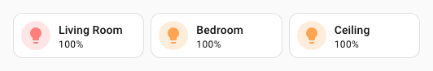
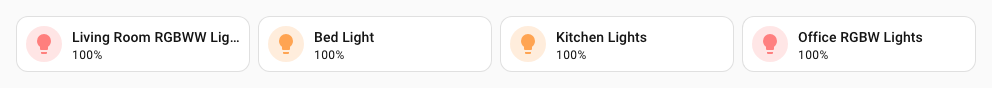

# :material-grid: Grid spark

The `grid` spark applies **CSS Grid** layout to any container element inside a [UIX Forge](../index.md) forged element.  It is designed for use with grid cards and section containers in Home Assistant dashboards, letting you define the full grid layout — columns, rows, gaps, template areas, auto-flow and alignment — with a concise YAML snippet instead of hand-writing `style` CSS.

It also supports **`media_queries`** to override grid properties at specific viewport breakpoints, and **`elements`** to assign named grid areas to child elements in order.

## Basic usage

Apply a 3-column equal-width grid to the forged element itself:

```yaml
type: custom:uix-forge
forge:
  mold: card
  sparks:
    - type: grid
      for: "hui-grid-card $ #root"
      columns: 3
element:
  type: grid
  square: false
  cards:
    - type: tile
      entity: light.living_room_rgbww_lights
      name: Living Room
    - type: tile
      entity: light.bed_light
      name: Bedroom
    - type: tile
      entity: light.ceiling_lights
      name: Ceiling
```

`columns: 3` expands to `grid-template-columns: repeat(3, 1fr)`.



!!! tip
    When using grid spark with a grid card in a section, it is best to set the section to `column_span: 4` and then `columns` of `grid_options` in forge mold to `columns: full`.
    ```yaml
    type: grid
    column_span: 4
    cards:
      - type: custom:uix-forge
    forge:
      mold: card
      grid_options:
        columns: full
      sparks:
        - type: grid
          ...
    element:
      type: grid
      cards:
        ...
    ```

## Configuration

### Base properties

| Key | Type | Required | Default | Description |
| --- | ---- | -------- | ------- | ----------- |
| `type` | `string` | ✅ | — | Must be `grid`. |
| `for` | `string` | | `element` | UIX selector for the target element. When the UIX Forge element is using [Blank card config](../forge.md#blank-card-config), the default is `uix-forge-blank-card $ div.content`. Otherwise, the default of `element` refers to the root of the forged element. Supports `$` for shadow-root crossings (see [DOM navigation](../../concepts/dom.md)). |
| `columns` | `number` \| `string` | | — | Grid template columns. A **number** becomes `repeat(n, 1fr)`. A **string** is used verbatim (e.g. `"200px 1fr 200px"`). |
| `rows` | `number` \| `string` | | — | Grid template rows. Same shorthand as `columns`. |
| `gap` | `number` \| `string` | | — | Shorthand gap between rows and columns. A **number** is treated as pixels (e.g. `8` → `8px`). A **string** is used verbatim (e.g. `"8px 16px"`). |
| `column_gap` | `number` \| `string` | | — | Column gap only. Same shorthand as `gap`. |
| `row_gap` | `number` \| `string` | | — | Row gap only. Same shorthand as `gap`. |
| `auto_rows` | `string` | | — | `grid-auto-rows` value (e.g. `"minmax(100px, auto)"`). |
| `auto_columns` | `string` | | — | `grid-auto-columns` value. |
| `auto_flow` | `string` | | — | `grid-auto-flow` value: `row`, `column`, `row dense`, or `column dense`. |
| `justify_items` | `string` | | — | `justify-items` value: `start`, `end`, `center`, `stretch`. |
| `align_items` | `string` | | — | `align-items` value: `start`, `end`, `center`, `stretch`. |
| `justify_content` | `string` | | — | `justify-content` value. |
| `align_content` | `string` | | — | `align-content` value. |
| `place_items` | `string` | | — | `place-items` shorthand (`<align-items> / <justify-items>`). |
| `place_content` | `string` | | — | `place-content` shorthand (`<align-content> / <justify-content>`). |
| `areas` | `string` | | — | `grid-template-areas` value. Each row is a quoted string of space-separated area names (e.g. `'"header header" "main sidebar"'`). Can also be specified per entry in `media_queries`. |
| `elements` | `list[string]` | | `[]` | Ordered list of `grid-area` names to assign to the direct children of the target container. The first name is applied to the first child, the second to the second, and so on. See Template areas and elements [example](#examples). |
| `media_queries` | `list` | | `[]` | List of responsive override blocks. See [Media queries](#media-queries). |

### Media queries

Each entry in `media_queries` has a required `query` key plus any subset of the base grid properties listed above (including `areas`).

| Key | Type | Required | Description |
| --- | ---- | -------- | ----------- |
| `query` | `string` | ✅ | Standard CSS media query condition, e.g. `"(min-width: 768px)"`. |
| *(grid props)* | — | | Any of `columns`, `rows`, `gap`, `column_gap`, `row_gap`, `auto_rows`, `auto_columns`, `auto_flow`, `justify_items`, `align_items`, `justify_content`, `align_content`, `place_items`, `place_content`, `areas`. |

!!! tip
    Use the [`uix_forge_path()`](../../concepts/dom.md#uix_forge_path0-forge-helper) console helper to find the exact DOM selector for your target container.

## Examples

??? example "Equal-width columns with a gap"
    ```yaml
    type: custom:uix-forge
    forge:
      mold: card
      grid_options:
        columns: full
      sparks:
        - type: grid
          for: "hui-grid-card $ #root"
          columns: repeat(4, minmax(0, 1fr))
          gap: 8
    element:
      type: grid
      square: false
      cards:
        - type: tile
          entity: light.living_room_rgbww_lights
        - type: tile
          entity: light.bed_light
        - type: tile
          entity: light.kitchen_lights
        - type: tile
          entity: light.office_rgbw_lights
    ```

    

??? example "Custom column widths"
    ```yaml
    type: custom:uix-forge
    forge:
      mold: card
      grid_options:
        columns: full
      sparks:
        - type: grid
          for: "hui-grid-card $ #root"
          columns: 200px minmax(0, 1fr) 200px
          gap: 8px 16px
    element:
      type: grid
      square: false
      cards:
        - type: tile
          entity: light.living_room_rgbww_lights
        - type: tile
          entity: light.bed_light
        - type: tile
          entity: light.kitchen_lights
    ```

    

??? example "Template areas and elements"
    Use `areas` to define named regions and `elements` to assign those names to child elements (in order):
    ```yaml
    type: custom:uix-forge
    forge:
      mold: card
      grid_options:
        columns: full
      sparks:
        - type: grid
          for: "hui-grid-card $ #root"
          columns: auto 150px
          gap: 8
          areas: '"header header" "main sidebar"'
          elements:
            - header
            - main
            - sidebar
    element:
      type: grid
      square: false
      cards:
        - type: markdown
          content: "# Header"     # → grid-area: header (spans full width)
        - type: tile
          entity: light.living_room_rgbww_lights  # → grid-area: main
        - type: tile
          entity: light.bed_light      # → grid-area: sidebar
    ```
    Each name in `elements` is applied to the corresponding child element via CSS `grid-area`.  The area name simply needs to match a region defined in `areas`.

    

    !!! tip
        You can repeat an area name in `areas` across multiple cells to make a child element span those cells (e.g. `"header header"` makes `header` span both columns).

??? example "Responsive template areas with media queries"
    Override `areas` at a larger breakpoint to change the layout while keeping the same element assignments:
    ```yaml
    type: custom:uix-forge
    forge:
      mold: card
      grid_options:
        columns: full
      sparks:
        - type: grid
          for: "hui-grid-card $ #root"
          columns: 1
          gap: 8
          areas: '"header" "main" "sidebar"'
          elements:
            - header
            - main
            - sidebar
          media_queries:
            - query: "(min-width: 768px)"
              columns: 2
              areas: '"header header" "main sidebar"'
            - query: "(min-width: 1200px)"
              columns: 3
              areas: '"header header header" "main main sidebar"'
    element:
      type: grid
      square: false
      cards:
        - type: markdown
          content: "# Header"
        - type: tile
          entity: light.living_room_rgbww_lights
        - type: tile
          entity: light.bed_light
    ```

    

??? example "Wrapping entity icons in a picture-glance card"
    ```yaml
    type: custom:uix-forge
    forge:
      mold: card
      sparks:
        - type: grid
          for: hui-picture-glance-card $ div.row:nth-of-type(2)
          columns: 4
    element:
      type: picture-glance
      title: Kitchen
      image: https://demo.home-assistant.io/stub_config/kitchen.png
      entities:
        - sun.sun
        - sun.sun
        - sun.sun
        - sun.sun
        - sun.sun
        - sun.sun
        - sun.sun
        - sun.sun
    ```

    

!!! note
    - The spark sets `display: grid` automatically — you do not need to set it yourself.
    - When `media_queries` or `elements` are configured, a scoped `<style>` element is injected into the nearest shadow root (or `document.head`). All `:nth-child()` area assignments and `@media` override rules live in that element, which is removed on disconnect.
    - When neither `media_queries` nor `elements` are configured, grid properties are applied as inline styles — no extra DOM elements are created.
    - The `elements` list assigns `grid-area` names using CSS `:nth-child()` selectors — it is not per-media-query.  To change the layout at a breakpoint, override `areas` inside `media_queries`; the same area names on the child elements will follow the new layout automatically.
    - All grid styles applied by this spark are **removed** when the forge element is disconnected or the configuration changes, so they do not leak into the surrounding layout.
    - Only properties that are explicitly configured are written; unconfigured properties are left untouched.
