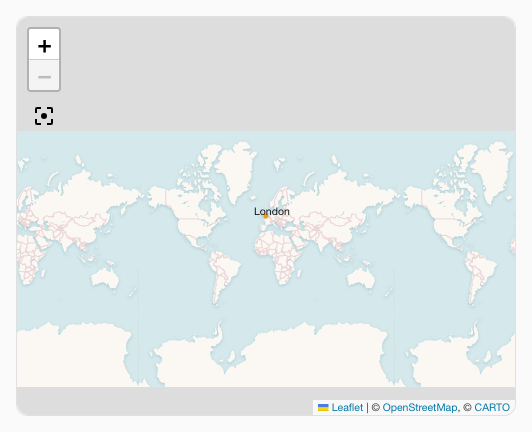
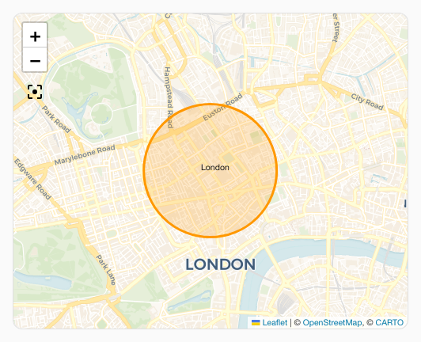
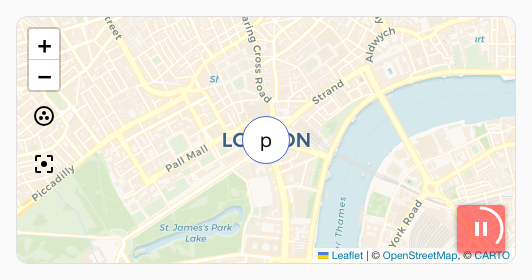
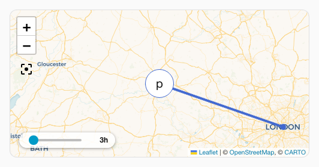
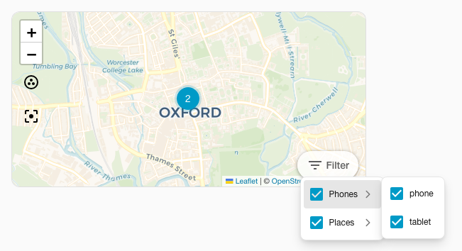

# :material-map: Map spark

The `map` spark adds advanced map state management to a map card used inside a [UIX Forge](../index.md) forged element. It supports five modes:

- **Speichermodus** (`memory: true`): Erfasst vor jedem Update Zoom und Mittelpunkt der aktuellen Karte und stellt sie danach wieder her. So bleibt die gewählte Kartenansicht erhalten. Ohne diesen Modus setzt jedes Forge-Template-Update die Karte auf den Standardzoom und die Standardposition zurück.
- **Fit map mode** (`fit_map: true`): Fits the map view when map card does not auto fit on load when used in custom cards which may hide the map initially. e.g. `custom: auto-entities`.
- **Tour mode** (`tour: true | object`): Automatically moves the map between a list of points of interest. A pause/play button is injected into the map. When `tour: true` all defaults are used; pass an object to customise behaviour.
- **Hours to show slider mode** (`hours_to_show: true | object`): Injects an interactive `ha-slider` overlay into the map allowing users to adjust the hours of history loaded and rendered in real-time.
- **Entity filter overlay mode** (`entity_filter: true | object`): Injects an interactive checkable dropdown checklist overlay into the map allowing users to toggle visible entities on the map in real-time.

## Basic usage

```yaml
type: custom:uix-forge
forge:
  mold: card
  sparks:
    - type: map
      memory: true
element:
  type: map
  entities:
    - device_tracker.phone
```

## Configuration

| Key | Type | Default | Description |
| --- | --- | --- | --- |
| `type` | string | — | Must be `map`. |
| `memory` | boolean | false | Save/restore zoom and centre before/after each update. |
| `fit_map` | boolean | false | Fit map view to all entities once map is visible (useful for cards hidden on load). |
| `tour` | boolean or object | false | Enable tour mode. `true` uses all defaults; pass an object to customise (see below). |
| `hours_to_show` | boolean or object | false | Enable hours to show slider overlay. `true` uses all defaults; pass an object to customise (see below). |
| `entity_filter` | boolean or object | false | Enable entity filter checklist dropdown overlay. `true` uses all defaults; pass an object to customise (see below). |

### Tour sub-keys

| Key | Type | Default | Description |
| --- | --- | --- | --- |
| `period` | string or number | `10s` | Time to spend at each point of interest. Accepts a human-readable duration (e.g. `"30s"`, `"2m"`) or a number in milliseconds. |
| `zoom` | number | `14` | Default zoom level used when moving to a POI. |
| `icon_pause` | string | `mdi:pause` | Icon shown on the overlay button while the tour is playing. |
| `icon_play` | string | `mdi:play` | Icon shown on the overlay button while the tour is paused. |
| `icon_position` | object | `{bottom: 40px, right: 10px}` | CSS-Position der Pause-/Wiedergabe-Schaltfläche. Akzeptiert `top`, `bottom`, `left` und `right`; Zahlen werden als Pixel behandelt. |
| `poi` | list | *(unset)* | List of points of interest. When omitted, the entities declared on the ha-map card are used. |

Each `poi` list entry may contain:

| Key | Type | Description |
| --- | --- | --- |
| `entity` | string | Entity ID. Must be present in the ha-map's `entities` list. Lat/lng are read from hass state attributes. |
| `latitude` | number | Latitude (required when `entity` is not set). |
| `longitude` | number | Longitude (required when `entity` is not set). |
| `zoom` | number | Per-POI zoom override. |

### Hours to Show sub-keys

| Key | Type | Default | Description |
| --- | --- | --- | --- |
| `min` | number | `0` | Minimum hours to show on the slider. |
| `max` | number | `24` | Maximum hours to show on the slider. |
| `step` | number | `1` | Increment step size of the slider. |
| `position` | object | `{bottom: 40px, right: 10px}` | CSS-Position der Reglerkapsel. Akzeptiert `top`, `bottom`, `left` und `right`; Zahlen werden als Pixel behandelt. |
| `tooltip_distance` | number | `20` | Distance in pixels of slider tooltip away from thumb. |

Bedienelemente ohne konfigurierte Position oder mit der expliziten Position `{bottom: 40px, right: 10px}` liegen gemeinsam in einer horizontalen Reihe über der Karten-Attribution. Alle anderen Positionen, auch `{bottom: 10px, right: 10px}`, verwenden ihre konfigurierten Abstände unabhängig voneinander.

### Entity Filter sub-keys

| Key | Type | Default | Description |
| --- | --- | --- | --- |
| `position` | object | `{bottom: 40px, right: 10px}` | CSS-Position der Filter-Schaltflächenkapsel. Akzeptiert `top`, `bottom`, `left` und `right`; Zahlen werden als Pixel behandelt. |
| `size` | string | `s` | Button size (e.g. `s`, `m`, `l`). |
| `variant` | string | `neutral` | Button variant brand/style (e.g. `brand`, `neutral`, `danger`, `warning`, `success`). |
| `appearance` | string | `filled` | Button presentation appearance (e.g. `accent`, `filled`, `plain`). |
| `icon` | string | `mdi:filter-variant` | Trigger button start-icon representation. |
| `label` | string | `Filter` | Trigger button label string. Set to empty string to disable. |
| `group` | boolean or object | false | Group entities according to their domain. Set to `true` to use defaults, or an object to set labels for each entity domain grouping. |

#### Entity filter group sub-keys

| Key | Type | Default | Description |
| --- | --- | --- | --- |
| `persons` | string | `Persons` | Label for the `person` domain entity grouping. |
| `trackers` | string | `Trackers` | Label for the `device_tracker` domain entity grouping. |
| `zones` | string | `Zones` | Label for the `zone` domain entity grouping. |

### Tour CSS variables

The pause/play button can be styled using CSS variables placed on the `ha-card` or any ancestor:

| Variable | Default | Description |
| --- | --- | --- |
| `--uix-map-tour-icon-color` | `var(--primary-color)` | Icon color. |
| `--uix-map-tour-icon-ring-color` | `var(--uix-map-tour-icon-color)` | Countdown ring color (defaults to icon color). |
| `--uix-map-tour-icon-background` | `rgba(255,255,255,0.8)` | Button background. |
| `--uix-map-tour-icon-box-shadow` | `0 1px 5px rgba(0,0,0,0.4)` | Box shadow of the icon container. |
| `--uix-map-tour-icon-width` | `auto` | Button width. |
| `--uix-map-tour-icon-height` | `auto` | Button height. |
| `--uix-map-tour-icon-border-radius` | `9999px` | Button border radius (pill by default). |
| `--uix-map-tour-icon-z-index` | `1000` | Button z-index (Leaflet controls use 1000). |

### Hours to Show CSS variables

The history duration slider can be styled using CSS variables placed on the `ha-card` or any ancestor:

| Variable | Default | Description |
| --- | --- | --- |
| `--uix-map-slider-background` | `rgba(255,255,255,0.8)` | Background color of slider container. |
| `--uix-map-slider-text-color` | `var(--primary-text-color, #212121)` | Color of the duration label next to the slider. |
| `--uix-map-slider-width` | `100px` | Explicit width of the slider component. |
| `--uix-map-slider-border-radius` | `9999px` | Slider container border radius (pill by default). |
| `--uix-map-slider-padding` | `4px 12px` | Padding of the capsule container. |
| `--uix-map-slider-box-shadow` | `0 1px 5px rgba(0,0,0,0.4)` | Box shadow of the container element. |
| `--uix-map-slider-z-index` | `1000` | Controls overlay depth of the slider capsule. |
| `--uix-map-slider-label-min-width` | `28px` | Minimum width of the duration label. |
| `--uix-map-slider-thumb-size` | *(unset)* | Height and width of the slider thumb. |
| `--uix-map-slider-thumb-height` | `16px` | Height of the slider thumb component structure (defaults to thumb-size if set). |
| `--uix-map-slider-thumb-width` | `16px` | Width of the slider thumb component structure (defaults to thumb-size if set). |
| `--uix-map-slider-track-size` | `4px` | Thickness of the slider track. |
| `--uix-map-slider-track-color` | `var(--disabled-color)` | Background base track color. |
| `--uix-map-slider-indicator-color` | `var(--primary-color)` | Color of the active indicator bar. |
| `--uix-map-slider-thumb-color` | `var(--uix-map-slider-indicator-color)` | Color of the circular slider thumb. |
| `--uix-map-slider-thumb-hover-opacity` | `0.08` | Hover opacity surrounding the thumb. |
| `--uix-map-slider-thumb-pressed-opacity` | `0.12` | Opacity of thumb halo while active/pressed. |
| `--uix-map-slider-thumb-box-shadow` | `inherit` | Custom shadow styling applied to the interactive thumb item. |
| `--uix-map-slider-tooltip-color` | `var(--primary-text-color)` | Text color inside the popup thumb tooltip. |
| `--uix-map-slider-tooltip-font-size` | `var(--ha-font-size-s)` | Font size of text inside the tooltip. |
| `--uix-map-slider-tooltip-font-weight` | `var(--ha-font-weight-normal)` | Font thickness of elements inside tooltip. |
| `--uix-map-slider-tooltip-background-color` | `var(--secondary-background-color)` | Background color of popup tooltip bubble. |
| `--uix-map-slider-tooltip-border-radius` | `var(--ha-border-radius-sm)` | Corner rounding of tooltip bubble. |
| `--uix-map-slider-tooltip-border-width` | `0px` | Border thickness of tooltip. |
| `--uix-map-slider-tooltip-border-color` | `currentColor` | Border color of tooltip bubble. |
| `--uix-map-slider-tooltip-border-style` | `none` | Border line style. |

### Entity Filter CSS variables

The entity filter dropdown can be styled using CSS variables placed on the `ha-card` or any ancestor:

| Variable | Default | Description |
| --- | --- | --- |
| `--uix-map-entity-filter-background` | `rgba(255,255,255,0.8)` | Background color of entity filter container. |
| `--uix-map-entity-filter-padding` | `4px` | Padding of the filter capsule container. |
| `--uix-map-entity-filter-border-radius` | `9999px` | Entity filter container border radius (pill by default). |
| `--uix-map-entity-filter-box-shadow` | `0 1px 5px rgba(0,0,0,0.4)` | Box shadow of the container element. |
| `--uix-map-entity-filter-z-index` | `1000` | Controls overlay depth of the filter capsule. |
| `--uix-map-entity-filter-dropdown-min-width` | `180px` | Minimum width of the opened dropdown menu list. |
| `--uix-map-entity-filter-item-icon-color` | `var(--ha-color-fill-neutral-loud-resting)` | Color of the check icon of entity filter list items. |
| `--uix-map-entity-filter-item-icon-checked-color` | `var(--uix-map-entity-filter-item-icon-color, var(--primary-color))` | Color of the check icon of entity filter items when checked. |

## How it works

**Memory mode:**

Each time the forged element is about to refresh due to a forge template update, the spark:

1. Liest `zoom` und `center` der aktuellen Karten-Engine innerhalb von `ha-map`.
2. Waits for the forged element and then `ha-map` to finish their own update cycle.
3. Stellt die gespeicherte Position über die Karten-Engine von Home Assistant wieder her, ohne eine Animation auszulösen.

Ist die Karten-Engine beim Aktualisieren noch nicht initialisiert, etwa beim ersten Rendern, wird das Speichern übersprungen und nichts wiederhergestellt. Beim ersten Laden zeigt die Karte dann ihre Standardansicht.

**Fit map mode:**

Sobald das geschmiedete Element und `ha-map` ihr Update beendet haben und die Karten-Engine eine nutzbare Größe hat, ruft der Spark `fitMap()` auf `ha-map` auf.

**Tour mode:**

After the map is ready (and after `fit_map` completes if both are configured), the spark:

1. Resolves the POI list (from `poi` config, or by reading `latitude`/`longitude` from hass state attributes of the ha-map entities).
2. Fügt ein `ha-icon-button`-Overlay mit einem kreisförmigen SVG-Countdown-Ring in den Container der Karten-Engine ein.
3. Bewegt die Karte sofort zum ersten POI und startet dann einen wiederkehrenden Timer, der über die Karten-Engine alle `period` Sekunden zum nächsten POI wechselt.
4. The countdown ring animates from full to empty over each `period`, giving a visual indication of time remaining at the current POI.
5. When the user clicks the pause/play button, the timer is stopped or restarted and the countdown ring is hidden or restarted.

When `memory: true` and `tour` are both active, hass-update memory restores are suppressed while the tour is playing so that the tour animation is not interrupted.

**Hours to show slider mode:**

When active, the spark:

1. Renders a horizontal `ha-slider` control in a capsule-shaped overlay container.
2. If `tour` is also active and at the default position, the slider is automatically shifted leftwards to prevent visual overlapping.
3. Automatically sets, clamps, and updates `hui-map-card` `_config.hours_to_show` based on slider drags and releases to fetch history records in real-time.
4. Smoothly preserves the user's selected value across template-driven forge re-renders.

**Entity filter overlay mode:**

When active, the spark:

1. Renders a dropdown overlay using `ha-dropdown` with a trigger `ha-button`.
2. Resolves and displays each map entity as a checkbox using Friendly Name.
3. Directly filters visible entities. As a map card will error with no entities, deselecting any last selected entity is disabled.
4. If the `show_all: true` is set in forged map card config, a `Show All` option will also show in the dropdown. While entities are filtered, any new map entities will not show until `Show All` is selected.
5. If `tour`or `hours_to_show` is also active and at the default position, the slider is automatically shifted leftwards to prevent visual overlapping.
6. If `tour` is also active, changing filtered entities will cause the map tour to restart.

!!! note
    Der Spark verwendet das Element `hui-map-card` innerhalb des geschmiedeten Elements sowie das Element `ha-map` in dessen Shadow Root. Er unterstützt die Karten-Engine von Home Assistant (MapLibre, wenn verfügbar, mit Leaflet-Fallback) sowie ältere Leaflet-basierte Frontends. Ist das geschmiedete Element keine Kartenkarte oder in ein Element eingebettet, das `hui-map-card` nicht bereitstellt, haben die Modi keine Wirkung.

## Examples

### Using fit map mode with auto-entities

When using a map card with `custom:auto-entities` the way auto-entities hides the map card will mean it does not fit on load. Fit map mode can be used in this case to make sure the map fits on first load.

No include filters have been used for brevity of the example.

```yaml
type: custom:auto-entities
entities:
  - zone.london
filter:
  include: []
  exclude: []
card:
  type: custom:uix-forge
  forge:
    mold: card
    sparks:
      - type: map
        fit_map: true
  element:
    type: map
    fit_zones: true
    uix:
      style: |
        :host {
          display: block;
          height: 400px;
        }
```

Without `fit_map: true`:



With `fit_map: true`:



### Tour mode with default settings

Automatically cycle through all map entities using defaults (10 s per stop, pause/play button in bottom-right corner):

```yaml
type: custom:uix-forge
forge:
  mold: card
  sparks:
    - type: map
      tour: true
element:
  type: map
  entities:
    - device_tracker.my_phone
    - device_tracker.my_tablet
```

:material-movie: [Map spark tour mode example animation (mp4)](../../assets/page-assets/forge/sparks/map-tour.mp4){ data-type="video" class="glightbox" }

### Tour mode with custom POI list

Fly between fixed coordinates and specific entities with individual zoom levels:

```yaml
type: custom:uix-forge
forge:
  mold: card
  sparks:
    - type: map
      tour:
        period: 15s
        zoom: 13
        icon_pause: mdi:pause-circle
        icon_play: mdi:play-circle
        icon_position:
          bottom: 16px
          left: 16px
        poi:
          - latitude: 51.614387 
            longitude: -0.731585
            zoom: 11
          - entity: device_tracker.my_tablet
            zoom: 14
element:
  type: map
  entities:
    - device_tracker.my_phone
    - device_tracker.my_tablet
```

:material-movie: [Map spark tour mode with pois example animation (mp4)](../../assets/page-assets/forge/sparks/map-tour-pois.mp4){ data-type="video" class="glightbox" }

### Styling the tour button

Override the default pill shape with rounded corners and a dark background:

```yaml
type: custom:uix-forge
forge:
  mold: card
  sparks:
    - type: map
      tour: true
element:
  type: map
  entities:
    - device_tracker.phone
  uix:
    style: |
      ha-card {
        --uix-map-tour-icon-color: white;
        --uix-map-tour-icon-background: rgba(255,0,0,0.5);
        --uix-map-tour-icon-border-radius: 4px;
      }
```



### Hours to show history slider

Enable a customizable history duration slider to load between 1 and 48 hours of tracker data on the map:

```yaml
type: custom:uix-forge
forge:
  mold: card
  sparks:
    - type: map
      hours_to_show:
        min: 1
        max: 48
        step: 2
        position:
          bottom: 15px
          left: 15px
element:
  type: map
  hours_to_show: 3
  default_zoom: 8
  entities:
    - device_tracker.phone
```



### Entity selection filter dropdown

Enable an interactive dropdown to toggle entity tracks visibility in real-time:

```yaml
type: custom:uix-forge
forge:
  mold: card
  sparks:
    - type: map
      entity_filter: true
element:
  type: map
  entities:
    - device_tracker.phone
    - device_tracker.tablet
```


Customise the trigger button text, size, color and icon styling:

```yaml
type: custom:uix-forge
forge:
  mold: card
  sparks:
    - type: map
      entity_filter:
        label: "Trackers"
        icon: "mdi:account-multiple"
        size: "m"
        variant: "brand"
        appearance: "filled"
element:
  type: map
  entities:
    - device_tracker.phone
    - device_tracker.tablet
```


Display entity filter grouped by domain with custom labels

```yaml
type: custom:uix-forge
forge:
  mold: card
  sparks:
    - type: map
      entity_filter:
        group:
          persons: Household
          trackers: Phones
          zones: Places
element:
  type: map
  entities:
    - zone.london
    - device_tracker.phone
    - device_tracker.tablet
```


