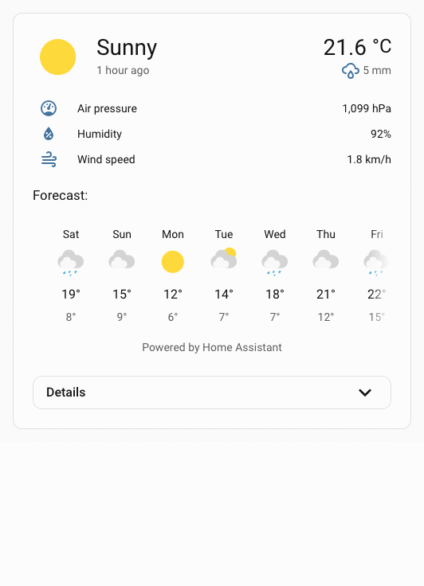
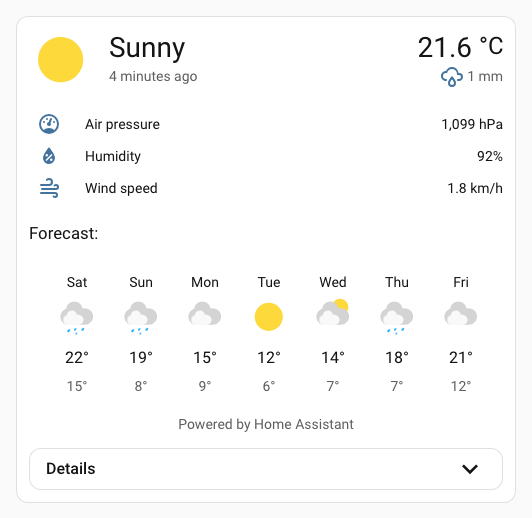
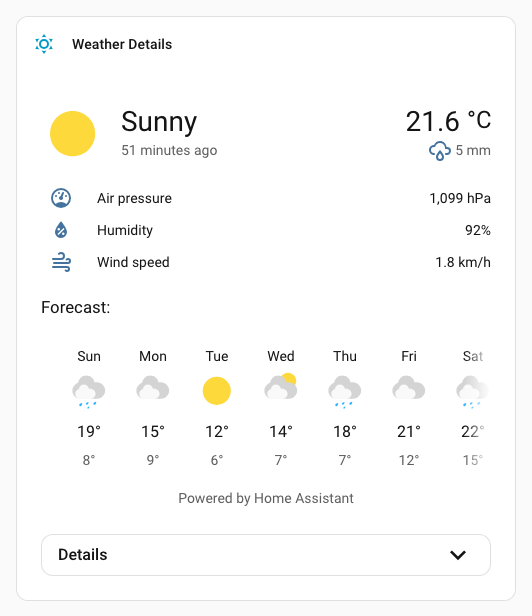

# :material-information-outline: More-info spark

The `more-info` spark inserts Home Assistant's `ha-more-info-info` element as a sibling before or after a target element inside a UIX Forge element.

It is most useful with [Blank card config](../forge.md#blank-card-config), where a Forge card has no `element` config and the spark uses the blank card content as its default insertion target.

!!! note
    When any action requires a child more-info view, for example Vacuum Clear Areas, a regular more-info dialog is opened at the child view.

## Basic usage

```yaml
type: custom:uix-forge
forge:
  mold: card
  grid_options:
    columns: full
  sparks:
    - type: more-info
      entity: weather.demo_weather_south
```


## With details

Set `details: true` to add a collapsible details section underneath the main more-info content. The details header includes:

- a `Details` subheading
- a code button to toggle the details view's YAML mode, shown only while the details section is expanded
- a chevron button to expand or collapse the details section

The collapsible details content is wrapped in an `ha-card` so it inherits normal Home Assistant card styling such as borders, background, and shadow.

```yaml
type: custom:uix-forge
forge:
  mold: card
  grid_options:
    columns: full
  sparks:
    - type: more-info
      entity: weather.demo_weather_south
      details: true
```



## Configuration

| Key | Type | Required | Default | Description |
| --- | ---- | -------- | ------- | ----------- |
| `type` | `string` | ✅ | — | Must be `more-info`. |
| `after` | `string` | | see description | UIX selector for the reference element. The more-info content is inserted as a sibling **after** the matched element. When the UIX Forge element is using [Blank card config](../forge.md#blank-card-config), the default is `uix-forge-blank-card $ div.content`. Otherwise, it defaults to `""`. |
| `before` | `string` | | — | UIX selector for the reference element. The more-info content is inserted as a sibling **before** the matched element. |
| `entity` | `string` | | `element.entity` | Entity ID shown in the embedded more-info content. If omitted, the spark uses the forged element's `entity` config when available. |
| `info` | `boolean` | | `true` | If false, does not show the main more-info content (represented by the `ha-more-info-info` element). This can be used in combination with `details: true` to display only the details section. |
| `details` | `boolean` | | `false` | Adds a collapsible `ha-more-info-details` section under the main info content. |

!!! note
    The spark targets the **first** element matched by `after` or `before`.

## Theme styling

The spark applies UIX `more-info` styling to the wrapper containing `ha-more-info-info`, so theme-level `uix-more-info-yaml` paths can target the embedded content the same way they target the more-info dialog.

This example sets the current and forecast high temps text color to red and makes the forecast day labels bold. `ha-more-info-info $$ more-info-weather $` [express search selector](../../concepts/dom.md#express-search-selector) condenses `ha-more-info-info $ more-info-content $ more-info-weather $`.

```yaml
my-theme:
  uix-theme: my-theme
  uix-more-info-yaml: |
    ha-more-info-info $$ more-info-weather $: |
      div.forecast-item-label {
        font-weight: bold;
      }
      div.temp,
      div.forecast-item div.temp {
        color: red;
      }
      div.forecast-item div.templow {
        color: blue;
      }
```


## CSS variables

| Variable | Default | Description |
| --- | --- | --- |
| `--uix-more-info-details-head-height` | `40px` | Height of the details toggle row. |
| `--uix-more-info-details-head-padding` | `0 var(--ha-space-4, 16px)` | Padding for the details toggle row. |
| `--uix-more-info-details-head-gap` | `var(--ha-space-2, 8px)` | Gap between details action buttons. |
| `--uix-more-info-details-outer-padding` | `0 var(--ha-space-6, 24px) var(--ha-space-6, 24px)` | Padding around the outside of the details card. |
| `--uix-more-info-details-no-info-outer-padding` | `var(--ha-space-6, 24px)` | Padding around the outside of the details card when info is not shown (`info: false`). When details are shown without the info content above, top padding is added. |
| `--uix-more-info-details-toggle-width` | `32px` | Size of the details action icon buttons. |
| `--uix-more-info-details-transition-duration` | `350ms` | Transition duration for the details dropdown, toggle icon, and YAML button fade. |
| `--uix-more-info-details-toggle-color` | `var(--primary-text-color)` | Details action button color. |
| `--uix-more-info-details-max-height` | `unset` | Maximum expanded details height. Set to a CSS size value to constrain the details dropdown height. Overflow is set to scroll. |

## Operation and styling considerations

The more-info spark uses the built-in Home Assistant elements `<ha-more-info-info>` and `<ha-more-info-details>`. These elements are designed to be used in the more-info dialog. Using them inside a UIX Forge layout introduces operational and styling considerations.

### YAML details fullscreen button

In the more-info dialog, the YAML details mode fullscreen button is constrained to a wide dialog. Without any changes, this would break in the more-info spark because it would be constrained to the dropdown and not break out to fullscreen. To work around this, the more-info spark sets the internal `inDialog` flag on `<ha-more-info-details>` once it has rendered.

### More-info info content padding

The inbuilt more-info info content padding is a generous `--ha-space-6` (24px) - the default more-info details outside padding is also set to match this default padding. This is likely too much for use in the more-info spark. As the inbuilt padding is applied in shadowRoot the best method to override is using UIX Styling via theme, also adjusting details outside padding at the same time.

Reduce padding to `--ha-space-3` (8px):

```yaml
my-theme:
  uix-theme: my-theme
  uix-more-info-yaml: |
    .: |
      :host {
        --uix-more-info-details-outer-padding: 0 var(--ha-space-3) var(--ha-space-3);
      }
    ha-more-info-info $: |
      div.content {
        padding: var(--ha-space-3);
      }
```



### More-info details content padding

The built-in more-info details content padding is also a generous `--ha-space-6` (24px). This is likely also too much for the more-info spark details section, especially the top padding. As the padding is applied in the shadow root, the best method to override it is using UIX styling via a theme styling `uix-more-info-yaml`.

Styling the more-info details content padding using `uix-more-info-yaml`, also setting reduced padding for the more-info details head:

```yaml
my-theme:
  uix-theme: my-theme
  uix-more-info-yaml: |
    .: |
      :host {
        --uix-more-info-details-head-padding: 0 var(--ha-space-3);
      }
    ha-more-info-details $: |
      div.content {
        padding: 0 var(--ha-space-3) var(--ha-space-3);
      }
```


## Using with standard cards

All the examples above are using the UIX Forge blank card. Due to the nature of the more-info spark and its content it is best to always use a UIX forge blank card in a stack of cards.

Example using a shortcut card in a stack, using UIX Styling to hide borders of cards in stack and then giving regular `ha-card` type styling to the vertical stack.

### Using with shortcut card in vertical stack

```yaml
type: vertical-stack
cards:
  - type: shortcut
    label: Weather Details
    icon: mdi:weather-sunny
    tap_action:
      action: navigate
      navigation_path: /weather-details
    uix:
      style: |
        ha-card {
          border-width: 0;
        }
  - type: custom:uix-forge
    forge:
      mold: card
      sparks:
        - type: more-info
          entity: weather.carlingford
          details: true
      grid_options:
        columns: full
    element:
      uix:
        style: |
          ha-card:has(.uix-forge-more-info) {
            border-width: 0px;
          }
uix:
  style: |
    :host {
      background: var(
        --ha-card-background,
        var(--card-background-color, white)
      );
      -webkit-backdrop-filter: var(--ha-card-backdrop-filter, none);
      backdrop-filter: var(--ha-card-backdrop-filter, none);
      box-shadow: var(--ha-card-box-shadow, none);
      box-sizing: border-box;
      border-radius: var(--ha-card-border-radius, var(--ha-border-radius-lg));
      border-width: var(--ha-card-border-width, 1px);
      border-style: solid;
      border-color: var(--ha-card-border-color, var(--divider-color, #e0e0e0));
      color: var(--primary-text-color);
      display: block;
      transition: all 0.3s ease-out;
      position: relative;
    }
```


