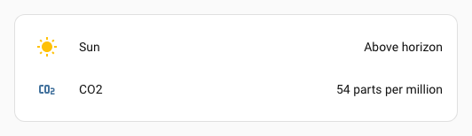
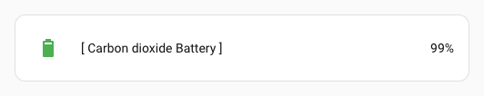
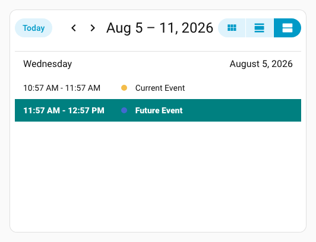
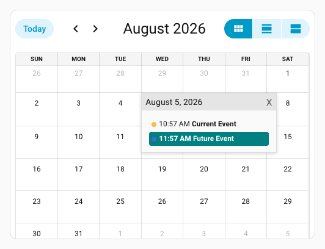

# :mag: Search spark

The `search` spark queries a container element with a CSS selector, optionally filters the results by a text regex, and then applies class, attribute, and/or text mutations to every matching element. It also sets up a `MutationObserver` so that newly added elements (for example, calendar events after month navigation) are automatically processed without any additional configuration.

## Basic usage

Add a `search` entry to `forge.sparks`:

```yaml
type: custom:uix-forge
forge:
  mold: card
  sparks:
    - type: search
      for: hui-calendar-card $ ha-full-calendar $
      query: .fc-event-title
      text: "Meeting"
      actions:
        add_class:
          - highlight
element:
  type: calendar
  entities:
    - calendar.work
```

`query` is a CSS selector passed to `querySelectorAll` on the resolved container. `text` is a regex that is tested against the full text content of each matched element (including text inside child elements such as `<a>` or `<span>`). Only elements that pass the text filter receive the `actions`.

## Configuration

| Key | Type | Required | Default | Description |
| --- | ---- | -------- | ------- | ----------- |
| `type` | `string` | ✅ | — | Must be `search`. |
| `for` | `string` | | `element` | UIX selector for the container element to search within. Supports `$` for shadow-root crossings (see [DOM navigation](../../concepts/dom.md)). Default `element` refers to the root of the forged element. |
| `query` | `string` | ✅ | — | CSS selector passed to `querySelectorAll` on the resolved container. All matching elements receive the configured `actions`. |
| `text` | `string` | | — | Regular expression string. When provided, only elements whose full text content (including text inside child elements) matches the regex are processed. |
| `actions` | `object` | | `{}` | Mutations to apply to each matching element. See [Actions](#actions) below. |

!!! tip
    Use the [`uix_forge_path()`](../../concepts/dom.md#uix_forge_path0-forge-helper) console helper to find the exact selector for `for`.

### Actions

The `actions` object may contain any combination of the following keys. All keys are optional.

| Key | Type | Description |
| --- | ---- | ----------- |
| `add_class` | `list[string]` | CSS class names to add to each matching element. |
| `remove_class` | `list[string]` | CSS class names to remove from each matching element. |
| `add_attribute` | `list[{attribute, value}]` | HTML attributes to set. Each entry must have an `attribute` name and a `value` string. |
| `remove_attribute` | `list[string]` | HTML attribute names to remove from each matching element. |
| `replace_text` | `string` \| `{find, replace}` | Regex-based text replacement applied to every text node inside the element. A **string** is used as the regex pattern and the match is replaced with an empty string. An **object** with `find` and `replace` keys replaces each match with the `replace` value. |
| `prepend_text` | `string` | Text to prepend to every text node inside the element. |
| `append_text` | `string` | Text to append to every text node inside the element. |

## Examples

### Add a CSS class to calendar events matching a regex

```yaml
type: custom:uix-forge
forge:
  mold: card
  sparks:
    - type: search
      for: hui-calendar-card $ ha-full-calendar $
      query: .fc-event-title
      text: ^(Future|Timetravel)
      actions:
        add_class:
          - future-event
element:
  type: calendar
  entities:
    - calendar.calendar_1
    - calendar.calendar_2
  uix:
    style:
      ha-full-calendar $: |
        .future-event {
          background: teal;
          color: white;
          font-weight: 900;
        }
        .fc-daygrid-event:has(.future-event) {
          background-color: teal !important;
          border-color: blue !important;
          border-width: 2px;
        }
        .fc-event-time:has(+ .future-event) {
          background: teal;
          color: white;
          font-weight: 900;      
        }
```


### Remove an attribute from all matched elements

Strip `title` attributes from every link inside a markdown card so the browser's native tooltip does not appear:

```yaml
type: custom:uix-forge
forge:
  mold: card
  sparks:
    - type: search
      for: >-
        hui-entities-card $ div:nth-child(2) hui-sensor-entity-row $ hui-generic-entity-row $
      query: .info
      text: Carbon dioxide
      actions:
        replace_text:
          find: Carbon dioxide
          replace: CO2
    - type: search
      for: hui-entities-card $ div:nth-child(2) hui-sensor-entity-row $
      query: hui-generic-entity-row
      text: ppm
      actions:
        replace_text:
          find: ppm
          replace: parts per million
element:
  type: entities
  entities:
    - sun.sun
    - sensor.carbon_dioxide
```



### Prepend and append text

Add a prefix and suffix to first entities row info:

```yaml
type: custom:uix-forge
forge:
  mold: card
  sparks:
    - type: search
      for: hui-entities-card $ div:nth-child(1) hui-sensor-entity-row $ hui-generic-entity-row $
      query: .info
      actions:
        prepend_text: "[ "
        append_text: " ]"
element:
  type: entities
  entities:
    - sensor.carbon_dioxide_battery
```



### Match text inside child elements

The `text` filter matches the **full** text content of each element, including text wrapped inside child elements like `<a>`, `<span>`, etc.

This example builds on from the earlier calendar example to include highlighting list events by adding the `future-event` class by querying `.fc-list-event-title`. Additional styling also added, using a selector that enables to select a preceding sibling of `.future-event` by using `:has` pseudo class with subsequent sibling combinator `+`.

```yaml
type: custom:uix-forge
forge:
  mold: card
  sparks:
    - type: search
      for: hui-calendar-card $ ha-full-calendar $
      query: .fc-event-title
      text: ^(Future|Timetravel)
      actions:
        add_class:
          - future-event
    - type: search
      for: hui-calendar-card $ ha-full-calendar $
      query: .fc-list-event-title
      text: ^(Future|Timetravel) # Matches even though `Future` is in child <a> link
      actions:
        add_class:
          - future-event
element:
  type: calendar
  initial_view: listWeek
  entities:
    - calendar.calendar_1
    - calendar.calendar_2
  uix:
    style:
      ha-full-calendar $: |
        .future-event {
          background: teal;
          color: white;
          font-weight: 900;
        }
        .fc-daygrid-event:has(.future-event) {
          background-color: teal !important;
          border-color: blue !important;
        }
        .fc-event-time:has(+ .future-event) {
          background: teal;
          color: white;
          font-weight: 900;      
        }
        .fc-list-event-graphic:has(+ .future-event) {
          background: teal;
          color: white;
          font-weight: 900;   
          border-bottom-left-radius: 0;
          border-bottom-right-radius: 0;
        }
        .fc-list-event-time:has(~ .future-event) {
          background: teal;
          color: white;
          font-weight: 900;   
          border-bottom-left-radius: 0;
          border-bottom-right-radius: 0;
        }
        .fc-list-event-title.future-event {
          border-bottom-left-radius: 0;
          border-bottom-right-radius: 0;
        }
```





!!! note
    - **All** elements returned by `query` receive the actions. Use `text` to narrow the selection to elements whose text content matches a regex.
    - The spark watches the container with a `MutationObserver` so dynamically added elements (e.g. after navigating a calendar month) are processed automatically.
