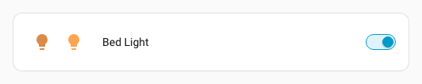
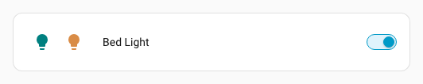
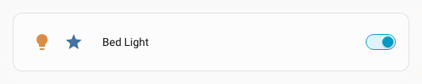

# :shield: State Badge spark

The `state-badge` spark inserts a Home Assistant [`state-badge`](https://github.com/home-assistant/frontend/blob/dev/src/components/entity/state-badge.ts) element as a DOM sibling immediately **before** or **after** a target element inside a forged element.

The badge can display:

- an entity's state icon, picture, or camera feed (via `entity`)
- a fixed override icon (via `override_icon`)
- a fixed override image URL (via `override_image`)

## Basic usage

Add a `state-badge` entry to `forge.sparks` with either `after` or `before` to specify the target element, and one of `entity`, `override_icon`, or `override_image` to provide the badge content.

The `after`/`before` value is a selector that locates the target element within the forged element. It supports the same [DOM navigation syntax](../../concepts/dom.md) as UIX styles, including `$` to cross shadow-root boundaries.

Since `state-badge` is most commonly found inside entity rows, the typical use case is with `mold: row`. The row element itself has a shadow root, so use `$` to cross into it and target the `state-badge` inside.

!!! tip
    If you are inserting a state badge **before** another state badge you will need to be specific in your selector so as to not select the inserted icon on updates. State badges added by this spark have an attribute `data-uix-forge-state-badge-id` so you can use this with your selector. e.g. `hui-tile-card $ ha-tile-icon:not([data-uix-forge-state-badge-id])`

```yaml
type: entities
entities:
  - type: custom:uix-forge
    forge:
      mold: row
      sparks:
        - type: state-badge
          before: $ hui-generic-entity-row $ state-badge:not([data-uix-forge-state-badge-id])
          entity: light.ceiling_lights
    element:
      entity: light.bed_light
```


## Configuration

| Key | Type | Required | Default | Description |
| --- | ---- | -------- | ------- | ----------- |
| `type` | `string` | ✅ | — | Must be `state-badge`. |
| `after` | `string` | one of `after`/`before` ✅ | — | UIX selector for the reference element. The badge is inserted as a sibling **after** the matched element. When the UIX Forge element is using [Blank card config](../forge.md#blank-card-config), the default is `uix-forge-blank-card $ div.content`. Otherwise, `""`. If you wish to target `before` using Blank card config, set explicitly to `""`. |
| `before` | `string` | one of `after`/`before` ✅ | — | UIX selector for the reference element. The badge is inserted as a sibling **before** the matched element. |
| `entity` | `string` | ✅ | — | Entity ID whose current state object is passed to `state-badge`, displaying the entity's native state icon, picture, or camera feed. |
| `override_icon` | `string` | | — | MDI icon string (e.g. `mdi:star`) that overrides the entity's default icon. Can be combined with `entity`. |
| `override_image` | `string` | | — | URL of an image that replaces the icon entirely. Can be combined with `entity`. |
| `color` | string | | — | Set the icon color when the entity is active for the state badge. By default, the color is based on the `state`, `domain`, and `device_class` of the entity. To disable coloring, set to `none`. It accepts `state`, `none`, a Home Assistant [color token](https://www.home-assistant.io/dashboards/tile/#available-colors), or a hex color code. |

!!! note
    - Exactly one of `after` or `before` must be provided.
    - The spark targets the **first** element matched by `after`/`before`.
    - The inserted `state-badge` element is placed in the same parent as the target element — it is a sibling, not a child.
    - If you are inserting a state badge **before** another state badge, be specific in your selector to avoid re-selecting the inserted badge on updates. State badges added by this spark have a `data-uix-forge-state-badge-id` attribute you can use for exclusion, e.g. `state-badge:not([data-uix-forge-state-badge-id])`.
  
!!! tip
    You can use the [`uix_forge_path()`](../../concepts/dom.md#uix_forge_path0-forge-helper) DOM helper to take the guesswork out of finding the right path for `before/after`.

## Examples

??? example "Insert an entity state badge after the existing badge"
    ```yaml
    type: entities
    entities:
      - type: custom:uix-forge
        forge:
          mold: row
          sparks:
            - type: state-badge
              after: $ hui-generic-entity-row $ state-badge
              entity: light.ceiling_lights
        element:
          entity: light.bed_light
    ```

    

??? example "Insert a state badge with a fixed color"
    ```yaml
    type: entities
    entities:
      - type: custom:uix-forge
        forge:
          mold: row
          sparks:
            - type: state-badge
              before: $ hui-generic-entity-row $ state-badge:not([data-uix-forge-state-badge-id])
              entity: light.ceiling_lights
              color: teal
        element:
          entity: light.bed_light
    ```

    

??? example "Insert a badge with an override icon and no state coloring"
    ```yaml
    type: entities
    entities:
      - type: custom:uix-forge
        forge:
          mold: row
          sparks:
            - type: state-badge
              after: $ hui-generic-entity-row $ state-badge
              entity: light.ceiling_lights
              override_icon: mdi:star
              color: none
        element:
          entity: light.bed_light
    ```

    

??? example "Insert a badge with an image override"
    ```yaml
    type: entities
    entities:
      - type: custom:uix-forge
        forge:
          mold: row
          sparks:
            - type: state-badge
              after: $ hui-generic-entity-row $ state-badge
              override_image: /local/my-icon.png
        element:
          entity: light.bed_light
    ```

    

??? example "Adding a tooltip spark to the added state-badge"
    The tooltip spark will retry attaching the tooltip so will find the added state badge on retry
    ```yaml
    type: entities
    entities:
      - type: custom:uix-forge
        forge:
          mold: row
          sparks:
            - type: tooltip
              for: >-
                $ hui-generic-entity-row $
                state-badge[data-uix-forge-state-badge-id]
              content: Ceiling lights badge
            - type: state-badge
              after: $ hui-generic-entity-row $ state-badge
              entity: light.ceiling_lights
              override_icon: mdi:star
              color: none
        element:
          entity: light.bed_light
    ```

    
