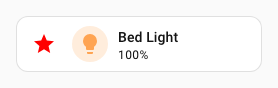
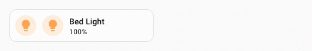
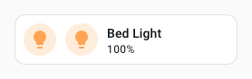
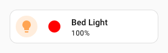
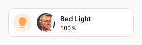

# :star: Tile Icon spark

The `tile-icon` spark inserts a `ha-tile-icon` element as a DOM sibling immediately **before** or **after** a target element inside a forged element.

The icon source can be:

- a fixed MDI icon string (`icon`)
- an SVG path string (`icon_path`)
- an image URL (`image_url`)
- an entity whose state icon is displayed via `ha-state-icon` placed in the tile icon's `icon` slot (`entity`)

Optionally the tile icon can be made interactive with tap/hold/double-tap [actions](#actions).

## Basic usage

Add a `tile-icon` entry to `forge.sparks` with either `after` or `before` to specify the target element, and one of `icon`, `icon_path`, `image_url`, or `entity` to provide the icon source.

The `after`/`before` value is a selector that locates the target element within the forged element. It supports the same [DOM navigation syntax](../../concepts/dom.md) as UIX styles, including `$` to cross shadow-root boundaries.

!!! tip
    If you are inserting a tile icon **before** another tile icon, you will need to be specific in your selector so as to not select the inserted icon on updates. Tile icons added by this spark have an attribute `data-uix-forge-tile-icon-id` so you can use this with your selector. e.g. `hui-tile-card $ ha-tile-icon:not([data-uix-forge-tile-icon-id])`

```yaml
type: custom:uix-forge
forge:
  mold: card
  sparks:
    - type: tile-icon
      before: hui-tile-card $ ha-tile-icon:not([data-uix-forge-tile-icon-id])
      icon: mdi:star
      color: red
element:
  type: tile
  entity: light.bed_light
```



## Configuration

| Key | Type | Required | Default | Description |
| --- | ---- | -------- | ------- | ----------- |
| `type` | `string` | ✅ | — | Must be `tile-icon`. |
| `after` | `string` | one of `after`/`before` ✅ | — | UIX selector for the reference element. The icon is inserted as a sibling **after** the matched element. When the UIX Forge element is using [Blank card config](../forge.md#blank-card-config), the default is `uix-forge-blank-card $ div.content`. Otherwise, `""`. If you wish to target `before` using Blank card config, set explicitly to `""`. |
| `before` | `string` | one of `after`/`before` ✅ | — | UIX selector for the reference element. The icon is inserted as a sibling **before** the matched element. |
| `icon` | `string` | one of `icon`/`icon_path`/`image_url`/`entity` ✅ | — | MDI icon string (e.g. `mdi:star`). `icon` can also be used to replace the default entity icon if `entity` is set. |
| `icon_path` | `string` | one of `icon`/`icon_path`/`image_url`/`entity` ✅ | — | SVG path string passed to `ha-tile-icon` as its `iconPath` property (rendered via `ha-svg-icon`). |
| `image_url` | `string` | one of `icon`/`icon_path`/`image_url`/`entity` ✅ | — | URL of an image to display inside the tile icon. |
| `entity` | `string` | one of `icon`/`icon_path`/`image_url`/`entity` ✅ | — | Entity ID whose current state object is passed to a `ha-state-icon` placed in the tile icon's `icon` slot, displaying the entity's native state icon. |
| `color` | CSS color | | - | Color to apply to tile icon. Overrides entity state color |
| `tap_action` | action | | — | Action to perform on tap. |
| `hold_action` | action | | — | Action to perform on hold. |
| `double_tap_action` | action | — | — | Action to perform on double tap. |

!!! note
    Exactly one of `after` or `before` must be provided, and exactly one icon source (`icon`, `icon_path`, `image_url`, or `entity`) must be provided.

!!! tip
    You can use the [`uix_forge_path()`](../../concepts/dom.md#uix_forge_path0-forge-helper) DOM helper to take the guesswork out of finding the right path for `before/after`.

## Actions

When one or more action keys are set (`tap_action`, `hold_action`, `double_tap_action`), the tile icon is automatically made interactive.

```yaml
type: custom:uix-forge
forge:
  mold: card
  sparks:
    - type: tile-icon
      after: hui-tile-card $ ha-tile-icon
      entity: light.ceiling_lights
      tap_action:
        action: toggle
      hold_action:
        action: more-info
element:
  type: tile
  entity: light.bed_light
```



!!! note
    - The spark targets the **first** element matched by `after`/`before`.
    - The inserted `ha-tile-icon` element is placed in the same parent as the target element — it is a sibling, not a child.
    - If you are inserting a tile icon **before** another tile icon, you will need to be specific in your selector so as to not select the inserted icon on updates. Tile icons added by this spark have an attribute `data-uix-forge-tile-icon-id` so you can use this with your selector. e.g. `hui-tile-card $ ha-tile-icon:not([data-uix-forge-tile-icon-id])`

## Examples

??? example "Insert an icon after an element using a fixed icon with color blue"
    ```yaml
    type: custom:uix-forge
    forge:
      mold: card
      sparks:
        - type: tile-icon
          after: hui-tile-card $ ha-tile-icon
          icon: mdi:chevron-right
          color: blue
    element:
      type: tile
      entity: light.bed_light
    ```

    

??? example "Insert an entity state icon before an element"
    ```yaml
    type: custom:uix-forge
    forge:
      mold: card
      sparks:
        - type: tile-icon
          before: hui-tile-card $ ha-tile-icon:not([data-uix-forge-tile-icon-id])
          entity: light.ceiling_lights
    element:
      type: tile
      entity: light.bed_light
    ```

    

??? example "Insert an icon using an SVG path"
    Path is a filled circle
    ```yaml
    type: custom:uix-forge
    forge:
      mold: card
      sparks:
        - type: tile-icon
          after: hui-tile-card $ ha-tile-icon
          icon_path: "M12 2C6.48 2 2 6.48 2 12s4.48 10 10 10 10-4.48 10-10S17.52 2 12 2z"
          color: red
    element:
      type: tile
      entity: light.bed_light
    ```

    

??? example "Insert an image icon"
    ```yaml
    type: custom:uix-forge
    forge:
      mold: card
      sparks:
        - type: tile-icon
          after: hui-tile-card $ ha-tile-icon
          image_url: /local/media/daniel_craig_cropped.png
    element:
      type: tile
      entity: light.bed_light
    ```

    

??? example "Cross a shadow boundary to reach a deeply nested element"
    ```yaml
    type: custom:uix-forge
    forge:
      mold: card
      sparks:
        - type: tile-icon
          before: hui-alarm-panel-card $$ ha-input
          icon: mdi:star
          color: red
    element:
      type: alarm-panel
      states: []
      entity: alarm_control_panel.security
    ```

    
