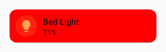

# Quick Start

!!! note inline end "Card-mod users"
    If you are migrating from Card-mod check out the [FAQ](./faq.md) where most of your questions will be answered. If you need to ask anything further, use the [GitHub discussions](https://github.com/Lint-Free-Technology/uix/discussions).

## Download

### HACS

[](https://my.home-assistant.io/redirect/hacs_repository/?owner=Lint-Free-Technology&repository=uix&category=integration)

Install UI eXtension via [HACS](https://hacs.xyz/). You can do this easily in a few steps by clicking the button above.

!!! hint "Download when viewing UI eXtension via HACS"
    If you are new to using HACS you may miss the step to actually Download the integration. Look for the Download button or choose from the `...` menu.

### Manual

Use your favorite method of accessing Home Assistant configuration files. Add `uix` folder to `custom_components`. Copy all files in [custom_components/uix](https://github.com/Lint-Free-Technology/uix/tree/master/custom_components/uix) to the `uix` folder.

## Add UI eXtension service

[](https://my.home-assistant.io/redirect/integration/?domain=uix)

Once the integration is downloaded and available in Home Assistant, you need to add the UI eXtension service to Home Assistant. This is done in the `Devices & services` section of `Settings` page in Home Assistant. You can do this easily in a few steps by clicking the button above.

Once the UI eXtension service has been added, refresh the page to make the Frontend resource available.

!!! question "Can't find UIX?"
    If you can't find UIX make sure that you have restarted Home Assistant after installing the integration via HACS or manually. If you installed via HACS you will have a repair notification waiting which you can use to restart Home Assistant.

## Your First UIX Styling

- Open your card in the Home Assistant GUI editor
- Click the `Show code editor` button at the bottom of the edit dialog
- Add the following to the bottom of yaml code:

```yaml
type: tile
entity: light.bed_light
uix:
  style: |
    ha-card {
      background: red;
    }
```

You should see the background of the card turn red as you type. You should also see a little brush icon popping up near the `Show visual editor` button. This indicates that this card has UIX code which will not be shown in the visual editor.



## Your first UIX Forge

Use the following YAML, adjusting for your entity, to forge a tile that will be hidden when `input_boolean.test_boolean` is `on`. Other `forge` and `element` options, while templates, do nothing more than set non-template values. This is to show that all element config and `hidden` and `grid_options` forge config may be templated (as well as `sparks`).

```yaml
type: custom:uix-forge
forge:
  mold: card
  show_error: false
  hidden: "{{ is_state('input_boolean.test_boolean', 'on') }}"
  grid_options:
    columns: "{{ 6 }}"
    rows: 1
element:
  type: tile
  icon: "{{ 'mdi:test-tube' }}"
  entity: "{{ 'sun.sun' }}"
  uix:
    style: |
      ha-card {
        background: red;
      }
```


