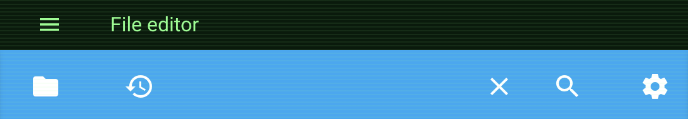

# App- und Ingress-Panels gestalten

Home Assistant zeigt eine einzelne App- oder Ingress-Seite in einem
`<ha-panel-app>`-Element an. Verwende den Theme-Schlüssel `uix-app` oder
`uix-app-yaml`, um den offenen Shadow Root dieses Panels zu gestalten.

Dies unterscheidet sich von der Liste der installierten Apps unter
`/config/apps/installed`. Diese gehört zum Konfigurationspanel und verwendet
`uix-config`.

## Beispiel

Dieses Beispiel gestaltet den Panel-Kopfbereich und legt ein nicht interaktives
CRT-Overlay über das Ingress-Iframe:

```yaml
Mein Theme:
  uix-theme: Mein Theme

  uix-app: |
    :host {
      position: relative;
    }

    .header {
      background: #041b0b !important;
      color: #7cff88 !important;
    }

    :host::after {
      content: "";
      position: absolute;
      inset: 0;
      z-index: 1;
      pointer-events: none;
      background: repeating-linear-gradient(
        to bottom,
        rgb(124 255 136 / 8%) 0,
        rgb(124 255 136 / 8%) 1px,
        transparent 1px,
        transparent 3px
      );
    }
```

{ width="450px" }

## Geltungsbereich

`uix-app` gestaltet die Home-Assistant-Oberfläche des Panels und kann das
Iframe überlagern. Das Dokument innerhalb des Iframes wird nicht gestaltet.
Ingress-Anwendungen teilen weder ein definiertes Root-Element noch einen
einheitlichen Render-Lebenszyklus. Die Gestaltung von Iframe-Inhalten ist daher
eine separate Funktion.
