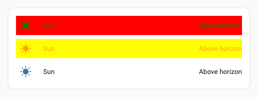

# Styling cards

Cards are styled by adding the following to the card configuration:

```yaml
uix:
  style: <styles>
```

In the simplest form, `<styles>` is a string of [CSS](https://www.w3schools.com/css/) which will be injected into the appropriate element based on the card type. See [Concepts - application](../concepts/application.md) for a detailed description on where UI eXtension is applied.

!!! note
    UI eXtension only works on cards that are contained by a `<hui-card>` element, or contain a `<ha-card>` element. This includes almost every standard Home Assistant Frontend card, and most custom cards.

For a card contained by a `<hui-card>` element, which is almost every standard Home Assistant Frontend card, styles are injected into a shadowRoot and the bottom most element is `:host`, though in most cases the first element in the shadowRoot is `<ha-card>`. For many custom cards which do not take advantage of the modern `<hui-root>` container, but contain a `<ha-card>` element, the styles are injected into ha-card and the bottommost element is `<ha-card>`. See [Concepts - application](../concepts/application.md) for more details.

!!! tip
    Home Assistant themes make use of [CSS variables](https://www.w3schools.com/css/css3_variables.asp). Those can both be set and used in UIX - prepended by two dashes:
    ```yaml
    type: tile
    entity: light.bed_light
    vertical: false
    features_position: bottom
    uix:
      style: |
        ha-card {
          --ha-card-background: teal;
          --ha-tile-info-primary-color: var(--yellow-color);
          --ha-tile-info-secondary-color: var(--white-color);
        }
    ```
    

You can also optionally set a local Home Assistant theme for just that styled element. The theme can contain [UIX Themes](./themes.md).

```yaml
uix:
  theme: my-awesome-theme
  style: |
    ha-card {
      color: var(--primary-color);
    }
```

`uix.theme` overrides the inherited/current theme for that UIX node and its UIX child paths unless a child sets its own `theme`. See [UIX Themes - Override with `uix.theme`](./themes.md#local-theme-override-with-uixtheme) for a full example.

### Custom CSS variables
UIX themes can be leveraged with [custom css variables](https://uix-guides.lf.technology/elements/2026/03/02/css-vars-entities.html), by declaring those high in the Frontend hierarchy, say `uix-drawer`, `uix-view`, or `uix-root`:

```yaml
uix-drawer: |

    :host {
      
      --darkslateblue-if-dark: {{ 'darkslateblue' if isDark else 'red' }};
      --slategrey-if-dark: {{ 'slategrey' if isDark else 'green' }};
      --yellow-if-not-dark: {{ 'yellow' if not isDark else 'pink' }};
      --orange-if-not-dark: {{ 'orange' if not isDark else 'purple' }};
    }
```

and use those custom css variables lower in the frontend hierarchy, say `uix-card` or `uix-dialog`, or even in a direct UIX card styling:

```yaml
type: entities
entities:
  - entity: sun.sun
    uix:
      style: |
        hui-generic-entity-row {
          background: var(--darkslateblue-if-dark);
          color: var(--slategrey-if-dark);
          --state-icon-color: var(--slategrey-if-dark);
        }
  - entity: sun.sun
    uix:
      style: |
        hui-generic-entity-row {
          background: var(--yellow-if-not-dark);
          color: var(--orange-if-not-dark);
          --state-icon-color: var(--orange-if-not-dark);
        }
  - entity: sun.sun
```


