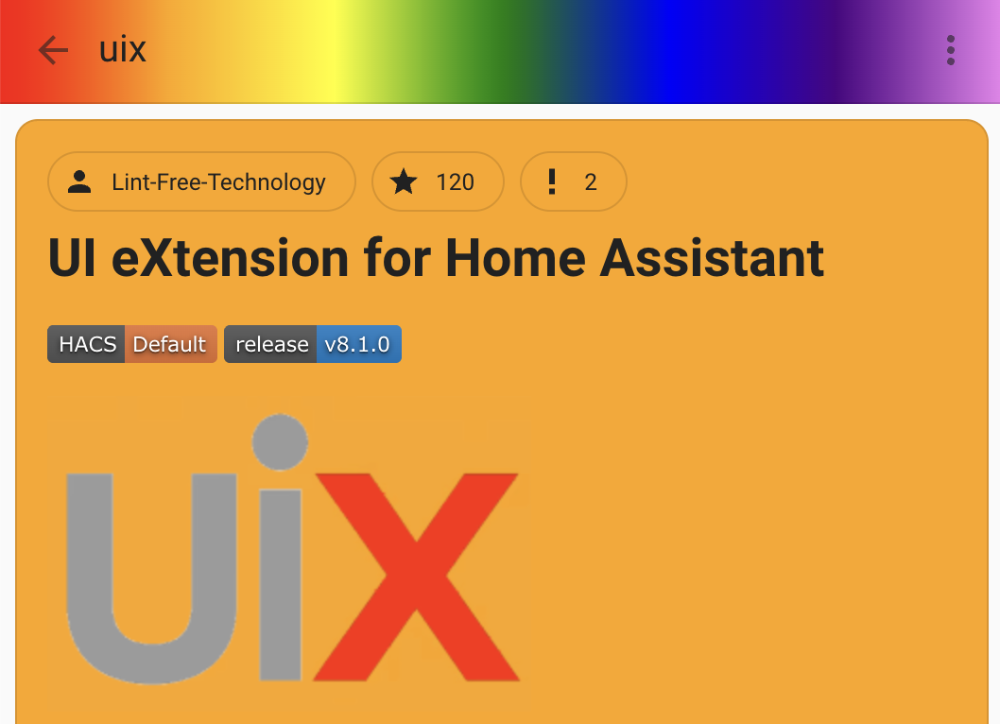

# Custom Panels stylen

UIX stylt Custom Panels, die nicht als iframe geladen werden, direkt. UIX kann außerdem Custom Panels stylen, die als iframe geladen werden. Derzeit ist dies eine experimentelle Funktion, die du aktivieren musst. Siehe [Extras – Custom Panels stylen](../extras/style-custom-panels.md).

!!! info "Als iframe geladenes Custom Panel – Funktionsweise"
    1. Als iframe geladene Custom Panels werden über einen Patch in `ha-panel-custom` gestylt. Dabei wird eine gepatchte Home-Assistant-Frontend-Datei `customPanelJS` erzeugt, die vom Custom-Panel-iframe verwendet wird. Sie führt zuerst das normale Home-Assistant-Frontend-`customPanelJS` und anschließend ein komprimiertes UIX-JavaScript-Modul aus.
    2. Wenn UIX erkennt, dass kein Theme angewendet wurde, wird UIX Styling mit dem aktuell geladenen Home-Assistant-Frontend-Theme angewendet. Einige Custom Panels wie [HACS](https://hacs.xyz) wenden das Theme selbst an; in diesem Fall erbt UIX Styling das angewendete Theme.
    3. [Home-Assistant-Custom-Panels](https://www.home-assistant.io/integrations/panel_custom/) werden über eine Konfiguration mit `name:` eingerichtet. UIX Styling nutzt diesen `name`, um die UIX-Theme-Variable für als iframe geladene Custom Panels zu erzeugen.

## Beispiele

### Direkt geladene Custom Panels stylen

Verwende die direkte Custom-Theme-Variable `uix-panel-custom(-yaml)`.

Beispiel für gezieltes Styling des Browser-Mod-Panels:

```yaml
UIX Test:

  uix-theme: UIX Test

  uix-panel-custom-yaml: |
    browser-mod-browser-panel $: |
      browser-mod-browser-settings-card {
        --card-background-color: red;
        --primary-text-color: white;
        --secondary-text-color: whitesmoke;
        --ha-color-form-background: darkorange;
      }
```

Beispiel für das Styling aller direkt geladenen Custom Panels:

```yaml
UIX Test:

  uix-theme: UIX Test

  uix-panel-custom: |
    ha-panel-custom > * {
      --card-background-color: red;
      --primary-text-color: white;
      --secondary-text-color: whitesmoke;
      --ha-color-form-background: darkorange;
    }
```

Das Ergebnis der beiden Beispiele ist identisch, wenn das Browser-Mod-Browser-Panel angezeigt wird.

??? example "Browser-Mod-Browser-Panel-Styling"
    

!!! info
    Custom Panels verwenden im DOM nicht immer shadowRoots oder Home-Assistant-Elemente. Daher musst du das Custom Panel eventuell inspizieren, um zu verstehen, welche Teile du themen kannst.

### Als iframe geladene Custom Panels stylen

Verwende die Theme-Variable `uix-<name>(-yaml)`, wobei `name` der Name des [Custom Panels](https://www.home-assistant.io/integrations/panel_custom/) ist. Wenn du den Namen des Custom Panels nicht kennst, nutze die Inspector-Werkzeuge eines Desktop-Browsers und prüfe, welches Element im DOM des iframe als erstes erscheint. Das Tag dieses Elements ist der Name des Custom Panels.

Beispiel für das Styling des als iframe geladenen [HACS](https://hacs.xyz)-Custom-Panels:

Bei HACS lautet der Custom-Panel-Name `hacs-frontend`; die UIX-Styling-Theme-Variable ist daher `uix-hacs-frontend(-yaml)`. Das folgende Theme versieht die Toolbar des HACS-Custom-Panels mit einem Regenbogeneffekt und setzt einige Card-Styling-Variablen.

```yaml
UIX Test:

  uix-theme: UIX Test

  uix-hacs-frontend-yaml: |
    hacs-dashboard $ hass-tabs-subpage-data-table $ hass-tabs-subpage $: |
      .toolbar {
        background: linear-gradient(90deg, red, orange, yellow, green, blue, indigo, violet);
      }
    hacs-repository-dashboard $:
      .: |
        ha-card {
          background-color: orange;
        }
      hass-subpage $: |
        .toolbar {
          background: linear-gradient(90deg, red, orange, yellow, green, blue, indigo, violet);
        }
      hass-loading-screen $: |
        .toolbar {
          background: linear-gradient(90deg, red, orange, yellow, green, blue, indigo, violet);
        }
```

??? example "HACS-Panel-Styling"
    

!!! warning "Theme-Aktualisierungen"
    Theme-Aktualisierungen am aktuell ausgewählten Theme des Nutzers werden angewendet, während das Custom Panel angezeigt wird. Wenn du jedoch das Theme für den Nutzer änderst, der das Custom Panel gerade betrachtet, musst du das Panel aktualisieren, damit das neue Theme angewendet wird.
