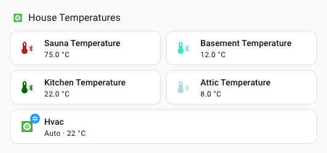

# Styling icons

With UI eXtension installed, the `ha-state-icon`, `<ha-icon>` or `ha-svg-icon` elements - used, for example, by `tile`, `entities`, `glance`, `heading` and many more cards can have its icon and color set using CSS variables either directly in UIX styling on the card or by theme.

## Specifying for an entity override

Define CSS variables of the form `--uix-icon-for-<entity_id>` and/or `--uix-icon-color-for-<entity_id>`, where every `.` in the entity ID is replaced with `_`. When an icon is rendered its icon and/or color is replaced with the supplied icon and/or color.

Templates are supported. For use see [Full theme example](#full-theme-example).

!!! tip
    - The variable can be set at any ancestor level in the DOM. UIX will detect it on the element via computed styles. If the variable is not set, or the element's entity does not match, the original icon is left unchanged.
    - To style overrides for Home Assistant dashboards add `--uix-icon-for-<entity_id>` and/or `--uix-icon-color-for-<entity_id>` to theme variables `uix-root(-yaml)` and `uix-more-info(-yaml)`.
    - To style overrides for config and UI editing add `--uix-icon-for-<entity_id>` and/or `--uix-icon-color-for-<entity_id>` to theme variables `uix-config(-yaml)` and `uix-dialog(-yaml)`.
    - To style override for other UIX stylable panels add  `--uix-icon-for-<entity_id>` and/or `--uix-icon-color-for-<entity_id>` to the appropriate theme variable. e.g. For History panel add the overrides to `uix-history(-yaml)`.

## Specifying generic override

Define generic CSS variables `--uix-icon` and/or `--uix-icon-color` in the context of the icon you wish to override.

When an icon is rendered its icon and/or color is replaced with the supplied icon and/or color.

Templates are supported.

!!! tip
    - If both `--uix-icon` and `--uix-icon-for-<entity_id>` are defined, `--uix-icon` takes precedence.
    - If both `--uix-icon-color` and `--uix-icon-color-for-<entity_id>` are defined, `--uix-icon-color` takes precedence.
    - In some cases to be able to override an icon you need to define an icon in the card's config. e.g. `heading` card. Without an icon set in config, no icon is rendered for UIX to override.
    - Special care needs to be taken for elements that use more than the single icon in the `:host`, like when a tile icon also has a badge. In that case set the `--uix-icon` styling to specific icon. See example.

??? example "Generic override example"
    ```yaml
      - type: heading
        heading: House Temperatures
        heading_style: title
        icon: mdi:checkbox-blank-outline
        uix:
          style: |
            ha-icon {
              --uix-icon: {{ 'mdi:hvac' if is_state('climate.hvac', 'auto') else 'mdi:hvac-off' }};
              --uix-icon-color: {{ 'var(--state-climate-auto-color)' if is_state('climate.hvac', 'auto') else 'var(--state-inactive-color)' }};
            }
      - type: tile
        entity: sensor.sauna_temperature
        uix:
          style: |
            ha-tile-icon {
              --uix-icon: mdi:thermometer-bluetooth;
              --uix-icon-color:
              
               gray;
              
              
               dodgerblue
               lightblue
               turquoise
               green
               darkgreen
               orange
               crimson
               firebrick
              ;
              
            }
      - type: tile
        entity: sensor.basement_temperature
        uix:
          style: |
            ha-tile-icon {
              --uix-icon: mdi:thermometer-bluetooth;
              --uix-icon-color:
              
               gray;
              
              
               dodgerblue
               lightblue
               turquoise
               green
               darkgreen
               orange
               crimson
               firebrick
              ;
              
            }
      - type: tile
        entity: sensor.kitchen_temperature
        uix:
          style: |
            ha-tile-icon {
              --uix-icon: mdi:thermometer-bluetooth;
              --uix-icon-color:
              
               gray;
              
              
               dodgerblue
               lightblue
               turquoise
               green
               darkgreen
               orange
               crimson
               firebrick
              ;
              
            }
      - type: tile
        entity: sensor.attic_temperature
        uix:
          style: |
            ha-tile-icon {
              --uix-icon: mdi:thermometer-bluetooth;
              --uix-icon-color:
              
               gray;
              
              
               dodgerblue
               lightblue
               turquoise
               green
               darkgreen
               orange
               crimson
               firebrick
              ;
              
            }
      - type: tile
        entity: climate.hvac
        grid_options:
          columns: 12
          rows: 1
        uix:
          style: |
            ha-state-icon {
              --uix-icon: {{ 'mdi:hvac' if is_state('climate.hvac', 'auto') else 'mdi:hvac-off' }};
              --uix-icon-color: {{ 'var(--state-climate-auto-color)' if is_state('climate.hvac', 'auto') else 'var(--state-inactive-color)' }};
            }
    ```

    

## Full theme example

This example uses two macros in UIX theme and applying those macros in styling for theme variables `uix-root-yaml` and `uix-more-info-yaml`. While the root selector `.:` is the only selector used, the example uses the `-yaml` variants as you may already have these variants in your [theme](./themes.md).

Theme:

```yaml
uix-doc-icon-for-entity-theme:
  uix-theme: uix-doc-icon-for-entity-theme
  uix-macros-yaml: |
    temp_icon_color:
      params:
        - entity_id
      template: >
        
        --uix-icon-for-{{ entityString }}: mdi:thermometer-bluetooth;
        --uix-icon-color-for-{{ entityString }}:
        
         gray;
        
        
         dodgerblue
         lightblue
         turquoise
         green
         darkgreen
         orange
         crimson
         firebrick
        ;
        
    temp_icon_color_all:
      template: >
        
        
          {{ temp_icon_color(entity) }}
        

  uix-root-yaml: |
    .: |
      :host {
        {{ temp_icon_color_all() }}
      }
  
  uix-more-info-yaml: |
    .: |
      :host {
        {{ temp_icon_color_all() }}
      }
```

!!! tip
    `--uix-icon` and `--uix-icon-color` take precedence over `--uix-icon-for-<entity_id>` and/or `--uix-icon-color-for-<entity_id>`. See the `sensor.kitchen_temperature` tile in the example.

Dashboard cards (section):

```yaml
type: grid
cards:
  - type: heading
    heading: Temperatures
    heading_style: title
  - type: tile
    entity: sensor.sauna_temperature
    icon: ''
    vertical: false
    features_position: bottom
  - type: tile
    entity: sensor.basement_temperature
  - type: tile
    entity: sensor.kitchen_temperature
    uix:
      style: |
        ha-tile-icon {
          
            --uix-icon: mdi:thermometer-auto;
          
        }
  - type: tile
    entity: sensor.attic_temperature
```


