# UIX Forge

UIX Forge (`custom:uix-forge`) est un élément Lovelace personnalisé qui associe une configuration basée sur des modèles à des comportements supplémentaires appelés **sparks**. Utilisez-le pour :

- **Créer** n'importe quel élément Home Assistant standard à partir de modèles, afin que toute sa configuration réagisse aux états des entités, à l'utilisateur, au navigateur et aux autres variables de modèle.
- **Ajouter des sparks** — des comportements autonomes qui enrichissent l'élément créé.
- **Appliquer des styles UIX** à l'élément créé, comme à tout autre élément. Les variables des sparks sont également accessibles dans la variable de modèle `uixForge`.

!!! tip "Encapsuler avec UIX Forge"
    Dans les éditeurs YAML des cartes, badges, lignes, picture-elements et fonctionnalités de carte, cherchez l'icône :bulb: pour encapsuler rapidement le code de l'élément existant dans UIX Forge.

## Structure de base

```yaml
type: custom:uix-forge
forge:
  mold: card
  # sparks, macros, hidden et grid_options facultatifs…
element:
  type: tile
  entity: "{{ 'sun.sun' }}"
  # toute configuration d'élément valide ; modèles pris en charge
```

`forge` configure le comportement de UIX Forge ; `element` contient la configuration de l'élément Home Assistant affiché à l'intérieur.

## Options Forge

| Clé | Type | Modèles acceptés | Valeur par défaut | Description |
| --- | ---- | ---------------- | ------- | ----------- |
| `mold` | string | | (obligatoire) | Définit le type de création ; chaque `mold` applique le comportement requis dans le frontend Home Assistant. Types standard : `"card"`, `"badge"`, `"row"`, `"picture-element"`, `"section"`, `"footer"`, `"card-feature"`. Types inter-contextes : `"card_as_row"`, `"card_as_badge"`, `"row_as_card"`, `"row_as_badge"`, `"badge_as_card"`, `"badge_as_row"`, `"badge_as_picture_element"`. Voir les [moules inter-contextes](#cross-context-molds). |
| `macros` | mapping | | — | [Macros de modèle](../using/templates.md#macros) disponibles dans tous les modèles de la configuration Forge. Elles sont également transmises à `uix` pour Forge et l'élément créé. Voir [Variables et macros UIX Styling](#template-variables-and-macros). |
| `billets` | mapping | | — | [Billets](#billets) : valeurs YAML nommées disponibles comme constantes dans tous les modèles de la configuration Forge. |
| `hidden` | boolean | ✅ | `false` | Si la valeur est vraie, l'élément est masqué. |
| `grid_options` | mapping | ✅ | — | Options de grille Lovelace, par exemple `rows` et `columns`, lorsque `mold` vaut `card`. Ignorées pour les autres types. |
| `show_error` | boolean | | `false` | Si `true`, affiche la carte d'erreur Lovelace au lieu de masquer l'élément lorsque sa création échoue. |
| `template_nesting` | string | | `"<<>>"` | Chaîne de quatre caractères qui protège les modèles imbriqués. Elle contrôle les deux syntaxes Jinja : avec `<<>>` par défaut, utilisez `<<...>>` pour `{{...}}` et `<%...%>` pour ``. À utiliser si la configuration de l'élément contient elle-même une syntaxe de type Jinja2. Pour chaque niveau Forge supplémentaire, ajoutez une paire `<>`, par exemple `<<< >>>` et `<<% %>>` pour deux niveaux. |
| `sparks` | list | ✅ | `[]` | Liste des configurations de [sparks](./sparks/index.md) à appliquer à l'élément créé. |
| `delayed_hass` | boolean | | — | Retarde la transmission de l'objet hass à la carte jusqu'à son chargement. Cela peut éviter des erreurs de console ou d'autres problèmes avec certaines cartes personnalisées, par exemple `apexcharts_card`. |

!!! warning
    Les [macros de thème](../using/themes.md#macros) sont disponibles uniquement dans les modèles UIX Styling, pas dans les modèles `element` ou `forge` de UIX Forge.
    Utilisez les [fonderies globales](./foundries.md#global-foundries) de UIX Forge pour définir des `forge.macros` disponibles globalement ou selon le type de `mold`.

## Configuration de l'élément

Toute configuration Lovelace valide est acceptée. Chaque valeur de type chaîne dans `element` est traitée comme un modèle et dispose des mêmes variables que les [modèles UIX](../using/templates.md) : `config`, `user`, `browser`, `hash` et `panel`.

La clé `uix` de `element` est transmise telle quelle à [UIX Styling](../using/index.md), qui traite les modèles. Utilisez-la pour styliser l'élément créé comme n'importe quel autre élément :

!!! example inline end "Exemple Forge"
    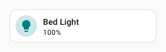

```yaml
type: custom:uix-forge
forge:
  mold: card
element:
  type: tile
  entity: light.bed_light
  uix:
    style: |
      ha-card {
        --tile-color: teal !important;
      }
```

<a id="element-entities-config"></a>
### Configuration des entités de l'élément

Vous pouvez aussi utiliser directement des modèles dans la configuration, par exemple pour générer les entités d'une carte `type: entities`. Cela peut remplacer l'utilisation du module personnalisé [auto-entities](https://github.com/Lint-Free-Technology/lovelace-auto-entities) pour créer une liste d'entités dynamique.

```yaml
type: custom:uix-forge
forge:
  mold: card
element:
  type: entities
  entities: |
    {{ integration_entities('sun') }}
```

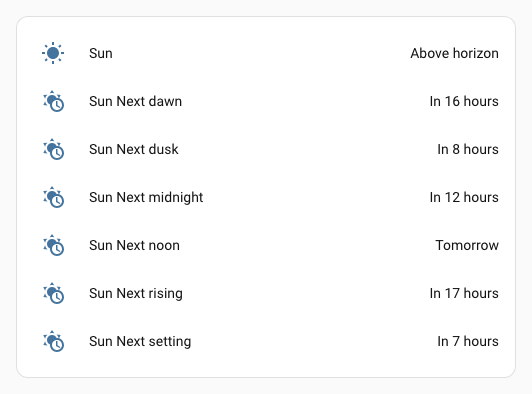

### Configuration de la carte vide

Avec les types `card`, `card_as_row` ou `card_as_badge`, si `element` ou `element.type` n'est pas défini, UIX Forge utilise la carte vide par défaut `custom:uix-forge-blank-card`. Vous pouvez ainsi appliquer directement des [sparks](./sparks/index.md) à une carte vide.

La configuration par défaut, sans spark, affiche un message d'espace réservé.

```yaml
type: "custom:uix-forge"
forge:
  mold: card
```


La définition de `element.title` affiche une carte contenant uniquement un titre.

```yaml
type: "custom:uix-forge"
forge:
  mold: card
element:
  title: "Blank Card Title"
```


Définissez `element.clear` pour rendre la carte vide transparente dans son contexte. Avec les types `card_as_row` et `card_as_badge`, cette transparence est activée automatiquement.

Cet exemple utilise UIX Forge avec `mold: card_as_row` dans une ligne Entities pour créer une carte vide sur laquelle le spark [`overlay-icon`](./sparks/overlay-icon.md) est affiché.

```yaml
type: entities
title: Entities Card
entities:
  - type: custom:uix-forge
    forge:
      mold: card_as_row
      sparks:
        - type: overlay-icon
          icon: mdi:shimmer
          icon_color: red
          icon_position:
            left: 10px
            top: 8px
      uix:
        style: |
          :host {
            --uix-forge-blank-card-height: 40px;
          }
```


!!! tip
    Sans autre contenu ajouté par un spark — comme élément frère ou enfant de la `div` — le contenu de la carte vide prend une hauteur de `var(--row-height, 56px)`. Si un élément frère existe mais reste vide, sa hauteur est `0px`. Dans tous les cas, vous pouvez définir explicitement cette hauteur avec la variable CSS `--uix-forge-blank-card-height`, comme dans l'exemple `card_as_row`.

<a id="template-variables-and-macros"></a>
## Variables de modèle et macros

Les macros Forge sont transmises à UIX Styling, à la fois pour Forge et pour l'élément créé. Vous pouvez donc les utiliser dans les styles de l'un comme de l'autre.

Les modèles s'exécutent dans des contextes différents selon qu'ils servent à créer l'élément, à styliser Forge ou à styliser l'élément. Le tableau ci-dessous résume ces contextes.

<!-- markdownlint-disable MD033 -->
<!-- markdownlint-disable MD046 -->
| Contexte | Variables de modèle |
| - | - |
| Modèles dans `forge` et `element`, sauf dans les styles `uix` | **Configuration Forge** : `config.forge`<br/> **Configuration de l'élément** : `config.element`<br/>`config.entity` est disponible si l'entité est définie dans la configuration globale `uix-forge`. |
| Modèles dans les styles `uix` de Forge | **Configuration Forge** : `config.forge`<br/>**Configuration de l'élément** : `config.element`<br/>`config.entity` est disponible si l'entité est définie dans la configuration globale `uix-forge`. |
| Modèles dans les styles `uix` de l'élément. Le modèle s'exécute dans le contexte UIX Styling habituel de l'élément créé. | **Configuration Forge** : indisponible<br/>**Configuration de l'élément** : `config`<br/>`config.entity` est disponible si l'entité est définie dans la configuration globale `uix-forge`. |

!!! tip
    Si vous définissez `entity` dans la configuration globale `uix-forge`, cette valeur sera disponible dans tous les contextes. Vous devez tout de même préciser l'entité de l'élément lorsqu'il en a besoin ; vous pouvez utiliser le modèle `config.entity`.
    ```yaml
    type: custom:uix-forge
    entity: light.bed_light
    forge:
      mold: card
    element:
      type: tile
      entity: "{{ config.entity }}"
      uix:
        style: |
          :host {
            --ha-card-border-color: {{ 'green' if is_state(config.entity, 'on') else 'red' }};
            --ha-card-border-width: 2px;
          }
    ```

    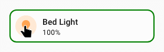

!!! warning
    Pour utiliser `config.entity` comme variable dans les modèles `forge` ou `element`, définissez `entity` sous forme de chaîne dans la configuration globale `uix-forge` ; les modèles n'y sont pas pris en charge. Pour composer l'ID d'une entité dans une [fonderie](foundries.md) à partir d'une partie variable, utilisez les `billets` et l'[interpolation des billets](#billet-interpolation).

    Exemple de fonderie fichier utilisant l'interpolation d'un billet dans un ID d'entité.

    ```yaml
    uix_foundries:
      uix_media_player:
        forge:
          mold: card
          billets:
            player_entity: media_player.cast_{player}
            player: ~ 
            name: ~ 
            icon: music
        element:
          type: custom:mini-media-player
          artwork: material
          adaptive_color: true
          entity: "{{ player_entity }}"
          icon: mdi:{{ icon }}
          name: >
            
              {{ name }}: Spotify
            
              {{ name }}: Music Assistant
            
              {{ name }}
            
    ```

### Exemple complet avec une macro

!!! example inline end "Exemple complet avec une macro"
    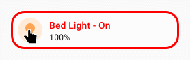

```yaml
type: custom:uix-forge
entity: light.bed_light
forge:
  mold: card
  macros:
    state_color:
      params:
        - entity_id
      template: "{{ 'red' if is_state(entity_id, 'on') else 'green' }}"
  uix:
    style: |
      :host {
        --ha-card-border-radius: 20px;
        --ha-card-border-color: {{ state_color(config.entity) }};
        --ha-card-border-width: 3px;
      }
element:
  type: tile
  entity: "{{ config.entity }}"
  name: "{{ device_name(config.entity) }} - {{ state_translated(config.entity) }}"
  uix:
    style: |
      span.primary {
        color: {{ state_color(config.entity) }};
      }
```

### Billets

Les billets sont des valeurs YAML nommées définies sous `forge.billets`. Ils sont disponibles comme constantes dans tous les modèles Forge **et** dans chaque style `uix:` de la carte Forge ou de l'élément créé. Contrairement aux macros, ils s'utilisent **sans parenthèses**. Les valeurs de type chaîne peuvent référencer d'autres billets avec la substitution `{name}` ; voir [Interpolation des billets](#billet-interpolation).

!!! warning
    Les billets ne peuvent pas contenir eux-mêmes des modèles Jinja2, sauf dans des objets `uix` imbriqués où le modèle est traité par UIX Styling et non par UIX Forge.

```yaml
type: custom:uix-forge
entity: light.bed_light
forge:
  mold: card
  grid_options:
    columns: 7
  billets:
    my_color: teal
    max_brightness: 255
    tags:
      - living_room
      - ambient
element:
  type: tile
  entity: "{{ config.entity }}"
  name: "{{ my_color | capitalize }} light"
  tap_action:
    action: perform-action
    perform_action: light.turn_on
    target:
      entity_id: "{{ config.entity }}"
    data:
      brightness: "{{ max_brightness }}"
  uix:
    style: |
      ha-card {
        --tile-color: {{ my_color }} !important;
      }
      ha-tile-info span:nth-of-type(2):after {
      
        content: ' - {{ tags | join(', ') }} - MAX';
        font-weight: 900;
      
        content: ' - {{ tags | join(', ') }}';
      
      }
```

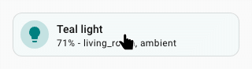

#### Types de billets

Le type YAML d'un billet détermine sa représentation dans les modèles :

| Type YAML | Exemple | Type Jinja2 | Utilisation dans un modèle |
| --------- | ------- | ----------- | -------------- |
| Vide (`~` ou `null`) | `my_billet: ~` | `none` | `{{ my_billet }}` → vide |
| Chaîne | `my_billet: hello` | `str` | `{{ my_billet }}` → `hello` |
| Nombre | `my_billet: 42` | `int` ou `float` | `{{ my_billet + 1 }}` → `43` |
| Booléen | `my_billet: true` | `bool` | `…` |
| Liste | `my_billet: [1, 2, 3]` | `list` | `{{ my_billet \| join(', ') }}` |
| Correspondance | `my_billet: {a: 1}` | `dict` | `{{ my_billet.a }}` |

Chaque billet est injecté sous forme d'instruction ``. Le type Jinja2 natif de chaque valeur YAML est ainsi conservé, sans enveloppe de macro.

<a id="billet-interpolation"></a>
#### Interpolation des billets

Les valeurs de type chaîne peuvent référencer d'autres billets avec la syntaxe `{name}`. Cette substitution simple est effectuée avant la conversion des billets en variables Jinja2. Utilisez `{name[N]}` pour référencer l'élément `N` (indexé à partir de zéro) d'un billet de type liste :

```yaml
forge:
  billets:
    room: "bed"                         # chaîne simple
    entity_id: "light.{room}_light"     # → "light.bed_light"
    scenes:
      - bright
      - dim
    default_scene: "{scenes[0]}"        # → "bright"
```

Les références entre billets sont résolues selon leurs dépendances ; leur ordre de déclaration n'a donc pas d'importance :

```yaml
billets:
  entity: "light.{room}_light" # → "light.bedroom_light"  (resolved after room)
  room: "{base}room"           # → "bedroom"  (resolved after base)
  base: "bed"
```

!!! note "Références circulaires"
    Si des billets se référencent en boucle, directement ou par une chaîne de références, aucun billet de cette boucle ne peut être résolu. UIX consigne une erreur pour chacun et conserve leurs valeurs telles quelles.

#### Billets et fonderies

Les billets suivent les mêmes règles de remplacement que les macros : une fonderie peut en définir et la configuration Forge locale peut remplacer certaines entrées. Seuls les billets référencés dans un modèle sont inclus dans son préambule.

Voir [Billets dans les fonderies](./foundries.md#billets-in-foundries) pour apprendre à définir des emplacements vides dans une fonderie et à gérer le cas `none` dans les modèles.

### Ignorer les modèles de la configuration de l'élément

`{# uix-forge.ignore #}`

Si vous devez transmettre un modèle entier tel quel à l'élément créé, vous pouvez demander à UIX Forge de ne pas le traiter. Utilisez cette option lorsque l'élément accepte des modèles dans sa configuration et que l'imbrication n'est pas nécessaire.

UIX Forge ignore les modèles qui contiennent `{# uix-forge.ignore #}`.

Exemples de cartes Markdown utilisant `{# uix-forge.ignore #}`.

```yaml
cards:
  # carte Markdown créée par Forge : son modèle content est traité par UIX Forge et config.entity est disponible
  - type: custom:uix-forge
    entity: light.bed_light
    forge:
      mold: card
    element:
      type: markdown
      content: |
        **config.entity:** {{ config.entity | default('light.ceiling_lights') }}

  # carte Markdown créée par Forge : le modèle content est ignoré par UIX Forge
  # config.entity n'existe pas pour cette carte Markdown ; le texte par défaut sera utilisé
  - type: custom:uix-forge
    entity: light.bed_light
    forge:
      mold: card
    element:
      type: markdown
      content: |
        {# uix-forge.ignore #}
        **config.entity:** {{ config.entity | default('light.ceiling_lights') }}
```

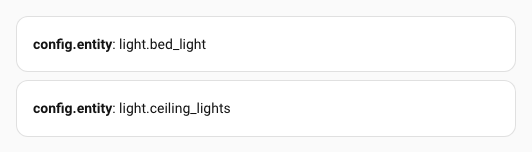

Si un modèle doit contenir à la fois un modèle Forge ou élément local et un modèle destiné à la carte elle-même, utilisez l'imbrication des modèles.

!!! warning "Ignorer les modèles et imbriquer plusieurs niveaux UIX Forge"
    L'ignorance des modèles repose sur un commentaire Jinja2 (`{# #}`), qui disparaît du modèle rendu. Si vous imbriquez plusieurs niveaux UIX Forge, utilisez l'imbrication des modèles pour contrôler leur traitement.

### Imbrication des modèles

Si l'élément que vous créez utilise des modèles de type Jinja ou les mêmes délimiteurs, comme ha-nunjucks, vous devez soit ignorer ces modèles, soit les imbriquer. Les délimiteurs d'imbrication par défaut sont `<<>>` ; vous pouvez les modifier dans la configuration Forge. Les délimiteurs Jinja d'instructions et de contrôle de flux (``) sont déduits de cette configuration. Avec `<<>>`, utilisez `<% %>` pour imbriquer une fois les instructions Jinja.

??? example "Exemple d'imbrication sur un niveau"
    L'exemple ci-dessous utilise `custom:template-entity-row`, qui prend lui-même en charge les modèles. Tout modèle destiné à être traité par `custom:template-entity-row` doit donc être entouré des délimiteurs `<<>>`.
    ```yaml
    type: custom:uix-forge
    entity: input_boolean.test_boolean
    forge:
      mold: card
    element:
      type: entities
      entities:
        - type: custom:template-entity-row
          entity: "{{ config.entity }}"
          state: |
            <<states(config.entity,with_unit=True)>>
    ```
    Voici la configuration rendue de la carte `entities`. Le modèle imbriqué devient un modèle final entouré des commentaires `{#uix#}`. Il sera ensuite traité par `custom:template-entity-row`, où `config.entity` fait référence à l'entité résolue `input_boolean.test_boolean`.
    ```yaml
    type: entities
    entities:
      - type: 'custom:template-entity-row'
        entity: input_boolean.test_boolean
        state: '{#uix#}{{states(config.entity,with_unit=True)}}{#uix#}'
    ```

#### Plusieurs niveaux d'imbrication

Lorsque plusieurs couches Forge sont imbriquées, chaque couche supplémentaire nécessite une paire `<` / `>` de plus, par exemple `<<<` / `>>>` et `<<% %>>` pour deux niveaux. UIX retire un niveau d'imbrication à chaque couche intermédiaire ; les bons délimiteurs atteignent ainsi automatiquement la couche finale. Définissez `template_nesting` selon le nombre total de couches à traverser.

??? example "Exemple avec plusieurs niveaux d'imbrication et résultat"
    ```yaml
    type: custom:uix-forge
    entity: media_player.kitchen # entité globale dans la configuration uix-forge
    forge:
      mold: card
      sparks:
        - type: grid
          for: "hui-grid-card $ #root"
          columns: 40% auto
          column_gap: 0px
    element:
      type: grid
      square: false
      cards:
        - type: custom:uix-forge
          entity: "{{ config.entity }}" # utiliser directement config.entity dans Forge imbriqué
          forge:
            mold: card
          element:
            entity: "{{ config.entity }}" # utiliser directement config.entity pour l'élément Forge imbriqué
            type: tile
            state_content: is_volume_muted
        - type: custom:uix-forge
          entity: "{{ config.entity }}" # utiliser directement config.entity dans Forge imbriqué
          forge:
            mold: card
          element:
            type: custom:custom-features-card
            features:
              - type: custom:service-call
                entries:
                  - type: button
                    entity_id: << config.entity >> # utiliser un niveau d'imbrication
                    icon: mdi:volume-high
                    haptics: true
                    tap_action:
                      action: perform-action
                      perform_action: media_player.volume_mute
                      target:
                        entity_id: |
                          <<< config.entity >>> {# utiliser deux niveaux d'imbrication #}
                      data:
                        is_volume_muted: true
    ```

    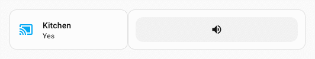

??? example "Plusieurs niveaux d'imbrication dans une carte Markdown"
    Dans cet exemple, le contenu Markdown traite le modèle imbriqué du premier niveau et affiche tel quel celui du deuxième niveau. Cela illustre le fonctionnement de l'imbrication.

    ```yaml
    type: custom:uix-forge
    forge:
      mold: card
    element:
      type: markdown
      content: |
        <<% if true %>><<< True >>><<% endif %>>
        <% if true %><< True >><% endif %>
    ```

    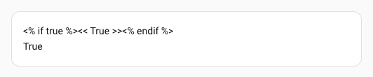

#### Imbrication des modèles et macros

L'imbrication des modèles **n'est pas** prise en charge dans les macros. Une macro ne peut pas renvoyer le texte d'un modèle déjà rendu. Les macros sont accessibles aux modèles UIX Forge et à UIX Styling, mais les modèles **ne peuvent pas** être traités dans le contexte d'une carte imbriquée ou créée, y compris une carte Markdown Home Assistant.

!!! tip
    Le choix d'imbriquer ou non les modèles du contenu Markdown dépend de votre usage. Sans imbrication, UIX Forge traite les modèles et actualise toute la carte Markdown à chaque changement. Si le contenu est dynamique et change souvent, l'imbrication permet à la carte Markdown d'utiliser son rendu optimisé et de ne mettre à jour que la ligne modifiée. Pour placer une logique complexe dans une macro de carte Markdown, vous pouvez l'enregistrer dans `custom_templates` de Home Assistant et l'appeler comme modèle imbriqué. Par exemple, si la macro est `content()`, utilisez `<< content() >>` pour que la carte Markdown la traite.

#### Utiliser des billets dans les modèles imbriqués

Les valeurs des billets sont disponibles comme variables Jinja2 dans les expressions `<<...>>`. Lorsqu'UIX construit le modèle, les variables des billets sont définies avec des instructions Jinja2 `` avant l'évaluation du corps du modèle par Home Assistant. Ainsi, `{{ billet_name }}` dans `<<...>>` est évalué par HA et sa valeur résolue est transmise à la carte destinataire.

!!! note "Vous venez de decluttering-card ?"
    Dans des outils comme decluttering-card, un espace réservé tel que `[[id]]` est remplacé en texte brut avant tout autre traitement. UIX Forge fonctionne différemment, mais aboutit au même résultat : il injecte les variables des billets dans le modèle Jinja2 généré, puis Home Assistant les évalue avec le reste du modèle. Ainsi, `{{ id }}` dans `<<...>>` est remplacé par la valeur du billet avant que la carte destinataire ne reçoive la chaîne.

    La différence essentielle est qu'il faut utiliser la syntaxe d'expression Jinja2 standard — `{{ billet_name }}` — et non la syntaxe d'interpolation entre billets (`{billet_name}`). La syntaxe `{...}` n'est disponible que dans les *valeurs* de billets pour référencer un autre billet, pas dans les expressions de modèle.

Un cas d'utilisation fréquent consiste à alimenter le modèle de filtre `auto-entities` avec un billet. Par exemple, si le billet `id` contient l'identifiant d'une pièce, vous pouvez générer la liste de ses entités d'appareil :

```yaml
type: custom:uix-forge
forge:
  mold: card
  billets:
    id: living_room
element:
  type: custom:auto-entities
  filter:
    template: >-
      <<device_entities(device_id('switch.{{id}}'))
      |reject('search','device')|list>>
  card:
    type: entities
```

Lorsqu'UIX traite le modèle, il ajoute au début ``. HA évalue ensuite le modèle et remplace `{{id}}` par `living_room`. L'expression transmise à `auto-entities` est :

```jinja
{#uix#}{{ device_entities(device_id('switch.living_room'))|reject('search','device')|list }}{#uix#}
```

`auto-entities` évalue cette expression Jinja2 et ajoute à la carte les entités correspondantes. Remplacez le billet `id` pour chaque instance, ou dans une fonderie, afin de réutiliser la même configuration Forge dans plusieurs pièces sans dupliquer la logique du filtre.

!!! tip
    Les billets étant résolus lors de l'évaluation du modèle UIX, leur valeur est **intégrée directement** à l'expression reçue par la carte. Si la carte doit réévaluer une valeur dynamiquement, par exemple selon un état HA qui change, écrivez cette logique sous forme d'appel de fonction Jinja2 dans le bloc `<<...>>` au lieu d'utiliser un billet pour cette partie dynamique.

??? warning "À lire avant de créer votre propre séquence d'imbrication"
    Lors de l'imbrication, les délimiteurs sont remplacés par des directives Jinja `raw` avant le rendu. Le remplacement inclut un marqueur qui permet au mécanisme interne de reconnaître le modèle imbriqué rendu. Avec les délimiteurs par défaut `<<>>`, `<<` devient `{#uix#}{{` et `>>` devient `}}{#uix#}`. Les délimiteurs de contrôle de flux sont déduits automatiquement : `<%` devient `{#uix#}{%` et `%>` devient `%}{#uix#}`. Si vous créez ces séquences sans raccourci d'imbrication, elles doivent être reproduites à l'identique pour que les contrôles internes de Forge aboutissent.

### Utiliser avec auto-entities

!!! tip
    Pour générer simplement des entités avec un modèle, vous pouvez créer une carte Entities et y définir directement la configuration `entities:`. Voir [Configuration des entités de l'élément](#element-entities-config).

UIX Forge prend en charge `custom:auto-entities` de deux façons :

1. Lorsque UIX Forge est la carte principale d'auto-entities, il accepte `entities` et le transmet à la configuration de l'élément, mais cette valeur n'est pas disponible dans `config.element.entities`.
2. Lorsque UIX Forge est utilisé comme carte d'entité dans les options `options` d'un filtre `include` auto-entities, il accepte l'`entity` transmise par auto-entities, mais ne la transmet pas à la configuration de l'élément. Elle reste disponible dans les modèles via `config.entity` ; utilisez `{{ config.entity }}` pour renseigner l'entité dans les options de carte.

??? example "Exemple avec auto-entities"
    ```yaml
    type: custom:auto-entities
    filter:
      include:
        - options:
            type: custom:uix-forge
            # auto-entities renseigne entity dans config ; la valeur est donc disponible dans les modèles
            forge:
              mold: card
              sparks:
                - type: tooltip
                  for: hui-tile-card $ ha-card
                  content: >-
                    {{ state_attr(config.entity,
                    'friendly_name') }} is {{ states(config.entity) }}
            element:
              entity: "{{ config.entity }}"
              type: tile
          area: bedroom
      exclude: []
    card:
      square: false
      type: grid
    show_empty: true
    card_param: cards
    ```

    

## UIX Styling

Ajoutez une clé `uix` sous `forge` pour appliquer [UIX Styling](../using/index.md) à l'enveloppe de l'élément Forge. Les variables `config.forge`, `config.element` et `uixForge` sont disponibles dans les modèles de style : `config.forge` et `config.element` contiennent les configurations résolues, et `uixForge` contient les variables de modèle des [sparks](./sparks/tooltip.md). `config.entity` est également disponible si l'entité est définie dans la configuration globale `uix-forge`.

```yaml
type: custom:uix-forge
forge:
  mold: card
  uix:
    style: |
      :host {
        --ha-card-border-radius: 50px;
      }
element:
  type: tile
  entity: light.bed_light
```

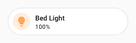

### Style de l'élément

UIX Styling s'applique à l'élément de la manière habituelle. Seule la variable `config` standard, résolue par UIX Styling pour les éléments, est disponible.

!!! warning
    Le style UIX de l'élément ne contient **PAS** les variables Forge et spark disponibles dans le style UIX de Forge. Pour les utiliser, appliquez UIX Styling à Forge plutôt qu'à l'élément créé.

```yaml
type: custom:uix-forge
forge:
  mold: card
  uix:
    style: |
      :host {
        --ha-card-border-radius: 50px;
      }
element:
  type: tile
  entity: light.bed_light
  uix:
    style: |
      span.primary::after {
        content: ' - {{ state_translated(config.entity) }}';
      }
```

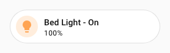

### Style de thème

Le type de thème attribué au conteneur UIX Forge correspond au type de `mold`, y compris les [moules inter-contextes](#cross-context-molds). Vous pouvez ainsi cibler le conteneur UIX Forge et styliser l'élément qu'il contient.

??? example "Thème pour le moule inter-contexte card_as_badge"
    Cet exemple applique un style de thème à toutes les cartes utilisées comme badges via `uix-card-as-badge-yaml`. Il suppose que ces cartes sont des cartes home-summary. *`energy` est commenté, car l'intégration de démonstration utilisée pour générer les images ne configure pas l'énergie.*

    Thème :
    ```yaml
    uix-card-as-badge-yaml: |
      .: |
        :host {
          --ha-tile-info-primary-font-size: var(--ha-font-size-s);
          --ha-card-border-radius: var(--ha-badge-border-radius, calc(var(--ha-badge-size, 36px) / 2));
        }
      hui-home-summary-card $: |
        ha-tile-container {
          line-height: 0;
        }
        ha-tile-icon {
          --mdc-icon-size: 18px;
          --tile-icon-size: 18px;
        }
      hui-home-summary-card $ ha-tile-info $: |
        div.info {
          flex-direction: row;
          align-items: center;
          gap: var(--ha-space-2);
        }
        div.info slot.primary span,
        div.info slot.secondary span {
          overflow: visible;
        }
      hui-home-summary-card $$ ha-tile-container $: |
        .container {
          margin: 0;
        }
        .content {
          gap: var(--ha-space-2) !important;
          padding: 8px 10px !important;
          min-height: unset !important;
        }
    ```

    Tableau de bord avec des cartes home-summary affichées comme badges :
    ```yaml
    - type: sections
      max_columns: 10
      title: Home Summary Cards as Badges
      path: home-summary-cards-as-badges
      header:
        layout: center
        badges_position: bottom
        badges_wrap: wrap
      badges:
        - type: custom:uix-forge
          forge:
            mold: card_as_badge
          element:
            type: home-summary
            summary: light
            tap_action:
              action: navigate
              navigation_path: /light?historyBack=1
        - type: custom:uix-forge
          forge:
            mold: card_as_badge
          element:
            type: home-summary
            summary: climate
            tap_action:
              action: navigate
              navigation_path: /climate?historyBack=1
        - type: custom:uix-forge
          forge:
            mold: card_as_badge
          element:
            type: home-summary
            summary: security
            tap_action:
              action: navigate
              navigation_path: /security?historyBack=1
        - type: custom:uix-forge
          forge:
            mold: card_as_badge
          element:
            type: home-summary
            summary: media_players
            tap_action:
              action: navigate
              navigation_path: /home/media-players
        # - type: custom:uix-forge
        #  forge:
        #    mold: card_as_badge
        #  element:
        #    type: home-summary
        #    summary: energy
        #    tap_action:
        #      action: navigate
        #      navigation_path: >-
        #        /energy/overview?historyBack=1&backPath=/dashboard-root/view-path
        - type: custom:uix-forge
          forge:
            mold: card_as_badge
          element:
            type: home-summary
            summary: maintenance
            tap_action:
              action: navigate
              navigation_path: >-
                /maintenance?historyBack=1&backPath=/dashboard-root/view-path
    ```

    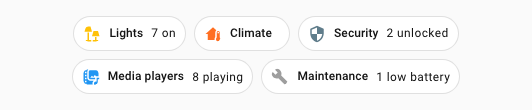

## Sections

Pour utiliser UIX Forge sur une section d'une vue Sections, ouvrez l'éditeur YAML de la section depuis le menu à trois points et remplacez son type par `custom:uix-forge`. Définissez `mold: section` dans la configuration Forge.

Avec UIX Forge pour les sections, vous pouvez définir directement les clés suivantes pour configurer leur affichage. Elles **ne prennent pas en charge les modèles** :

- `row_span`
- `column_span`
- `background`

```yaml
type: custom:uix-forge
forge:
  hidden: # use hidden to control visibility, templates supported
  # ...
element:
  # ...
# seules les clés principales de la section sont prises en charge ; pas la visibilité
row_span: # nombre de lignes de la section
column_span: # nombre de colonnes de la section
background: # arrière-plan de la section
```

Lors de la modification du tableau de bord en mode visuel, une bordure rouge en pointillés entoure la section pour indiquer que sa configuration UIX Forge est en YAML. Les cartes qu'elle contient sont visibles en aperçu, mais ne sont pas modifiables. Modifiez la section en YAML.

!!! warning
    La visibilité dans la configuration principale n'est pas prise en charge avec `mold: section`. Même si l'éditeur visuel Home Assistant permet de la définir, l'enregistrement de la section provoquera une erreur. Pour utiliser des options de visibilité frontend non prises en charge par les modèles, par exemple `screen`, placez une carte stack dans `element` et configurez sa visibilité frontend ; les modèles y sont acceptés.

## Pied de page

Utilisez `mold: footer` pour afficher une carte fixe en bas de la fenêtre. L'élément créé reste ancré au bas de l'écran, quelle que soit la position de la carte `custom:uix-forge` dans le tableau de bord. L'élément Forge utilise `display: contents` et n'occupe donc pas d'espace dans la grille.

Vous pouvez utiliser `mold: footer` dans les tableaux de bord Sections, Masonry et Panel. Dans une vue Sections, il remplace le pied de page Home Assistant standard et offre davantage de contrôle de visibilité grâce aux modèles dans `hidden`.

Lors de la modification du tableau de bord en mode visuel, une bordure rouge en pointillés entoure le pied de page pour indiquer que sa configuration UIX Forge est en YAML.

!!! note
    L'élément `<hui-view-footer>` utilise la position CSS `fixed` au lieu de `sticky`, utilisée par le pied de page d'une section. `sticky` dépend de l'élément parent ; seule la position `fixed` permet donc au pied de page Forge de sortir de son conteneur. Son apparence diffère légèrement : il est centré dans la fenêtre, et non uniquement dans la zone du tableau de bord. Ajustez-le si besoin avec des marges intérieures asymétriques via `--uix-forge-footer-padding`.

La clé de configuration Forge suivante définit la largeur maximale du pied de page :

| Clé | Type | Modèles acceptés | Valeur par défaut | Description |
| --- | ---- | ---------------- | ------- | ----------- |
| `max_width` | string | | `600` | Largeur maximale du pied de page en pixels. |

```yaml
type: custom:uix-forge
forge:
  mold: footer
  max_width: 400
element:
  type: tile
  entity: light.bed_light
```

Vous pouvez définir les variables CSS suivantes sur l'élément Forge ou l'un de ses ancêtres pour personnaliser le pied de page :

| Variable | Valeur par défaut | Description |
| -------- | ------- | ----------- |
| `--uix-forge-footer-border-width` | `1px` | Épaisseur de la bordure de la carte affichée dans le pied de page. |
| `--uix-forge-footer-bottom` | `var(--ha-space-2)` | Distance par rapport au bas de la fenêtre. |
| `--uix-forge-footer-padding` | `0 var(--ha-space-2)` | Marge intérieure du conteneur du pied de page. |

### Visibilité

Utilisez `forge.hidden` (modèles pris en charge) pour afficher ou masquer le pied de page :

```yaml
type: custom:uix-forge
forge:
  mold: footer
  hidden: "{{ is_state('input_boolean.show_footer', 'off') }}"
element:
  type: tile
  entity: light.bed_light
```

## Fonctionnalités de carte

Utilisez `mold: card-feature` lorsque UIX Forge sert de fonctionnalité de carte. Les modèles disposent alors d'une variable supplémentaire `context`, fournie par la carte hôte. Elle contient généralement `entity_id`, l'entité définie sur cette carte.

```yaml
type: tile
entity: light.bed_light
features:
  - type: custom:uix-forge
    forge:
      mold: card-feature
    element:
      type: |
        {{ "light-brightness" if is_state(context.entity_id, "on") else "toggle" }}
features_position: inline
```


Si plusieurs fonctionnalités de carte sont placées en bas et utilisent un modèle `hidden`, activez la hauteur automatique des lignes afin que la carte hôte ne conserve pas d'espace supplémentaire lorsqu'une fonctionnalité est masquée.

```yaml
type: tile
entity: light.bed_light
grid_options:
  columns: 12
  rows: auto
features:
  - type: toggle
  - type: custom:uix-forge
    entity: light.bed_light
    forge:
      mold: card-feature
      hidden: |
        {{ is_state(context.entity_id, "off") }}
    element:
      type: light-brightness
features_position: bottom
```


<a id="cross-context-molds"></a>
## Moules inter-contextes

Les moules inter-contextes permettent de **créer un type d'élément tout en se présentant comme un autre type** auprès du conteneur parent. Ils remplacent les astuces fragiles `custom:hui-element` et `custom:hui-xxx-card`, qui ne prennent pas en charge la visibilité et peuvent cesser de fonctionner après une mise à jour HA.

| Moule | Crée | Se comporte comme |
| ---- | ------ | ------- |
| `card_as_row` | `hui-card` (élément carte) | Ligne dans une carte entities ou fold-entity-row |
| `card_as_badge` | `hui-card` (élément carte) | Badge dans un conteneur de badges |
| `row_as_card` | Élément ligne | Carte dans une grille de cartes |
| `row_as_badge` | Élément ligne | Badge dans un conteneur de badges |
| `badge_as_card` | `hui-badge` (élément badge) | Carte dans une grille de cartes |
| `badge_as_row` | `hui-badge` (élément badge) | Ligne dans une carte entities ou fold-entity-row |
| `badge_as_picture_element` | `hui-badge` (élément badge) | Élément picture dans une carte picture-elements |

Chaque moule inter-contexte intercepte l'événement de visibilité natif de l'élément interne, met à jour son propre état masqué puis émet l'événement adapté pour le conteneur parent. `forge.hidden` (modèles pris en charge) fonctionne avec tous les moules inter-contextes.

Avec `badge_as_picture_element`, la configuration du badge doit inclure dans l'objet `style` les paramètres de positionnement habituels d'un picture-element.

### card_as_row — intégrer une carte comme ligne

Cas d'utilisation courant : intégrer une carte `glance`, `markdown`, `tile` ou tout autre type de carte directement dans une carte `entities` (ou `custom:fold-entity-row`). La carte est créée comme un véritable élément `hui-card`, tandis que UIX Forge la signale à la carte Entities parent comme une ligne standard.

```yaml
type: entities
title: "Bedroom"
icon: mdi:bed
entities:
  - type: "custom:uix-forge"
    forge:
      mold: card_as_row
    element:
      type: glance
      entities:
        - entity: light.bed_light
          name: Bed
        - entity: light.ceiling_lights
          name: Ceiling
        - entity: light.kitchen_lights
          name: Kitchen
  - entity: light.bed_light
```


### badge_as_picture_element — intégrer un badge dans un picture-element

```yaml
type: picture-elements
elements:
  - type: custom:uix-forge
    forge:
      mold: badge_as_picture_element
    element:
      type: entity
      entity: light.bed_light
      style:
        top: 25%
        left: 50%
image: https://demo.home-assistant.io/stub_config/floorplan.png
```


!!! tip "Visibilité"
    Contrairement à `custom:hui-element` et `custom:hui-xxx-card`, `forge.hidden` fonctionne avec `card_as_row`. Utilisez un modèle pour afficher ou masquer la carte intégrée selon une condition ; la carte Entities réagira correctement :
    ```yaml
    type: "custom:uix-forge"
    forge:
      mold: card_as_row
      hidden: "{{ is_state('sun.sun', 'below_horizon') }}"
    element:
      type: glance
      entities:
        - entity: sun.sun
    ```
