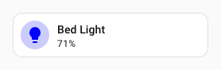
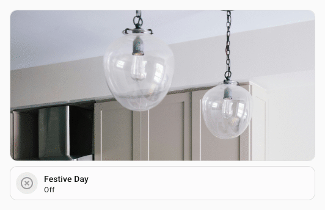

# Fonderies

Une **fonderie** est une configuration UIX Forge nommée et enregistrée dans Home Assistant. Elle sert de base réutilisable : définissez une fois les configurations `forge` et `element`, attribuez-leur un nom, puis référencez-les dans autant d'éléments que nécessaire avec la clé `foundry:`. La configuration locale de l'élément est fusionnée avec cette base ; vous pouvez donc remplacer chaque valeur pour une instance donnée.

<a id="global-foundries"></a>
## Fonderies globales

Deux noms de fonderie réservés sont fusionnés automatiquement dans **toutes** les configurations Forge du tableau de bord, qu'elles demandent explicitement une fonderie ou non.

- `global` — si une fonderie porte exactement ce nom, elle est fusionnée comme configuration de base de toutes les instances Forge.
- `global_<mold-type>` — si une fonderie porte ce nom (par exemple `global_card`, `global_badge` ou `global_row`), elle est fusionnée juste après `global` pour toutes les instances utilisant ce type de `mold`. Celui-ci est déterminé à partir de la configuration locale ou d'une fonderie explicitement référencée.

Ces fonderies permettent de définir un ensemble cohérent de macros, de sparks ou de styles par défaut sans ajouter `foundry: ma_fonderie_de_base` à chaque élément.

Consultez l'[exemple de fonderie globale utilisant une macro](#example-global-foundry-using-macro).

## Gérer les fonderies

Les fonderies se gèrent de deux façons : comme **fonderies via l'interface**, configurées dans Home Assistant (adaptées à un petit nombre de fonderies), ou comme **fonderies dans des fichiers YAML**, enregistrées sur le disque (plus pratiques pour les grandes collections, la création en série et le contrôle de version).

### Fonderies via l'interface

Les fonderies via l'interface se configurent dans l'interface de l'intégration Home Assistant et sont gérées par celle-ci.

1. Ouvrez **Paramètres → Appareils et services → UI eXtension → Configurer (roue dentée)**.
2. Choisissez **Gérer les fonderies de l'interface**, puis l'une des options :
   - **Ajouter une fonderie** — saisissez un nom et un objet de configuration YAML.
   - **Modifier une fonderie** — sélectionnez une fonderie dans la liste, puis modifiez sa configuration.
   - **Supprimer une fonderie** — sélectionnez une fonderie dans la liste et confirmez.

Le nom de la fonderie doit être unique. Il est utilisé avec la clé `foundry:` dans la configuration de l'élément.

### Fonderies dans des fichiers YAML

Vous pouvez enregistrer les fonderies dans des fichiers YAML ordinaires situés dans le dossier de configuration Home Assistant, ou accessibles depuis celui-ci, puis déclarer ces fichiers dans UIX. Cette méthode :

- permet le contrôle de version (Git, par exemple) ;
- permet d'utiliser l'éditeur de texte de votre choix ;
- prend en charge les ancres YAML (`&`) et les clés de fusion (`<<: *`) pour éviter les répétitions ;
- prend en charge `!include` et `!secret` sans guillemets, car Home Assistant charge le fichier avec son chargeur YAML natif.

#### Format du fichier

Chaque fichier doit contenir à la racine la clé `uix_foundries`, associée à une table reliant les noms des fonderies à leurs configurations :

```yaml
uix_foundries:
  light_tile:
    forge:
      mold: card
    element:
      type: tile
      entity: light.bed_light

  switch_tile:
    forge:
      mold: card
    element:
      type: tile
      entity: switch.living_room
```

#### Ancres YAML

Les ancres YAML et les clés de fusion facilitent le partage de valeurs répétées au même niveau de configuration. Par exemple, elles permettent de réutiliser des options de mise en forme pour plusieurs entités d'une carte `custom:multiple-entity-row` :

```yaml
uix_foundries:
  browser_multiple_entity_anchors:
    forge:
      mold: row
      billets:
        id: my_browser_id
    element:
      type: custom:multiple-entity-row
      entity: binary_sensor.{{ id }}
      entities:
        - entity: sensor.{{ id }}_browser_battery
          <<: &width                    # définir l'ancre dès sa première utilisation
            format: precision2
            styles:
              text-align: center
        - entity: sensor.{{ id }}_browser_height
          <<: *width                    # réutiliser les mêmes options de mise en forme
```

!!! warning "Les clés de fusion YAML sont superficielles"
    Les clés de fusion YAML (`<<: *anchor`) effectuent une fusion **superficielle** : elles ne copient que les clés de premier niveau. Elles ne conviennent donc pas au partage d'une base commune `forge` et `element` entre plusieurs fonderies, car une fusion à la racine remplacerait tout l'objet `element` au lieu d'en fusionner le contenu. Utilisez plutôt les [fonderies imbriquées](#nested-foundries), qui effectuent une fusion récursive en profondeur.

#### Déclarer un fichier

1. Ouvrez **Paramètres → Appareils et services → UI eXtension → Configurer (roue dentée)**.
2. Choisissez **Gérer les fichiers de fonderies**, puis **Déclarer un fichier de fonderies**.
3. Saisissez le chemin du fichier, absolu ou relatif au dossier de configuration Home Assistant (par exemple `uix/mes_fonderies.yaml`).

UIX vérifie le fichier avant d'enregistrer sa déclaration. Une erreur s'affiche si le fichier est introuvable, illisible ou dépourvu de la clé obligatoire `uix_foundries`.

#### Recharger les fichiers

Le contenu des fichiers est lu à la première demande de fonderies par le navigateur, puis à chaque mise à jour des fonderies. Pour forcer toutes les sessions connectées à recharger les derniers fichiers sans redémarrer Home Assistant :

1. Ouvrez **Paramètres → Appareils et services → UI eXtension → Configurer (roue dentée)**.
2. Choisissez **Gérer les fichiers de fonderies**, puis **Recharger les fichiers de fonderies**.

Si votre tableau de bord est en **mode YAML**, vous pouvez aussi utiliser le bouton **Actualiser** intégré au tableau de bord. UIX écoute l'événement `config-refresh` envoyé par ce bouton et relit automatiquement tous les fichiers de fonderies déclarés.

L'onglet YAML des outils Home Assistant comporte également un bouton `UIX Foundries` pour recharger les fichiers et afficher les éventuelles erreurs.

#### Supprimer la déclaration d'un fichier

1. Ouvrez **Paramètres → Appareils et services → UI eXtension → Configurer (roue dentée)**.
2. Choisissez **Gérer les fichiers de fonderies**, puis **Retirer la déclaration d'un fichier** et sélectionnez le fichier dans la liste.

Seule la déclaration est supprimée ; le fichier lui-même n'est pas effacé.

#### Priorité

Lorsqu'un même nom de fonderie apparaît dans un fichier YAML et dans l'interface, la **fonderie de l'interface est prioritaire**. Si le nom apparaît dans plusieurs fichiers, le **dernier fichier déclaré l'emporte**. Cette règle s'applique aussi aux noms réservés `global` et `global_<mold-type>`.

<a id="using-a-foundry"></a>
## Utiliser une fonderie

Référencez une fonderie par son nom avec la clé `foundry:` :

```yaml
type: custom:uix-forge
foundry: my_tile
```

Les configurations `forge` et `element` de la fonderie sont appliquées comme si elles figuraient directement dans la configuration UIX Forge.

Vous pouvez ajouter ou remplacer localement n'importe quelle clé ; les valeurs locales sont prioritaires sur celles de la fonderie :

```yaml
type: custom:uix-forge
foundry: my_tile
element:
  entity: light.kitchen
```

## Structure de la configuration d'une fonderie

Une fonderie est un objet YAML qui peut contenir les clés `forge` et `element`, seules ou ensemble :

```yaml
forge:
  mold: card
  uix:
    style:
      hui-tile-card $: |
        ha-card {
          --tile-color: red !important;
        }
element:
  type: tile
  entity: "{{ 'sun.sun' }}"
```

Les mêmes clés sont disponibles que dans un élément `uix-forge` classique. Consultez la page [UIX Forge](./index.md) pour connaître les options `forge` et `element`.

## Inclure des fichiers externes et des secrets

Les configurations de fonderies prennent en charge les directives YAML de Home Assistant, comme `!include` et `!secret`. Leur fonctionnement diffère légèrement selon que la fonderie est configurée dans l'interface ou dans un fichier YAML.

- **Dans une fonderie de fichier YAML** — Home Assistant charge le fichier avec son chargeur YAML natif ; `!include` et `!secret` fonctionnent comme dans `configuration.yaml`, sans guillemets.
- **Dans une fonderie via l'interface** — la configuration est saisie comme texte brut dans le navigateur. Son analyseur YAML ne reconnaît pas les balises `!` ; elles doivent donc être entre guillemets comme chaînes de caractères. UIX les résout lors de l'envoi au navigateur.

!!! warning "Les guillemets sont obligatoires dans les fonderies via l'interface"
    Dans l'éditeur YAML de l'interface Home Assistant, `!include` et `!secret` **doivent être entre guillemets**. Écrivez par exemple `"!include chemin/vers/fichier.yaml"` ou `"!secret ma_cle"`.

    Dans les fonderies enregistrées dans des fichiers YAML, utilisez-les sans guillemets, comme dans tout autre fichier YAML Home Assistant.

### `!include`

Utilisez `!include` pour remplacer une valeur par le contenu d'un fichier YAML externe. Le chemin est relatif au dossier de configuration Home Assistant.

```yaml
# /config/uix/my_forge_styles.yaml
style: "ha-card { background: teal; }"
```

```yaml
# Fonderie de fichier YAML — guillemets inutiles
uix_foundries:
  my_tile:
    forge:
      mold: card
    element:
      type: tile
      entity: "{{ config.entity }}"
      uix: !include uix/my_forge_styles.yaml
```

```yaml
# Fonderie via l'interface — guillemets obligatoires
forge:
  mold: card
element:
  type: tile
  entity: "{{ config.entity }}"
  uix: "!include uix/my_forge_styles.yaml"
```

Le fichier inclus doit contenir la valeur complète de la clé qu'il remplace. Dans l'exemple, `my_forge_styles.yaml` contient un objet de configuration `uix` (avec une clé `style`) ; après résolution, la clé `uix:` de l'élément reçoit cet objet.

### `!secret`

Utilisez `!secret` pour récupérer une valeur de `secrets.yaml`, dans le dossier de configuration Home Assistant.

```yaml
# /config/secrets.yaml
accent_colour: teal
lock_pin: "1234"
```

```yaml
# Fonderie de fichier YAML — guillemets inutiles
uix_foundries:
  my_tile:
    forge:
      mold: card
      billets:
        accent: !secret accent_colour
    element:
      type: tile
      entity: "{{ config.entity }}"
```

```yaml
# Fonderie via l'interface — guillemets obligatoires
forge:
  mold: card
  billets:
    accent: "!secret accent_colour"
element:
  type: tile
  entity: "{{ config.entity }}"
```

Pour en savoir plus sur les secrets Home Assistant, consultez <https://www.home-assistant.io/docs/configuration/secrets/>.

## Fonctionnement de la fusion

Lorsqu'une configuration Forge est résolue, ses paramètres sont fusionnés à partir de plusieurs sources. L'ordre de fusion est le suivant ; chaque source remplace les précédentes :

1. **Globale** — la configuration de la fonderie `global`, si elle existe.
2. **Moule global** — la configuration `global_<mold-type>`, si elle existe pour le type de moule résolu.
3. **Fonderie(s) de base** — si la fonderie nommée contient elle-même une clé `foundry:`, ses bases sont résolues récursivement.
4. **Fonderie** — la configuration de la fonderie explicitement nommée.
5. **Locale** — les clés définies directement dans la configuration Forge.

Pour les **objets** (par exemple `forge` et `element`), la fusion est récursive : les clés imbriquées sont fusionnées individuellement au lieu de remplacer l'objet entier. Pour les **tableaux et les valeurs simples**, la valeur locale remplace entièrement celle de la fonderie. `forge.sparks` fait exception :

- Par défaut, les sparks locaux sont **ajoutés** à la liste héritée.
- Pour remplacer ou fusionner un spark, attribuez le même `id` (ou `spark_id`) aux deux entrées.
- Le remplacement exige que l'identifiant et le `type` du spark soient identiques.
- Définissez localement `forge.sparks: []` pour supprimer explicitement les sparks hérités.

### Exemple de fusion

Fonderie `weather_tile` :

```yaml
forge:
  mold: card
  macros:
    entity_color: "my_macros.jinja"
element:
  type: weather-forecast
  show_current: true
  show_forecast: false
```

Configuration de l'élément :

```yaml
type: custom:uix-forge
foundry: weather_tile
element:
  entity: weather.home
  show_forecast: true
```

Configuration obtenue :

```yaml
forge:
  mold: card
  macros:
    entity_color: "my_macros.jinja"
element:
  type: weather-forecast
  entity: weather.home        # from element
  show_current: true          # valeur provenant de la fonderie
  show_forecast: true         # valeur remplacée par l'élément
```

<a id="nested-foundries"></a>
## Fonderies imbriquées

Une fonderie peut elle-même référencer une autre fonderie avec la clé `foundry`. Vous pouvez ainsi créer une hiérarchie de configurations partagées.

Fonderie `base_tile` :

```yaml
forge:
  mold: card
  uix:
    style:
      hui-tile-card $: |
        ha-card {
          border-radius: 20px;
        }
element:
  type: tile
```

Fonderie `light_tile` (qui étend `base_tile`) :

```yaml
foundry: base_tile
element:
  vertical: false
  features_position: inline
  features:
    - type: light-brightness
```

Configuration Forge :

```yaml
type: custom:uix-forge
foundry: light_tile
element:
  entity: light.living_room
```

La configuration obtenue fusionne les trois niveaux : `base_tile` → `light_tile` → configuration Forge.

!!! warning "Références circulaires"
    Si une chaîne de références revient vers une fonderie déjà parcourue, UIX détecte la boucle et renvoie une erreur. Veillez toujours à ce que la hiérarchie de vos fonderies ne contienne aucun cycle.

<a id="billets-in-foundries"></a>
## Billets dans les fonderies

Les [billets](./forge.md#billets) conviennent bien aux fonderies : ils servent d'emplacements nommés que chaque instance Forge peut renseigner ou remplacer sans modifier les modèles de la fonderie.

Deux méthodes complémentaires sont possibles :

### Méthode 1 — définir des valeurs par défaut et les remplacer pour chaque instance

Définissez une valeur par défaut pertinente dans la fonderie. Chaque instance peut la conserver ou la remplacer par une valeur locale. Les modèles de la fonderie utilisent directement le billet, sans logique de repli supplémentaire.

Fonderie `accent_tile` :

```yaml
forge:
  mold: card
  billets:
    accent: teal
element:
  type: tile
  entity: "{{ config.entity }}"
  uix:
    style: |
      ha-card {
        --tile-color: {{ accent }} !important;
      }
```

Instance — conserve la valeur par défaut de la fonderie :

```yaml
type: custom:uix-forge
foundry: accent_tile
entity: light.bed_light
```


Instance — remplace la couleur d'accentuation :

```yaml
type: custom:uix-forge
foundry: accent_tile
entity: light.bed_light
forge:
  billets:
    accent: blue
```



### Méthode 2 — définir des emplacements de billets vides

Si la fonderie ne doit imposer aucune valeur et que l'instance doit fournir le billet, définissez-le avec `~` (valeur nulle). Les modèles de la fonderie doivent alors gérer le cas `none`, soit avec une valeur de repli (`or` ou `default()`), soit avec une condition ``.

Fonderie `flexible_tile` :

```yaml
forge:
  mold: card
  billets:
    accent: ~          # emplacement vide, à renseigner dans l'instance
    label: ~           # libellé facultatif ; les modèles gèrent la valeur nulle
element:
  type: tile
  entity: "{{ config.entity }}"
  name: "{{ label or state_attr(config.entity, 'friendly_name') }}"
  uix:
    style: |
      ha-card {
        
        --tile-color: {{ accent }} !important;
        
      }
```

Instance — renseigne la couleur et laisse le libellé vide :

```yaml
type: custom:uix-forge
foundry: flexible_tile
entity: light.bed_light
forge:
  billets:
    accent: teal
```


Instance — renseigne les deux billets :

```yaml
type: custom:uix-forge
foundry: flexible_tile
entity: light.bed_light
forge:
  billets:
    accent: pink
    label: Applique de chambre
```


!!! note "Les commentaires sont supprimés dans les fonderies via l'interface"
    Home Assistant enregistre ces configurations au format JSON ; les commentaires YAML ne sont donc pas conservés. Utilisez des noms de billets explicites (par exemple `accent_color` ou `card_label`) afin que leur rôle soit clair pour toute personne qui modifie les instances. Les fonderies enregistrées dans des fichiers YAML ne sont pas concernées : leurs commentaires sont conservés.

## Appliquer UIX Styling depuis une fonderie

Une fonderie peut inclure une clé `uix` sous `forge` pour appliquer [UIX Styling](../using/index.md) à l'enveloppe de l'élément généré. Les styles de la fonderie sont fusionnés avec la clé `uix` de la configuration Forge locale, qui reste prioritaire.

!!! tip "Combiner les styles"
    Pour appliquer des styles à la racine et dans une racine Shadow DOM, utilisez des sélecteurs YAML et placez les styles de racine dans la clé `.:`. Si vous définissez uniquement du texte dans `style:` de l'élément, vous remplacerez tous les styles YAML des fonderies.

```yaml
# Fonderie : "styled_tile"
forge:
  mold: card
  uix:
    style:
      hui-tile-card $: |
        ha-card {
          --tile-color: red !important;
        }
element:
  type: tile
```

```yaml
# Forge — ajoute son propre style uix par-dessus
type: custom:uix-forge
foundry: styled_tile
forge:
  uix:
    style:
      .: |
        :host {
          --ha-card-border-radius: 20px;
        }
element:
  entity: light.bed_light
```


<a id="example-global-foundry-using-macro"></a>
## Exemple de fonderie globale utilisant une macro

!!! tip
    Pour utiliser une macro comme valeur booléenne, elle doit employer le format `returns`. Sinon, elle renverra une chaîne et le résultat risque d'être inattendu.

Fonderie nommée `global` :

```yaml
forge:
  macros:
    is_festive_day:
      returns: true
      template: ""
```

Carte Picture créée avec UIX Forge :

```yaml
type: custom:uix-forge
forge:
  mold: card
  grid_options:
    columns: full
    rows: 4
element:
  type: picture
  image:
    media_content_id: |
      media-source://media_source/local/{{ 'birthday.jpg' if is_festive_day() else 'kitchen.jpg' }}
```


