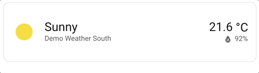
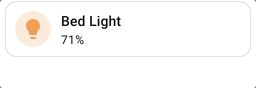

# :label: Spark d'attribut

Le spark `attribute` permet de **remplacer** ou de **supprimer** un attribut HTML de n'importe quel élément créé avec UIX Forge. Par exemple, vous pouvez supprimer ou remplacer l'attribut `title` afin que l'infobulle native du navigateur ne s'affiche plus, ou qu'une valeur personnalisée apparaisse à sa place.

## Configuration

| Clé | Type | Obligatoire | Valeur par défaut | Description |
| --- | ---- | -------- | ------- | ----------- |
| `type` | `string` | ✅ | — | Doit être défini sur `attribute`. |
| `attribute` | `string` | ✅ | — | Nom de l'attribut HTML ciblé, par exemple `title`. |
| `for` | `string` | | `element` | Sélecteur CSS/UIX de l'élément cible. Le caractère `$` permet de traverser une racine Shadow DOM (voir [Navigation dans le DOM](../../concepts/dom.md)). Si l'élément UIX Forge utilise la [configuration de carte vide](../forge.md#blank-card-config), la valeur par défaut est `uix-forge-blank-card $ div.content`. Sinon, `element` désigne la racine de l'élément créé avec UIX Forge. |
| `action` | `string` | | `replace` | Opération à effectuer sur l'attribut : `replace` définit une nouvelle valeur, tandis que `remove` supprime entièrement l'attribut. |
| `value` | `string` | | `""` | Nouvelle valeur de l'attribut. Utilisée uniquement si `action` vaut `replace`. Les [modèles Jinja2](../../using/templates.md) sont pris en charge. |

!!! tip
    Le helper DOM [`uix_forge_path()`](../../concepts/dom.md#uix_forge_path0-forge-helper) vous aide à déterminer le chemin à utiliser pour `for`.

## Utilisation

### Supprimer l'infobulle native (attribut `title`)

La carte de prévisions météo possède un attribut `title` sur son nom, ce qui affiche l'infobulle native du navigateur au survol. Pour la supprimer :

```yaml
type: custom:uix-forge
forge:
  mold: card
  sparks:
    - type: attribute
      for: hui-weather-forecast-card $ div.name
      attribute: title
      action: remove
element:
  show_current: true
  show_forecast: false
  type: weather-forecast
  entity: weather.carlingford
  forecast_type: daily
```

### Remplacer l'attribut `title` par une valeur personnalisée

```yaml
type: custom:uix-forge
forge:
  mold: card
  sparks:
    - type: attribute
      for: hui-weather-forecast-card $ div.name
      attribute: title
      action: replace
      value: Weather forecast for Carlingford and surrounding districts.
element:
  show_current: true
  show_forecast: false
  type: weather-forecast
  entity: weather.carlingford
  forecast_type: daily
```



### Utiliser un modèle pour définir la valeur

Le champ `value` accepte les [modèles](../../using/templates.md), qui donnent accès aux états des entités et aux autres variables de modèle :

```yaml
type: custom:uix-forge
forge:
  mold: card
  sparks:
    - type: attribute
      for: hui-tile-card
      attribute: title
      action: replace
      value: |
        {{ relative_time(states[config.element.entity].last_changed) }} ago
element:
  type: tile
  entity: light.bed_light
```



!!! note
    - Le spark cible le **premier** élément correspondant au sélecteur `for`.
    - Si `action` vaut `replace` et que `value` est une chaîne vide, un attribut vide (par exemple `title=""`) est défini ; l'attribut n'est pas supprimé. Utilisez `action: remove` pour le supprimer entièrement.
