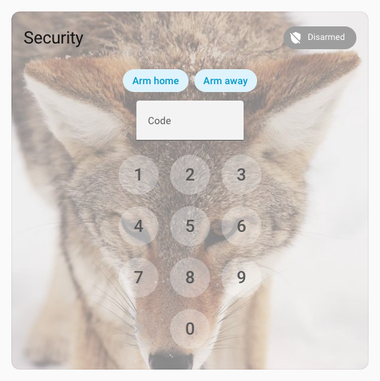
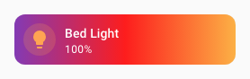
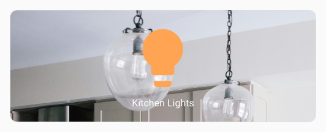
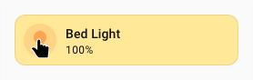
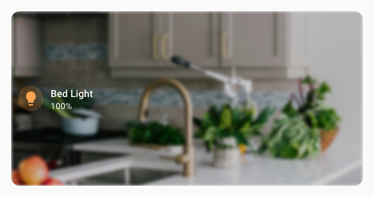
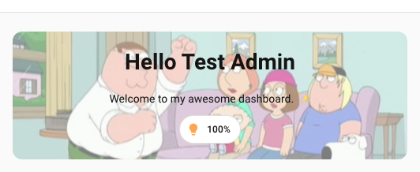

# :material-image-outline: Spark Background

Le spark `background` ajoute un arrière-plan stylisé derrière un élément cible créé avec [UIX Forge](../index.md). Le conteneur d'arrière-plan utilise `z-index: -1` pour s'afficher sous les éléments frères sans modifier la mise en page.

Sources d'arrière-plan prises en charge (la première valeur non vide est utilisée) :

| Source | Clé | Description |
| ------ | --- | ----------- |
| Caméra | `camera_entity` | Flux `ha-camera-stream` en direct. Prend en charge le zoom, le panoramique et le positionnement. Un indicateur de chargement apparaît pendant le chargement. |
| Image d'entité | `image_entity` | Récupère l'attribut `entity_picture` d'une entité et signe l'URL. Un indicateur apparaît pendant le chargement. |
| Vidéo | `video_url` | Élément `<video>` avec lecture automatique, son coupé et boucle. Prend en charge les URI `media-source://`. |
| URL d'image | `image_url` | Image statique appliquée avec `background-image`. Un indicateur apparaît pendant le chargement. Prend en charge les URI `media-source://`. |
| Couleur unie ou raccourci CSS | `background` | Toute valeur CSS `background` ou une correspondance de sous-propriétés. |

!!! tip
    Lorsque le spark cible un `hui-section` (c'est-à-dire avec `mold: section`), UIX annule automatiquement le padding de `div.section-container` pour éviter un double espacement si l'arrière-plan standard d'une section HA est également actif. Vous pouvez utiliser cet arrière-plan Home Assistant pour ajouter une couleur derrière celle du spark, puis régler son `opacity` à moins de 1 pour laisser apparaître cette couleur.

---

## Utilisation de base

```yaml
type: custom:uix-forge
forge:
  mold: card
  sparks:
    - type: background
      for: hui-tile-card $ ha-card
      background:
        color: "rgba(220, 53, 69, 0.6)"
element:
  type: tile
  entity: light.bed_light
```


La valeur `for` accepte la même [syntaxe de navigation dans le DOM](../../concepts/dom.md) que les styles UIX, y compris `$` pour traverser les limites d'un shadowRoot. Utilisez `hui-tile-card $ ha-card` pour cibler la surface de la carte dans une carte Tile : l'[adaptateur ha-card](#card-ha-card-adapter) applique automatiquement un `border-radius` et une `margin` adaptés aux coins arrondis de la carte.

---

## Configuration

| Clé | Type | Valeur par défaut | Description |
| --- | ---- | ------- | ----------- |
| `type` | string | — | Doit être défini sur `background`. |
| `for` | string | Avec la [configuration de carte vide](../forge.md#blank-card-config), la valeur par défaut est `uix-forge-blank-card $ div.content`. Sinon, `element` désigne la racine de l'élément créé avec Forge. | Sélecteur UIX de l'élément cible. |
| `camera_entity` | string | — | ID d'une entité `camera.*` diffusée en direct comme arrière-plan. |
| `camera_zoom` | chaîne ou nombre | — | Valeur CSS de zoom ou d'échelle appliquée au flux, par exemple `1.5` ou `"150%"`. |
| `camera_pan_x` | chaîne ou nombre | — | Translation CSS sur l'axe X, par exemple `"10%"` ou `"-20px"`. |
| `camera_pan_y` | chaîne ou nombre | — | Translation CSS sur l'axe Y du flux. |
| `camera_position` | string | `center` | Alignement du flux dans le conteneur : `center`, `top`, `bottom`, `left`, `right`, `top-left`, `top-right`, `bottom-left` ou `bottom-right`. |
| `camera_stream_cache_ms` | number | `20000` | Durée (ms) de conservation en cache d'un élément `ha-camera-stream` après son retrait du conteneur. Pendant cette période, l'élément reste **connecté** à un conteneur hors écran pour maintenir son flux (session MPEG/HLS/WebRTC et jetons d'authentification). Lors de la prochaine reconstruction avec la même entité et les mêmes dimensions, l'élément est déplacé directement dans le nouveau conteneur sans renégocier le flux. |
| `image_entity` | string | — | ID de l'entité dont l'attribut `entity_picture` fournit l'image d'arrière-plan. |
| `video_url` | string | — | URL d'une vidéo lue automatiquement sans son comme arrière-plan. Accepte les URI `media-source://` (voir [URI de sources multimédias](#media-source-uris)). |
| `image_url` | string | — | URL d'une image d'arrière-plan statique. Accepte les URI `media-source://` (voir [URI de sources multimédias](#media-source-uris)). |
| `background` | chaîne ou objet | — | Raccourci CSS `background` ou correspondance de sous-propriétés (voir ci-dessous). Avec `image_entity` ou `image_url`, les sous-propriétés de l'objet, comme `position` ou `size`, remplacent les valeurs correspondantes de l'image. Une chaîne simple remplace tout le raccourci `background`, y compris `background-image`. |
| `opacity` | nombre | — | Opacité CSS du conteneur d'arrière-plan, de 0 à 1. Permet d'assombrir l'arrière-plan sans affecter l'élément au premier plan. |
| `dissolve_target` | chaîne ou liste | — | Rend l'élément `for` transparent pour laisser apparaître l'arrière-plan (voir ci-dessous). |
| `class` | string | — | Classe(s) CSS supplémentaire(s) ajoutée(s) à la `div` du conteneur d'arrière-plan. |

!!! tip
    Utilisez le helper [`uix_forge_path()`](../../concepts/dom.md#uix_forge_path0-forge-helper) dans la console du navigateur pour trouver le sélecteur `for` exact de tout élément créé avec Forge.

### Correspondance des sous-propriétés de `background`

Lorsque `background` est une correspondance, chaque clé est convertie en propriété CSS correspondante :

| Key | CSS property |
| --- | ------------ |
| `color` | `background-color` |
| `image` | `background-image` |
| `position` | `background-position` |
| `size` | `background-size` |
| `repeat` | `background-repeat` |
| `attachment` | `background-attachment` |
| `origin` | `background-origin` |
| `clip` | `background-clip` |

### `dissolve_target`

`dissolve_target` modifie l'élément `for` afin de rendre visible l'arrière-plan placé derrière. Deux formats sont acceptés :

- **Chaîne `opacity_<0-100>`** — définit l'opacité de l'élément `for`, par exemple `opacity_50` pour 50 %.
- **Liste d'objets de propriétés CSS** — chaque paire clé/valeur est appliquée comme style en ligne à l'élément `for`. Les noms de propriété peuvent utiliser des traits de soulignement à la place des tirets.

`dissolve_target` est prévu pour les cas où l'élément cible possède son propre arrière-plan. Cette option n'est souvent pas nécessaire et n'est utilisée dans aucun des exemples ci-dessous.

```yaml
# Remove the card's own background using a CSS property list
dissolve_target:
  - background: "none"

# Make the card 50% transparent
dissolve_target: opacity_50
```

### URI de sources multimédias

`video_url` et `image_url` acceptent les URI de [source multimédia](https://www.home-assistant.io/integrations/media_source/) Home Assistant au format `media-source://media_source/local/<filename>`. UIX les résout automatiquement avant de définir l'arrière-plan à l'aide de la commande WebSocket HA `media_source/resolve_media` : aucune signature manuelle de l'URL n'est nécessaire.

Les fichiers du répertoire `/media` de votre instance HA sont accessibles à l'adresse `media-source://media_source/local/<filename>`.

```yaml
# Image from the local media library
- type: background
  for: hui-tile-card $ ha-card
  image_url: "media-source://media_source/local/kitchen.jpg"

# Video from the local media library
- type: background
  for: hui-tile-card $ ha-card
  video_url: "media-source://media_source/local/ambient.mp4"
```

---

## Adaptateur Card (ha-card)

Lorsque `for` désigne un élément `ha-card`, UIX active automatiquement l'**adaptateur ha-card**, qui :

- définit `border-radius: var(--ha-card-border-radius, var(--ha-border-radius-lg))` sur le conteneur pour suivre les coins arrondis de la carte ;
- définit `margin: calc(-1 * var(--ha-card-border-width, 1px))` pour compenser la bordure et couvrir toute la carte ;
- insère le conteneur dans le shadowRoot de `ha-card` afin qu'il respecte le bon contexte d'empilement.

Aucune configuration supplémentaire n'est nécessaire : l'adaptateur s'active automatiquement lorsque l'élément `for` résolu est `ha-card`.

---

## Adaptateur Section (hui-section)

Lorsque `for` désigne un élément `hui-section` — ce qui se produit automatiquement si `mold: section` est utilisé sans `for` explicite — UIX active l'**adaptateur hui-section**, qui :

- définit `border-radius: var(--ha-section-border-radius, var(--ha-border-radius-xl))` sur le conteneur pour suivre les coins arrondis de la section ;
- définit `padding: var(--ha-space-2)` sur l'élément enfant `hui-grid-section` (DOM léger de `hui-section`) pour éloigner les cartes des bords, comme avec les paramètres de couleur d'arrière-plan du frontend. Le padding précédent est restauré à la déconnexion du spark ;
- applique `--ha-card-background: none` à la section afin que ses cartes héritent d'un arrière-plan transparent et laissent apparaître celui de la section ;
- définit `padding: 0` sur l'ancêtre `div.section-container` le plus proche, le conteneur de section Home Assistant, afin d'éviter un double espacement si un arrière-plan de section HA est aussi actif. Le padding précédent est restauré à la déconnexion du spark.

```yaml
type: custom:uix-forge
forge:
  mold: section
  sparks:
    - type: background
      background:
        color: "rgba(0, 100, 200, 0.2)"
cards: []
```

Aucun `for` n'est nécessaire : avec `mold: section`, la valeur par défaut `for: element` désigne l'élément `hui-section` et active automatiquement l'adaptateur.

---

## Exemples

### Arrière-plan de caméra en direct

!!! tip
    Comme la cible `for` est `ha-card`, l'adaptateur correspondant applique au flux vidéo en direct le rayon et la marge de la carte.

```yaml
type: custom:uix-forge
forge:
  mold: card
  grid_options:
    columns: 12
    rows: 6
  sparks:
    - type: background
      for: hui-button-card $ ha-card
      camera_entity: camera.demo_camera
      camera_zoom: 1.3
      camera_position: bottom-left
element:
  type: button
  entity: light.bed_light
```


### Image d'entité en arrière-plan

!!! tip
    Comme la cible `for` est `ha-card`, l'adaptateur correspondant applique à l'image d'entité le rayon et la marge de la carte.

```yaml
type: custom:uix-forge
forge:
  mold: card
  grid_options:
    rows: 3
  sparks:
    - type: background
      for: hui-tile-card $ ha-card
      image_entity: person.james_bond_007
element:
  type: tile
  entity: light.bed_light
  name: Shaken not stirred
  icon: mdi:glass-cocktail
```


### Arrière-plan vidéo

!!! tip
    Comme la cible `for` est `ha-card`, l'adaptateur correspondant applique à la vidéo le rayon et la marge de la carte.

```yaml
type: custom:uix-forge
forge:
  mold: card
  grid_options:
    columns: 12
    rows: 6
  sparks:
    - type: background
      for: hui-weather-forecast-card $ ha-card
      video_url: /local/media/sydney_ferry.mp4
      opacity: 0.9
element:
  show_current: true
  show_forecast: true
  type: weather-forecast
  entity: weather.demo_weather_south
  forecast_type: daily
  uix:
    style: |
      :host {
        --primary-text-color: white;
        --secondary-text-color: smokewhite;
        --content-border-radius: var(--ha-card-border-radius, 12px);
      }
      .content {
        background: rgba(0,0,0,0.3);
        border-top-left-radius: var(--content-border-radius);
        border-top-right-radius: var(--content-border-radius);
      }
      .forecast {
        background: rgba(0,0,0,0.3);
        border-bottom-left-radius: var(--content-border-radius);
        border-bottom-right-radius: var(--content-border-radius);
      }
```


### Arrière-plan avec image statique

!!! tip
    Comme la cible `for` est `ha-card`, l'adaptateur correspondant applique à l'image statique le rayon et la marge de la carte.

```yaml
type: custom:uix-forge
forge:
  mold: card
  sparks:
    - type: background
      for: hui-alarm-panel-card $ ha-card
      image_url: https://picsum.photos/id/582/600/600
      opacity: 0.5
element:
  type: alarm-panel
  states:
    - arm_home
    - arm_away
  entity: alarm_control_panel.security
  uix:
    style: |
      ha-control-button {
        --control-button-background-color: white;
        --control-button-background-opacity: 0.3;
      }
```



#### Régler la position et la taille de l'image

La clé `background` peut être combinée à `image_url` ou `image_entity` pour modifier le rendu de l'image. Utilisez un objet avec des sous-propriétés pour régler sa position, sa taille et les autres propriétés CSS d'arrière-plan sans remplacer l'image :

```yaml
type: custom:uix-forge
forge:
  mold: card
  sparks:
    - type: background
      for: hui-tile-card $ ha-card
      image_url: https://picsum.photos/id/582/600/600
      background:
        position: "top center"
        size: contain
        repeat: "no-repeat"
element:
  type: tile
  entity: light.bed_light
```

!!! note
    Avec `image_url` ou `image_entity`, seules les **sous-propriétés d'un objet** (par exemple `position` ou `size`) remplacent les valeurs de l'image. Une chaîne simple, comme `background: red`, remplace tout le raccourci `background` et supprime aussi `background-image`. Utilisez une chaîne uniquement pour remplacer entièrement l'image par un autre arrière-plan, comme une couleur unie ou un dégradé.

### Arrière-plan avec une règle CSS complète

!!! tip
    Comme la cible `for` est `ha-card`, l'adaptateur correspondant applique au fond CSS complet le rayon et la marge de la carte.

```yaml
type: custom:uix-forge
forge:
  mold: card
  sparks:
    - type: background
      for: hui-tile-card $ ha-card
      background: linear-gradient(90deg,rgba(131, 58, 180, 1) 0%, rgba(253, 29, 29, 1) 50%, rgba(252, 176, 69, 1) 100%)
element:
  type: tile
  entity: light.bed_light
  uix:
    style: |
      :host {
        --primary-text-color: white;
      }
```



### Image de la bibliothèque multimédia

!!! tip
    Comme la cible `for` est `ha-card`, l'adaptateur correspondant applique au fond CSS le rayon et la marge de la carte. Ici, `background` définit également `position: top` pour placer l'image en haut.

```yaml
type: custom:uix-forge
forge:
  mold: card
  grid_options:
    columns: 12
    rows: 3
  sparks:
    - type: background
      for: hui-button-card $ ha-card
      image_url: "media-source://media_source/local/kitchen.jpg"
      background:
        position: top
element:
  type: button
  entity: light.kitchen_lights
```



### Couleur d'arrière-plan dynamique à l'aide d'un modèle

Toutes les valeurs de configuration `forge` acceptent les modèles Jinja2. Utilisez la clé `background` avec un modèle pour faire dépendre la couleur de l'état d'une entité :

```yaml
type: custom:uix-forge
forge:
  mold: card
  sparks:
    - type: background
      for: hui-tile-card $ ha-card
      background:
        color: >-
          
            rgba(255, 200, 0, 0.4)
          
            rgba(100, 100, 100, 0.2)
          
element:
  type: tile
  entity: light.bed_light
```



### Arrière-plan d'une section

Cet exemple utilise l'arrière-plan standard de la section pour donner une teinte bleu clair plus soutenue à la vidéo. L'adaptateur de section (`hui-section`) annule automatiquement le padding de `section-container` afin d'éviter un double espacement.

!!! tip
    Ce YAML décrit une section complète d'un tableau de bord Sections. Pour modifier son YAML, éditez la section puis choisissez `Modifier en YAML` dans le menu à trois points.

```yaml
type: custom:uix-forge
forge:
  mold: section
  sparks:
    - type: background
      video_url: /local/media/sydney_ferry.mp4
      opacity: 0.7
element:
  type: grid
  cards:
    - type: heading
      heading: Section Heading
    - type: button
      entity: light.bed_light
    - type: button
      entity: light.kitchen_lights
  uix:
    style: |
      :host {
        --primary-text-color: white;
      }
column_span: 1
background:
  color: light-blue
  opacity: 100
```


### Styliser le conteneur d'arrière-plan avec UIX Styling

Utilisez la clé `class` pour ajouter une classe CSS au conteneur d'arrière-plan, puis ciblez sa `div` d'arrière-plan avec un chemin de style UIX :

```yaml
type: custom:uix-forge
forge:
  mold: card
  grid_options:
    rows: 4
  sparks:
    - type: background
      for: hui-tile-card $ ha-card
      image_url: /local/media/kitchen.jpg
      class: my-background
  uix:
    style:
      .: |
        :host {
          --primary-text-color: white;
        }
      "hui-tile-card $ ha-card $": |
        .my-background div {
          filter: blur(2px) brightness(0.8);
        }
element:
  type: tile
  entity: light.bed_light
```



### Ajouter un arrière-plan à l'en-tête du tableau de bord

L'en-tête complet d'un tableau de bord Sections (titre et badges) ne peut pas être créé avec UIX Forge. Cependant, la carte Markdown utilisée dans l'en-tête peut être remplacée par une carte Forge. En plaçant les cartes de votre choix et `custom:badge-horizontal-container-card` dans une pile verticale, vous pouvez recréer un en-tête complet avec badges et utiliser le spark Background pour lui ajouter un arrière-plan.

En mode édition du tableau de bord, cliquez sur `+ Ajouter un titre` dans l'en-tête, puis sur `Afficher l'éditeur de code` pour remplacer la carte Markdown du titre.

Le rayon de bordure doit être appliqué à l'arrière-plan, car aucun adaptateur ne le fait automatiquement. De même, appliquez le padding à la racine de la pile verticale intégrée.

```yaml
type: custom:uix-forge
forge:
  mold: card
  sparks:
    - type: background
      for: "hui-vertical-stack-card $ #root"
      camera_entity: camera.demo_camera
      opacity: 0.5
      class: heading-background
element:
  type: vertical-stack
  cards:
    - type: markdown
      text_only: true
      content: |-
        # Hello {{ user }}
        Welcome to my awesome dashboard. ✨
    - type: custom:badge-horizontal-container-card
      badges:
        - type: entity
          show_name: false
          show_state: true
          show_icon: true
          entity: light.bed_light
      badges_align: center
  uix:
    style: |
      #root {
        padding: 20px !important;
      }
      .heading-background {
        border-radius: var(--ha-card-border-radius, var(--ha-border-radius-lg));
      }
```

??? example "Configuration YAML complète du tableau de bord"
    Placez la carte d'en-tête Forge sous `card:` dans `header:`.
    ```yaml
    views:
      - type: sections
        max_columns: 4
        title: Test Background
        path: test-background
        header:
          card:
            type: custom:uix-forge
            forge:
              mold: card
              sparks:
                - type: background
                  for: "hui-vertical-stack-card $ #root"
                  camera_entity: camera.demo_camera
                  opacity: 0.5
                  class: heading-background
            element:
              type: vertical-stack
              cards:
                - type: markdown
                  text_only: true
                  content: |-
                    # Hello {{ user }}
                    Welcome to my awesome dashboard. ✨
                - type: custom:badge-horizontal-container-card
                  badges:
                    - type: entity
                      show_name: false
                      show_state: true
                      show_icon: true
                      entity: light.bed_light
                  badges_align: center
              uix:
                style: |
                  #root {
                    padding: 20px !important;
                  }
                  .heading-background {
                    border-radius: var(--ha-card-border-radius, var(--ha-border-radius-lg));
                  }
    ```


