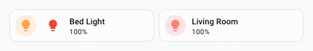
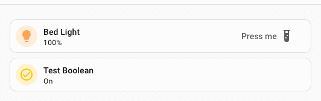

# :material-button-cursor: Spark Button

Le spark `button` insère un élément Home Assistant [`ha-button`](https://github.com/home-assistant/frontend/tree/dev/src/components/ha-button.ts) dans le DOM, immédiatement **avant** ou **après** un élément cible de l'élément créé avec UIX Forge.

Le bouton peut afficher :

- un libellé texte (`label`)
- une icône à la place du libellé (`icon`)
- une icône avant le libellé (`start_icon`)
- une icône après le libellé (`end_icon`)

`icon` et `label` ne peuvent pas être utilisés ensemble : lorsque `icon` est défini, l'icône est placée dans l'emplacement du libellé de `ha-button` et `label` est ignoré.

Lorsque seul `icon` est défini, le bouton reçoit automatiquement le style des boutons d'icône Home Assistant.

Vous pouvez rendre le bouton interactif avec des [actions](#actions) au toucher, à l'appui prolongé ou au double toucher.

## Utilisation de base

Ajoutez une entrée `button` à `forge.sparks` et définissez `after` ou `before` pour indiquer l'élément cible et l'emplacement du bouton par rapport à celui-ci.

La valeur de `after` ou `before` est un sélecteur qui repère la cible dans l'élément créé. Elle accepte la même [syntaxe de navigation dans le DOM](../../concepts/dom.md) que les styles UIX, y compris `$` pour traverser les limites d'une racine Shadow DOM.

```yaml
type: custom:uix-forge
forge:
  mold: card
  sparks:
    - type: button
      after: hui-tile-card $ ha-tile-icon
      label: Toggle
      entity: light.living_room
      tap_action:
        action: toggle
element:
  type: tile
  entity: light.living_room
```


!!! tip
    Le helper DOM [`uix_forge_path()`](../../concepts/dom.md#uix_forge_path0-forge-helper) vous aide à déterminer le chemin à utiliser pour `after` ou `before`.

## Configuration

| Clé | Type | Obligatoire | Valeur par défaut | Description |
| --- | ---- | -------- | ------- | ----------- |
| `type` | `string` | ✅ | — | Doit être défini sur `button`. |
| `after` | `string` | l'un de `after`/`before` ✅ | Avec la [configuration de carte vide](../forge.md#blank-card-config), la valeur par défaut est `uix-forge-blank-card $ div.content`. Sinon, elle est `""`. Pour utiliser `before` dans cette configuration, définissez explicitement `after: ""`. | Sélecteur UIX de l'élément de référence. Le bouton est inséré comme élément frère **après** l'élément correspondant. |
| `before` | `string` | l'un de `after`/`before` ✅ | — | Sélecteur UIX de l'élément de référence. Le bouton est inséré comme élément frère **avant** l'élément correspondant. |
| `entity` | `string` | | — | ID de l'entité transmis aux gestionnaires d'action, par exemple `toggle`. Obligatoire pour les actions qui utilisent une entité. |
| `icon` | `string` | | — | Nom d'une icône MDI, par exemple `mdi:lightbulb`, affichée à la place du libellé. Ne peut pas être utilisé avec `label`. |
| `color` | `string` | | — | Couleur de l'icône en mode icône seule, par exemple `red` ou `var(--primary-color)`. Cette option s'applique uniquement si `icon` est défini. |
| `label` | `string` | | `""` | Libellé affiché dans le bouton. Ne peut pas être utilisé avec `icon`. |
| `start_icon` | `string` | | — | Icône MDI, par exemple `mdi:play`, affichée **avant** le libellé. |
| `end_icon` | `string` | | — | Icône MDI, par exemple `mdi:chevron-right`, affichée **après** le libellé. |
| `variant` | `string` | | — | Variante de couleur : `brand`, `neutral`, `danger`, `warning` ou `success`. Par défaut, Home Assistant utilise `brand`, sauf si `icon` est défini ; dans ce cas, la variante est `neutral`. |
| `appearance` | `string` | | — | Apparence du bouton : `accent`, `filled`, `outlined` ou `plain`. Par défaut, Home Assistant utilise `accent`, sauf si `icon` est défini ; dans ce cas, l'apparence est `plain`. |
| `size` | `string` | | — | Taille du bouton : `s` (petite) ou `m` (moyenne). |
| `tap_action` | action | | — | Action exécutée au toucher. |
| `hold_action` | action | | — | Action exécutée lors d'un appui prolongé. |
| `double_tap_action` | action | | — | Action exécutée lors d'un double toucher. |

!!! note
    - Définissez exactement l'une des options `after` ou `before`.
    - Le spark cible le **premier** élément correspondant à `after` ou `before`.
    - Le `ha-button` est placé dans un `<div>` conteneur, dans le même parent que l'élément cible : c'est un élément frère, pas un enfant.
    - `icon` et `label` ne peuvent pas être utilisés ensemble. Si `icon` est défini, `label` est ignoré.
    - Une marge de `-6px` est appliquée aux boutons avec libellé. Pour les boutons avec icône seule, la marge par défaut est `0px`. La variable CSS `--uix-button-margin` permet de la modifier.
    - Lorsque seul `icon` est défini, le bouton reçoit automatiquement le style des boutons d'icône Home Assistant.

## Actions

Lorsque vous définissez une ou plusieurs clés d'action (`tap_action`, `hold_action`, `double_tap_action`), le bouton déclenche l'action Home Assistant correspondante. Définissez `entity` pour les actions qui nécessitent une entité, comme `toggle` ou `more-info`.

```yaml
type: custom:uix-forge
forge:
  mold: card
  sparks:
    - type: button
      after: hui-tile-card $ ha-tile-icon
      label: Living Room
      entity: light.living_room_rgbww_lights
      tap_action:
        action: toggle
      hold_action:
        action: more-info
element:
  type: tile
  entity: light.bed_light
```


!!! note
    Dans une carte Tile, les clics sur le bouton sont isolés du gestionnaire d'action de la carte : seules les actions configurées sur le bouton sont déclenchées.

## CSS variables

| Variable | Valeur par défaut | Description |
| --- | --- | --- |
| `--uix-button-margin` | `-6px` ou `0px` avec une icône seule | Définit la marge du bouton. La valeur par défaut des boutons avec libellé respecte le style frontend de Home Assistant. |
| `--uix-button-label-text-wrap` | `wrap` | Définit le retour à la ligne du libellé. `ha-button` utilise `wrap` par défaut. Définissez `nowrap` pour empêcher le retour à la ligne. Selon l'élément parent, cette option peut être nécessaire ; l'exemple ci-dessous l'utilise avec une carte Tile. |
| `--uix-button-border-color` | `revert-layer` | Définit la couleur de bordure. Elle dépend généralement de `variant` et `appearance`, mais peut être définie directement avec cette variable CSS. |
| `--uix-icon-button-background-color` | `currentColor` | Définit l'arrière-plan d'un bouton avec icône seule. Par défaut, `currentColor` reprend `color` si cette option est définie, sinon la couleur courante à l'emplacement du bouton. Cette couleur n'apparaît qu'au survol par défaut. |
| `--uix-icon-button-background-opacity` | `0` | Définit l'opacité de l'arrière-plan d'un bouton avec icône seule. Définissez une valeur de 0 à 1 pour toujours afficher l'arrière-plan à cette opacité. |
| `--uix-icon-button-background-color-hover` | `var(--uix-icon-button-background-color, currentColor)` | Remplace la couleur d'arrière-plan du bouton avec icône seule au survol. |
| `--uix-icon-button-background-opacity-hover` | `calc(var(--uix-icon-button-background-opacity, 0) + 0.1)` | Remplace l'opacité de l'arrière-plan au survol. |

## Exemples

??? example "Bouton après l'icône Tile avec action de bascule et icône fluorescente"
    ```yaml
    type: custom:uix-forge
    forge:
      mold: card
      grid_options:
        columns: 9
      sparks:
        - type: button
          after: hui-tile-card $ ha-tile-icon
          label: Living Room
          end_icon: mdi:lightbulb-fluorescent-tube-outline
          entity: light.living_room_rgbww_lights
          tap_action:
            action: toggle
      uix:
        style: |
          :host {
            --uix-button-label-text-wrap: nowrap;
          }
    element:
      type: tile
      entity: light.bed_light
    ```

    

??? example "Bouton avant l'icône Tile avec la variante Danger"
    ```yaml
    type: custom:uix-forge
    forge:
      mold: card
      sparks:
        - type: button
          before: hui-tile-card $ ha-tile-icon
          label: Turn off
          variant: danger
          appearance: plain
          entity: light.living_room
          tap_action:
            action: call-service
            service: light.turn_off
            target:
              entity_id: light.living_room
    element:
      type: tile
      entity: light.bed_light
    ```

    

??? example "Bouton avec une icône avant et après le libellé"
    ```yaml
    type: custom:uix-forge
    forge:
      mold: card
      sparks:
        - type: button
          after: hui-tile-card $ ha-tile-icon
          start_icon: mdi:play
          label: Scene
          end_icon: mdi:chevron-right
          tap_action:
            action: perform-action
            perform_action: light.turn_off
            target:
              entity_id: light.living_room_rgbww_lights
    element:
      type: tile
      entity: light.bed_light
    ```

    

??? example "Bouton avec icône seule"
    Ajustez ici la taille du bouton pour qu'elle corresponde à celle de l'icône Tile, soit 36 px. La taille par défaut du bouton avec icône est de 48 px.
    ```yaml
    type: custom:uix-forge
    forge:
      mold: card
      sparks:
        - type: button
          before: hui-tile-card $ ha-tile-info
          icon: mdi:lightbulb
          color: var(--red-color)
          entity: light.living_room_rgbww_lights
          tap_action:
            action: toggle
    element:
      type: tile
      entity: light.bed_light
      uix:
        style: |
          ha-button {
            --ha-icon-button-size: 36px;
          }
    ```

    

??? example "Espacement du bouton dans une carte Tile avec les propriétés CSS flex"
    Cet exemple utilise également le [spark Tooltip](tooltip.md) [:speech_balloon:].
    ```yaml
    type: custom:uix-forge
    forge:
      mold: card
      grid_options:
        columns: 12
        rows: 1
      sparks:
        - type: tooltip
          for: hui-tile-card $ ha-button
          content: Toggle Special Switch
        - type: button
          after: hui-tile-card $ ha-tile-info
          label: Press me
          variant: neutral
          appearance: plain
          end_icon: mdi:test-tube
          entity: input_boolean.test_boolean
          tap_action:
            action: toggle
          hold_action:
            action: more-info
    element:
      type: tile
      entity: light.bed_light
      vertical: false
      features_position: bottom
      uix:
        style: |
          ha-tile-info {
            flex: 2;
          }
          ha-button {
            margin-top: -2px;
            flex: 1;
          }
    ```

    

## Variantes et apparences

`variant` peut prendre l'une des valeurs `brand`, `neutral`, `danger`, `warning` ou `success`. Si cette option est omise, Home Assistant utilise la variante `brand` par défaut.

`appearance` peut prendre l'une des valeurs `accent`, `filled` ou `plain`. Si cette option est omise, Home Assistant utilise l'apparence `accent` par défaut.

!!! info "Illustration des variantes et apparences de bouton"
    
