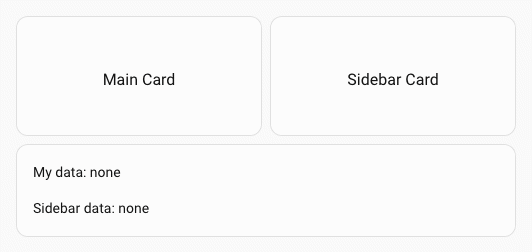
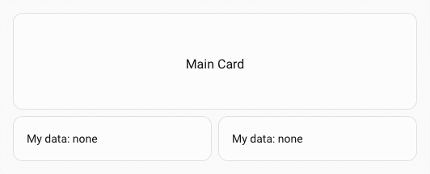

# :zap: Spark Event

Le spark `event` reçoit les événements déclenchés avec l'action Home Assistant `fire-dom-event` et expose leurs données sous forme de variables de modèle dans l'élément créé avec UIX Forge. Utilisez-le pour créer des cartes qui réagissent aux interactions ou aux événements d'automatisation provenant du tableau de bord.

## Configuration

| Clé | Type | Obligatoire | Valeur par défaut | Description |
| --- | ---- | -------- | ------- | ----------- |
| `type` | `string` | ✅ | — | Doit être défini sur `event`. |
| `forge_id` | `string` | | — | Identifiant de cet élément Forge. Les données des événements `fire-dom-event` dont le `forge_id` correspond sont directement ajoutées à `uixForge.event`. |
| `other_forge_ids` | liste de chaînes | | — | Identifiants des autres éléments Forge à écouter. Les données de chaque identifiant sont accessibles sous `uixForge.event.<id>`. |

Définissez `forge_id` ou `other_forge_ids` pour que le spark puisse recevoir des événements.

## Variables de modèle

Lorsque le spark `event` est actif, une clé `event` est ajoutée à la variable de modèle `uixForge` :

| Variable | Description |
| -------- | ----------- |
| `uixForge.event.<key>` | Clés de données des événements correspondant à `forge_id`, ajoutées directement à `uixForge.event`. |
| `uixForge.event.<other_id>.<key>` | Données des événements correspondant à un identifiant de `other_forge_ids`, imbriquées sous cet identifiant. |

Par défaut, les données s'accumulent d'un événement à l'autre : chaque nouvel événement est fusionné en profondeur avec l'état existant. Pour remplacer les données, utilisez `replace: true`.

## Déclencher un événement

Tout élément Home Assistant prenant en charge `tap_action` peut déclencher un événement avec `action: fire-dom-event`. Ajoutez une clé `uix_forge` à côté de `action`, contenant une liste d'objets d'événement Forge.

```yaml
tap_action:
  action: fire-dom-event
  uix_forge:
    - forge_id: my_card
      # replace: false
      data:
        selected: living_room
```

## Utilisation

### Exemple de base : un bouton qui met à jour une carte

Deux cartes bouton déclenchent des événements DOM. Un élément UIX Forge les reçoit et met à jour son modèle :

```yaml
type: button
name: Living Room
tap_action:
  action: fire-dom-event
  uix_forge:
    - forge_id: my_tile
      data:
        entity: light.living_room_rgbww_lights
```

```yaml
type: button
name: Bed Room
tap_action:
  action: fire-dom-event
  uix_forge:
    - forge_id: my_tile
      data:
        entity: light.bed_light
```

Tuile créée avec UIX Forge qui reçoit les événements et modifie l'entité affichée selon leurs données. Une valeur par défaut est utilisée tant qu'aucun événement n'a été reçu.

```yaml
type: custom:uix-forge
forge:
  mold: card
  grid_options:
    rows: 1
    columns: full
  sparks:
    - type: event
      forge_id: my_tile
element:
  type: tile
  entity: "{{ uixForge.event.entity | default('light.bed_light') }}"
```


### Écouter les événements d'un autre élément Forge

Utilisez `other_forge_ids` pour recevoir les événements destinés à un autre élément Forge. Les données sont alors accessibles sous `uixForge.event.<forge_id>` :

!!! tip
    `uixForge.event` existe toujours comme variable de modèle, mais `uixForge.event.<forge_id>` peut être absent. Vérifiez donc sa présence dans le dictionnaire avant d'y accéder, sinon le modèle générera une erreur. En cas de doute, utilisez le [débogage des modèles](../../debugging/templates.md) avec `{# uix.debug #}`.

Deux cartes bouton déclenchent des événements DOM qu'un élément UIX Forge reçoit grâce à `other_forge_ids` :

```yaml
type: button
name: Card A
tap_action:
  action: fire-dom-event
  uix_forge:
    - forge_id: card_a
      data:
        selected: Selected
```

```yaml
type: button
name: Card B
tap_action:
  action: fire-dom-event
  uix_forge:
    - forge_id: card_b
      data:
        entity: Selected
```

```yaml
type: custom:uix-forge
forge:
  mold: card
  sparks:
    - type: event
      other_forge_ids:
        - card_a
        - card_b
element:
  type: markdown
  content: |
    card_a selected: {{ uixForge.event.card_a.selected if "card_a" in
    uixForge.event else 'none' | default('none') }} 
    card_b selected: {{ uixForge.event.card_b.selected if "card_b" in 
    uixForge.event else 'none' | default('none') }}
```


### Combiner son propre identifiant avec d'autres identifiants

Vous pouvez définir simultanément `forge_id` et `other_forge_ids`.

Deux cartes bouton déclenchent des événements DOM qu'un élément UIX Forge reçoit via `forge_id` et `other_forge_ids` :

```yaml
type: button
name: Main Card
tap_action:
  action: fire-dom-event
  uix_forge:
    - forge_id: main-card
      data:
        selected: "Hello main_card!"
```

```yaml
type: button
name: Sidebar Card
tap_action:
  action: fire-dom-event
  uix_forge:
    - forge_id: sidebar_card
      data:
        data_key: "Hello sidebar_card!"
```

```yaml
type: custom:uix-forge
forge:
  mold: card
  sparks:
    - type: event
      forge_id: main_card
      other_forge_ids:
        - sidebar_card
element:
  type: markdown
  content: |
    My data: {{ uixForge.event.data_key | default('none') }}

    Sidebar data: {{ uixForge.event.sidebar_card.data_key if "sidebar_card" in
    uixForge.event else 'none' | default('none') }}
```



### Envoyer des données à plusieurs éléments Forge

Vous pouvez envoyer les données d'un événement à plusieurs éléments Forge simultanément.

Une carte bouton envoie les données de l'événement à deux éléments Forge :

```yaml
type: button
name: Main Card
grid_options:
  columns: full
tap_action:
  action: fire-dom-event
  uix_forge:
    - forge_id: card_a
      data:
        selected: Selected A
    - forge_id: card_b
      data:
        selected: Selected B
```

Deux éléments Forge reçoivent les données de l'événement :

```yaml
type: custom:uix-forge
forge:
  mold: card
  grid_options:
    columns: 6
    rows: auto
  sparks:
    - type: event
      forge_id: card_a
element:
  type: markdown
  content: |
    My data: {{ uixForge.event.selected | default('none') }}
```

```yaml
type: custom:uix-forge
forge:
  mold: card
  grid_options:
    columns: 6
    rows: auto
  sparks:
    - type: event
      forge_id: card_b
element:
  type: markdown
  content: |
    My data: {{ uixForge.event.selected | default('none') }}
```



### Utiliser un badge raccourci pour contrôler les cartes expander-card

Cet exemple ajoute un badge à l'en-tête du tableau de bord. Il ouvre ou ferme toutes les cartes `custom:expander-card` dont la valeur `expander-card-id` correspond à `id_of_target_cards`.

```yaml
  - type: custom:uix-forge
    forge:
      mold: badge
      billets:
        expander_card_id: id_of_target_cards
        expand_txt: Expand All
        collapse_txt: Collapse All
      macros:
        expanded:
          returns: true
          template: ""
      sparks:
        - type: event
          forge_id: "{{expander_card_id}}"
        - type: tooltip
          content: "{{ collapse_txt if expanded() else expand_txt }}"
    element:
      type: shortcut
      text: " "
      icon: >-
        {{ 'mdi:collapse-all-outline' if expanded() else
        'mdi:expand-all-outline' }}
      tap_action:
        action: fire-dom-event
        expander-card:
          data:
            expander-card-id: "{{expander_card_id}}"
            action: "{{ 'close' if expanded() else 'open' }}"
        uix_forge:
          - forge_id: "{{expander_card_id}}"
            data:
              details: "{{ not expanded() }}"
```


!!! note
    - Le spark `event` s'active dès que l'élément Forge est ajouté au DOM et cesse d'écouter lorsqu'il en est retiré.
    - Toutes les chaînes de la configuration `element` sont traitées comme des modèles. `uixForge.event` est donc disponible dans toute cette configuration.
    - Si aucun événement correspondant n'a encore été reçu, `uixForge.event` est vide ou absent. Utilisez `| default(...)` dans vos modèles pour gérer ce cas.
    - Les données des événements successifs sont **fusionnées en profondeur**, et non remplacées. Après un premier événement `{ forge_id: "my_card", data: { score: 10 } }`, l'envoi de `{ forge_id: "my_card", data: { count: 2 } }` laisse `count` et `score` dans `uixForge.event`.
