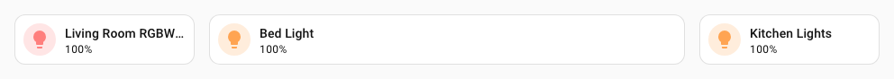
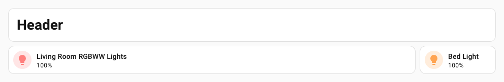
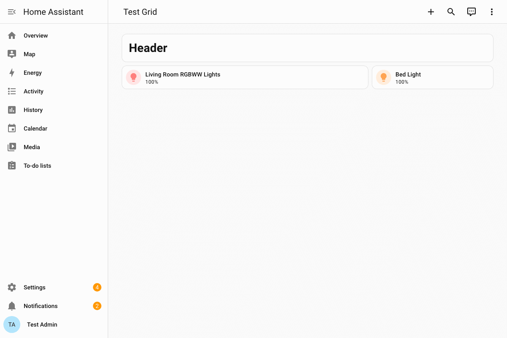
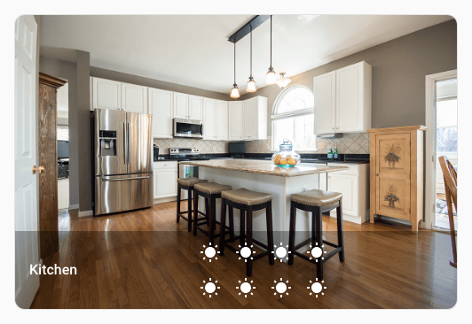

# :material-grid: Spark Grid

Le spark `grid` applique une mise en page **CSS Grid** à n'importe quel conteneur d'un élément créé avec [UIX Forge](../index.md). Il est conçu pour les cartes de grille et les conteneurs de sections des tableaux de bord Home Assistant. Un court extrait YAML permet de définir l'ensemble de la grille — colonnes, lignes, espacements, zones de modèle, flux automatique et alignement — sans écrire le CSS de `style` à la main.

Il prend également en charge **`media_queries`** pour remplacer les propriétés de la grille à certains seuils d'affichage, ainsi que **`elements`** pour affecter des zones nommées aux éléments enfants dans l'ordre.

## Utilisation de base

Appliquez une grille de trois colonnes de même largeur à l'élément créé :

```yaml
type: custom:uix-forge
forge:
  mold: card
  sparks:
    - type: grid
      for: "hui-grid-card $ #root"
      columns: 3
element:
  type: grid
  square: false
  cards:
    - type: tile
      entity: light.living_room_rgbww_lights
      name: Living Room
    - type: tile
      entity: light.bed_light
      name: Bedroom
    - type: tile
      entity: light.ceiling_lights
      name: Ceiling
```

`columns: 3` est converti en `grid-template-columns: repeat(3, 1fr)`.


!!! tip
    Lorsque vous utilisez le spark Grid avec une carte Grid dans une section, définissez de préférence `column_span: 4` sur la section, puis `columns: full` dans `grid_options` du moule Forge.
    ```yaml
    type: grid
    column_span: 4
    cards:
      - type: custom:uix-forge
    forge:
      mold: card
      grid_options:
        columns: full
      sparks:
        - type: grid
          ...
    element:
      type: grid
      cards:
        ...
    ```

## Configuration

### Propriétés de base

| Clé | Type | Obligatoire | Valeur par défaut | Description |
| --- | ---- | -------- | ------- | ----------- |
| `type` | `string` | ✅ | — | Doit être défini sur `grid`. |
| `for` | `string` | | `element` | Sélecteur UIX de l'élément cible. Avec la [configuration de carte vide](../forge.md#blank-card-config), la valeur par défaut est `uix-forge-blank-card $ div.content`. Sinon, `element` désigne la racine de l'élément créé. `$` permet de traverser les racines Shadow DOM (voir [Navigation dans le DOM](../../concepts/dom.md)). |
| `columns` | `number` \| `string` | | — | Colonnes du modèle de grille. Un **nombre** devient `repeat(n, 1fr)`. Une **chaîne** est utilisée telle quelle, par exemple `"200px 1fr 200px"`. |
| `rows` | `number` \| `string` | | — | Lignes du modèle de grille. Même raccourci que pour `columns`. |
| `gap` | `number` \| `string` | | — | Espacement entre les lignes et les colonnes. Un **nombre** est interprété en pixels (par exemple `8` devient `8px`). Une **chaîne** est utilisée telle quelle (par exemple `"8px 16px"`). |
| `column_gap` | `number` \| `string` | | — | Espacement entre les colonnes uniquement. Même raccourci que pour `gap`. |
| `row_gap` | `number` \| `string` | | — | Espacement entre les lignes uniquement. Même raccourci que pour `gap`. |
| `auto_rows` | `string` | | — | Valeur de `grid-auto-rows`, par exemple `"minmax(100px, auto)"`. |
| `auto_columns` | `string` | | — | Valeur de `grid-auto-columns`. |
| `auto_flow` | `string` | | — | Valeur de `grid-auto-flow` : `row`, `column`, `row dense` ou `column dense`. |
| `justify_items` | `string` | | — | Valeur de `justify-items` : `start`, `end`, `center` ou `stretch`. |
| `align_items` | `string` | | — | Valeur de `align-items` : `start`, `end`, `center` ou `stretch`. |
| `justify_content` | `string` | | — | Valeur de `justify-content`. |
| `align_content` | `string` | | — | Valeur de `align-content`. |
| `place_items` | `string` | | — | Raccourci `place-items` (`<align-items> / <justify-items>`). |
| `place_content` | `string` | | — | Raccourci `place-content` (`<align-content> / <justify-content>`). |
| `areas` | `string` | | — | Valeur de `grid-template-areas`. Chaque ligne est une chaîne entre guillemets contenant des noms de zones séparés par des espaces, par exemple `'"header header" "main sidebar"'`. Peut aussi être définie dans chaque entrée de `media_queries`. |
| `elements` | `list[string]` | | `[]` | Liste ordonnée des noms `grid-area` à affecter aux enfants directs du conteneur cible. Le premier nom est affecté au premier enfant, le deuxième au suivant, et ainsi de suite. Voir l'[exemple des zones de modèle et des éléments](#exemples). |
| `media_queries` | `list` | | `[]` | Liste de blocs de remplacement adaptatifs. Voir [Requêtes média](#media-queries). |

### Requêtes média

Chaque entrée de `media_queries` doit contenir la clé `query` et peut définir une partie des propriétés de grille ci-dessus, y compris `areas`.

| Clé | Type | Obligatoire | Description |
| --- | ---- | -------- | ----------- |
| `query` | `string` | ✅ | Condition standard de requête média CSS, par exemple `"(min-width: 768px)"`. |
| *(propriétés de grille)* | — | | Une ou plusieurs propriétés parmi `columns`, `rows`, `gap`, `column_gap`, `row_gap`, `auto_rows`, `auto_columns`, `auto_flow`, `justify_items`, `align_items`, `justify_content`, `align_content`, `place_items`, `place_content` et `areas`. |

!!! tip
    Utilisez le helper de console [`uix_forge_path()`](../../concepts/dom.md#uix_forge_path0-forge-helper) pour trouver le sélecteur DOM exact de votre conteneur cible.

## Exemples

??? example "Colonnes de même largeur avec un espacement"
    ```yaml
    type: custom:uix-forge
    forge:
      mold: card
      grid_options:
        columns: full
      sparks:
        - type: grid
          for: "hui-grid-card $ #root"
          columns: repeat(4, minmax(0, 1fr))
          gap: 8
    element:
      type: grid
      square: false
      cards:
        - type: tile
          entity: light.living_room_rgbww_lights
        - type: tile
          entity: light.bed_light
        - type: tile
          entity: light.kitchen_lights
        - type: tile
          entity: light.office_rgbw_lights
    ```

    

??? example "Largeurs de colonnes personnalisées"
    ```yaml
    type: custom:uix-forge
    forge:
      mold: card
      grid_options:
        columns: full
      sparks:
        - type: grid
          for: "hui-grid-card $ #root"
          columns: 200px minmax(0, 1fr) 200px
          gap: 8px 16px
    element:
      type: grid
      square: false
      cards:
        - type: tile
          entity: light.living_room_rgbww_lights
        - type: tile
          entity: light.bed_light
        - type: tile
          entity: light.kitchen_lights
    ```

    

??? example "Zones de modèle et éléments"
    Utilisez `areas` pour définir des zones nommées, puis `elements` pour affecter ces noms aux éléments enfants dans l'ordre :
    ```yaml
    type: custom:uix-forge
    forge:
      mold: card
      grid_options:
        columns: full
      sparks:
        - type: grid
          for: "hui-grid-card $ #root"
          columns: auto 150px
          gap: 8
          areas: '"header header" "main sidebar"'
          elements:
            - header
            - main
            - sidebar
    element:
      type: grid
      square: false
      cards:
        - type: markdown
          content: "# Header"     # → grid-area: header (spans full width)
        - type: tile
          entity: light.living_room_rgbww_lights  # → grid-area: main
        - type: tile
          entity: light.bed_light      # → grid-area: sidebar
    ```
    Chaque nom de `elements` est affecté à l'enfant correspondant avec la propriété CSS `grid-area`. Le nom de la zone doit correspondre à une région définie dans `areas`.

    

    !!! tip
        Vous pouvez répéter un nom de zone dans plusieurs cellules de `areas` pour qu'un élément enfant s'étende sur ces cellules. Par exemple, `"header header"` fait occuper les deux colonnes à `header`.

??? example "Zones adaptatives avec des requêtes média"
    Remplacez `areas` à un seuil d'affichage plus large pour modifier la mise en page tout en conservant les mêmes affectations d'éléments :
    ```yaml
    type: custom:uix-forge
    forge:
      mold: card
      grid_options:
        columns: full
      sparks:
        - type: grid
          for: "hui-grid-card $ #root"
          columns: 1
          gap: 8
          areas: '"header" "main" "sidebar"'
          elements:
            - header
            - main
            - sidebar
          media_queries:
            - query: "(min-width: 768px)"
              columns: 2
              areas: '"header header" "main sidebar"'
            - query: "(min-width: 1200px)"
              columns: 3
              areas: '"header header header" "main main sidebar"'
    element:
      type: grid
      square: false
      cards:
        - type: markdown
          content: "# Header"
        - type: tile
          entity: light.living_room_rgbww_lights
        - type: tile
          entity: light.bed_light
    ```

    

??? example "Répartir les icônes d'entités dans une carte Picture Glance"
    ```yaml
    type: custom:uix-forge
    forge:
      mold: card
      sparks:
        - type: grid
          for: hui-picture-glance-card $ div.row:nth-of-type(2)
          columns: 4
    element:
      type: picture-glance
      title: Kitchen
      image: https://demo.home-assistant.io/stub_config/kitchen.png
      entities:
        - sun.sun
        - sun.sun
        - sun.sun
        - sun.sun
        - sun.sun
        - sun.sun
        - sun.sun
        - sun.sun
    ```

    

!!! note
    - Le spark définit automatiquement `display: grid` ; vous n'avez pas besoin de le faire vous-même.
    - Lorsque `media_queries` ou `elements` sont configurés, un élément `<style>` limité au composant est ajouté à la racine Shadow DOM la plus proche (ou à `document.head`). Les affectations de zones `:nth-child()` et les règles de remplacement `@media` y sont regroupées. Cet élément est supprimé lors de la déconnexion.
    - Si ni `media_queries` ni `elements` ne sont configurés, les propriétés de grille sont appliquées comme styles en ligne, sans créer d'élément DOM supplémentaire.
    - La liste `elements` affecte les noms `grid-area` avec des sélecteurs CSS `:nth-child()` ; ces affectations ne dépendent pas des requêtes média. Pour modifier la mise en page à un seuil donné, remplacez `areas` dans `media_queries` ; les noms déjà affectés aux enfants suivront automatiquement la nouvelle disposition.
    - Tous les styles de grille appliqués par ce spark sont **supprimés** lorsque l'élément Forge est déconnecté ou que sa configuration change. Ils ne se propagent donc pas au reste de la mise en page.
    - Seules les propriétés explicitement configurées sont écrites ; les autres restent inchangées.
