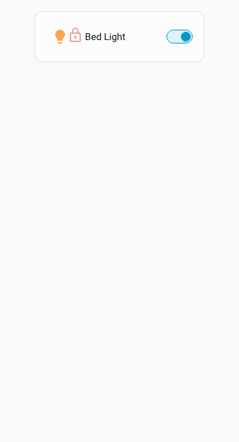
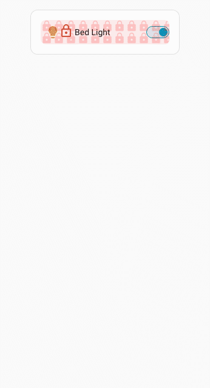
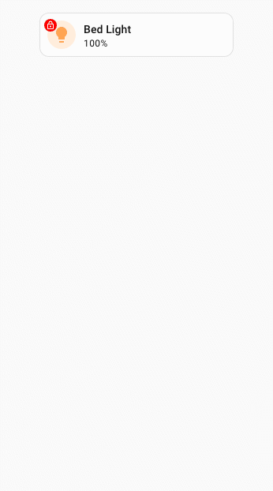

# :material-lock: Spark Lock

Le spark `lock` superpose une icône de verrou à tout élément créé avec [UIX Forge](../index.md). Tant que l'élément est verrouillé, toutes les interactions avec lui sont bloquées. L'utilisateur peut le déverrouiller par toucher, appui prolongé ou double toucher, avec éventuellement un code PIN, une phrase secrète ou une simple confirmation. Après la durée `duration` configurée, la superposition verrouille à nouveau l'élément.

Les boîtes de dialogue de saisie, de confirmation et de retour d'information utilisent les boîtes de dialogue natives de Home Assistant.

---

!!! tip
    Tous les exemples complets définissent `admins: true` dans la configuration du verrou, car vous serez administrateur pendant les tests. Sans cela, le verrou pourrait sembler inopérant.

## Utilisation de base

Les exemples de base incluent les administrateurs dans la configuration, en supposant que l'administrateur met en place le spark. Supprimez `admins: true` si les administrateurs doivent contourner le verrou.

```yaml
type: custom:uix-forge
forge:
  mold: card
  sparks:
    - type: lock
      locks:
        - code: 1234
          admins: true
element:
  type: tile
  entity: light.bed_light
```

??? example "Animation de l'utilisation de base"
    

---

## Cibler des éléments précis avec `for`

Comme pour les autres sparks, `for` accepte la même [syntaxe de navigation dans le DOM](../../concepts/dom.md) que les styles UIX, y compris `$` pour traverser les limites d'un shadowRoot.

Dans cet exemple, une ligne de carte Entities est la cible du verrou.

```yaml
type: entities
grid_options:
  columns: 6
entities:
  - type: custom:uix-forge
    forge:
      mold: row
      sparks:
        - type: lock
          for: $ hui-generic-entity-row
          locks:
            - code: 1234
              admins: true
    element:
      entity: light.bed_light
```

??? example "Exemple de ciblage"
    

!!! warning
    Les lignes des cartes Entities sont affichées en ligne (`display: inline`). Il n'est donc pas possible de cibler un élément plus profond, car les superpositions ne fonctionnent pas sur les éléments en ligne. Le spark `lock` ne peut s'appliquer qu'à une ligne d'entité entière.

---

## Règles de correspondance des verrous

`locks` est une liste ordonnée. La **première entrée correspondante** détermine ce que l'utilisateur doit faire pour déverrouiller l'élément. Les règles de correspondance sont les suivantes :

| Configuration | Utilisateurs concernés |
| --- | --- |
| Liste `users` présente | Utilisateurs dont le nom figure dans la liste. Si `admins: true`, les administrateurs sont également concernés. |
| Aucune liste `users` | Tous les utilisateurs non administrateurs qui ne figurent pas dans la liste `except`. |
| Aucune liste `users` et `admins: true` | **Tous les utilisateurs**, administrateurs ou non, qui ne figurent pas dans `except`. |

`admins` est un indicateur **additif**. Sans liste `users`, il *étend* la portée par défaut (tous les non-administrateurs) aux administrateurs ; l'entrée concerne alors tout le monde. Par défaut, les administrateurs sont **exclus** des entrées qui ne définissent pas explicitement `admins: true` et ne les mentionnent pas dans `users`.

Lorsqu'une entrée définit `active: false`, les verrous suivants sont examinés pour trouver une correspondance avec `active: true`. Si aucun verrou n'est actif, la première entrée inactive correspondant à l'utilisateur est retenue ; les utilisateurs concernés **ne sont pas verrouillés** et la superposition est masquée pour eux.

Si aucune entrée ne correspond, y compris une entrée `active: false` :

- `permissive: true` → l'élément est accessible à tous, sans superposition.
- `permissive: false` (valeur par défaut) → les **administrateurs contournent automatiquement** le verrou ; les autres utilisateurs sont bloqués sans possibilité de déverrouillage.

---

## Référence de configuration

### Clés principales

| Clé | Type | Valeur par défaut | Description |
| --- | --- | --- | --- |
| `type` | string | — | Doit être défini sur `lock`. |
| `for` | string | `element` | Sélecteur UIX de l'élément à recouvrir. Avec la [configuration de carte vide](../forge.md#blank-card-config), la valeur par défaut est `uix-forge-blank-card $ div.content`. Sinon, `element` désigne la racine de l'élément créé avec Forge. |
| `action` | string | `tap` | Geste qui déclenche le déverrouillage : `tap`, `hold` ou `double_tap`. |
| `duration` | nombre ou chaîne | `3000` | Délai avant le verrouillage automatique après un déverrouillage réussi. Les nombres sont en millisecondes ; les chaînes acceptent des unités lisibles, par exemple `"5s"`, `"1m"` ou `"500ms"`. |
| `icon_locked` | string | `mdi:lock-outline` | Icône MDI affichée lorsque l'élément est verrouillé. |
| `icon_unlocked` | string | — | Icône MDI affichée lorsque l'élément est déverrouillé. Si cette option est absente, l'icône de verrou s'estompe. |
| `icon_locked_color` | string | `--error-color` | Couleur CSS de l'icône verrouillée. |
| `icon_unlocked_color` | string | `--success-color` | Couleur CSS de l'icône déverrouillée ; utilisée uniquement si `icon_unlocked` est défini. |
| `icon_position` | object | Moule `row` : `{top: 6, left: 30}` ; cible `ha-tile-icon` : `{top: 3, left: 3}` | Décalages de l'icône dans la superposition. Accepte `top` ou `bottom`, ainsi que `left` ou `right` (une seule valeur par paire). Les nombres sont en pixels ; les chaînes acceptent toute valeur CSS. |
| `icon_size` | nombre ou chaîne | `12px` pour `ha-tile-icon`, sinon `24px` | Taille de l'icône. Les nombres sont en pixels, par exemple `18` devient `18px` ; les chaînes sont transmises telles quelles, par exemple `"1.5rem"`. La variable CSS `--uix-lock-icon-size`, définie dans UIX Styling ou un thème, est prioritaire. |
| `permissive` | booléen | `false` | Si `true`, l'élément est accessible lorsqu'aucune entrée de verrou ne correspond à l'utilisateur. |
| `entity` | string | — | ID d'entité utilisé lorsque `unlocked_action` est une action Home Assistant classique. |
| `unlocked_action` | object | — | Action exécutée immédiatement après un déverrouillage réussi. |
| `locks` | liste | `[]` | Liste ordonnée des entrées de verrou (voir ci-dessous). |
| `code_dialog` | object | — | Options transmises à la boîte de dialogue de saisie du code ou de la phrase secrète (voir ci-dessous). |

### `code_dialog`

Contrôle l'apparence de la boîte de dialogue de saisie du code PIN ou de la phrase secrète. Dans la boîte de dialogue numérique, le titre est mis en évidence et le texte de validation apparaît au survol de la coche. Dans celle de la phrase secrète, toutes les options sont affichées.

| Clé | Type | Valeur par défaut | Description |
| --- | --- | --- | --- |
| `title` | string | Valeur Home Assistant | Titre de la boîte de dialogue. Si l'option est omise, le titre natif de Home Assistant est utilisé. |
| `submit_text` | string | Valeur Home Assistant | Libellé du bouton de confirmation. Si l'option est omise, le libellé natif de Home Assistant est utilisé. |
| `cancel_text` | string | Valeur Home Assistant | Libellé du bouton d'annulation. Si l'option est omise, le libellé natif de Home Assistant est utilisé. |

### `unlocked_action`

| Valeur | Effet |
| --- | --- |
| `action: element_tap` | Déclenche `tap_action` sur l'élément cible. |
| `action: element_hold` | Déclenche `hold_action` sur l'élément cible. |
| `action: element_double_tap` | Déclenche `double_tap_action` sur l'élément cible. |
| N'importe quel objet d'action HA | Exécute cette action sur `entity`, par exemple `action: toggle`. |

### Lock entry keys

| Clé | Type | Valeur par défaut | Description |
| --- | --- | --- | --- |
| `active` | booléen | `true` | Définissez `false` pour déverrouiller explicitement l'élément pour les utilisateurs concernés, sans superposition. |
| `code` | chaîne ou nombre | — | Code à saisir. Une valeur numérique affiche le pavé numérique Home Assistant ; une chaîne affiche un champ de mot de passe. |
| `pin` | chaîne ou nombre | — | Alias de `code`. |
| `confirmation` | chaîne ou booléen | — | Demande de confirmation. Utilisez `true` pour le texte localisé par défaut de Home Assistant ou indiquez un texte personnalisé. |
| `users` | liste de chaînes | — | Noms des utilisateurs concernés par cette entrée. |
| `admins` | booléen | `false` | **Indicateur additif.** Sans liste `users`, `admins: true` étend l'entrée à **tous les utilisateurs**, administrateurs compris. Avec une liste `users`, les administrateurs sont également concernés. Ils sont exclus si cette option est absente ou définie sur `false`. |
| `except` | liste de chaînes | — | Utilisateurs exemptés de cette entrée ; cette option est utilisée uniquement sans liste `users`. |
| `retry_delay` | nombre ou chaîne | — | Délai entre deux tentatives après un code incorrect. Les nombres sont en millisecondes ; les chaînes acceptent des unités lisibles, par exemple `"10s"`. |
| `max_retries` | nombre | — | Nombre maximal de tentatives incorrectes consécutives avant l'application du délai prolongé. |
| `max_retries_delay` | nombre ou chaîne | `30000` | Durée du blocage après le nombre maximal de tentatives. Les nombres sont en millisecondes ; les chaînes acceptent des unités lisibles, par exemple `"30s"` ou `"5m"`. |

---

## Exemples

### Même code PIN pour tout le monde, administrateurs compris

`admins: true` étend l'entrée à tout le monde : une seule entrée suffit.

```yaml
locks:
  - code: 1234
    admins: true   # applies to all users (non-admins by default + admins because admins: true)
```

### Aucun verrou pour les administrateurs (par défaut) et un utilisateur précis

Les administrateurs contournent toute entrée qui ne définit pas `admins: true` et ne les mentionne pas dans `users`. Ici, `user1` est explicitement déverrouillé et tous les autres utilisateurs non administrateurs doivent saisir un code PIN :

```yaml
locks:
  - active: false
    users:
      - user1
  - code: 1234      # non-admins only (admins are excluded by default)
```

### Demander confirmation à tout le monde, administrateurs compris

```yaml
locks:
  - admins: true
    confirmation: true
```

### Code PIN pour tout le monde, sans verrou pour certains utilisateurs

```yaml
permissive: false
locks:
  - active: false
    users:
      - trusted_user
  - code: 1234
    admins: true   # apply to everyone (including admins)
```

### Codes PIN différents par groupe d'utilisateurs, avec contournement pour les administrateurs

Comme `admins: true` dans une entrée sans liste `users` concerne *tout le monde*, cette méthode ne permet pas de créer une entrée réservée aux administrateurs. Pour leur attribuer un code PIN distinct, indiquez-les explicitement dans `users` :

```yaml
locks:
  - users:
      - admin_user
    code: 9876     # admin_user gets this PIN
  - users:
      - jim
      - alison
    code: 1234
  - users:
      - john
      - jane
    code: 4567
```

### Verrouiller uniquement certains utilisateurs (`permissive: true`)

```yaml
permissive: true
locks:
  - users:
      - jim
      - alison
    code: 1234
```

### Carte Tile : exécuter hold_action au déverrouillage

```yaml
type: custom:uix-forge
forge:
  mold: card
  sparks:
    - type: lock
      unlocked_action:
        action: element_hold
      locks:
        - code: 1234
          admins: true
element:
  type: tile
  entity: light.bed_light
  hold_action:
    action: toggle
```

### Carte Tile : basculer directement l'entité au déverrouillage

```yaml
type: custom:uix-forge
forge:
  mold: card
  sparks:
    - type: lock
      entity: light.bed_light
      unlocked_action:
        action: toggle
      locks:
        - code: 1234
          admins: true
element:
  type: tile
  entity: light.bed_light
```

---

### Carte Tile : verrouiller uniquement l'icône

Utilisez `for` pour cibler directement `ha-tile-icon` : seule la zone de l'icône est verrouillée, le reste de la tuile reste interactif. Dans ce contexte, l'icône de verrou utilise par défaut une taille de `12px`, une position `top: 3px`, `left: 3px` et `--uix-lock-icon-padding: 2px`, pour imiter un badge placé à gauche de l'icône de tuile.

```yaml
type: custom:uix-forge
forge:
  mold: card
  sparks:
    - type: lock
      for: hui-tile-card $ ha-tile-icon
      locks:
        - code: 1234
          admins: true
element:
  type: tile
  entity: light.bed_light
  tap_action:
    action: toggle
```

---

### Libellés personnalisés de la boîte de dialogue du code

Utilisez `code_dialog` pour remplacer le titre et les libellés des boutons de la boîte de dialogue de saisie du code PIN ou de la phrase secrète :

```yaml
type: custom:uix-forge
forge:
  mold: card
  sparks:
    - type: lock
      code_dialog:
        title: 'Enter Pin:'
        submit_text: 'Unlock'
        cancel_text: 'Cancel'
      locks:
        - code: 1234
          admins: true
element:
  type: tile
  entity: light.bed_light
```

---

## Personnaliser l'apparence de la superposition

La superposition de verrou utilise les propriétés CSS personnalisées suivantes. Définissez-les dans `uix.style` de l'élément Forge ou dans un thème pour personnaliser son apparence :

| Variable CSS | Valeur par défaut | Description |
| --- | --- | --- |
| `--uix-lock-z-index` | `10` | Ordre de superposition. |
| `--uix-lock-display` | `block` | Valeur CSS `display` de la superposition. À ajuster si la position doit être adaptée à la cible. |
| `--uix-lock-opacity` | `0.5` | Opacité de la superposition, icône et arrière-plan compris. |
| `--uix-lock-background` | `transparent` | Arrière-plan lorsque l'élément est verrouillé. |
| `--uix-lock-background-unlocked` | `none` | Arrière-plan lorsque l'élément est déverrouillé. Par défaut, aucun arrière-plan n'est affiché afin que `--uix-lock-background` ne s'applique pas à cet état. |
| `--uix-lock-background-blocked` | `--uix-lock-background` | Arrière-plan lorsque le verrou bloque définitivement l'accès (aucun moyen de déverrouillage, sauf moule `row`). |
| `--uix-lock-border-radius` | `inherit` | Rayon de bordure de la superposition, hérité de la cible. |
| `--uix-lock-icon-size` | `24px` ; `12px` pour `ha-tile-icon` | Taille de l'icône de verrou. Remplace toute valeur `icon_size` définie dans la configuration du spark. |
| `--uix-lock-icon-background` | `none` | Arrière-plan de l'élément icône. Permet, par exemple, d'ajouter une pastille ou un cercle coloré. |
| `--uix-lock-icon-background-unlocked` | `--uix-lock-icon-background` | Arrière-plan de l'icône lorsque le verrou est ouvert. À défaut, utilise `--uix-lock-icon-background`. |
| `--uix-lock-icon-background-blocked` | `--uix-lock-icon-background` | Arrière-plan de l'icône lorsque l'accès est bloqué définitivement. À défaut, utilise `--uix-lock-icon-background`. |
| `--uix-lock-icon-border-radius` | `none` ; `50%` pour `ha-tile-icon` | Rayon de bordure de l'icône. Utilisez `50%` pour un cercle ou une grande valeur, par exemple `50px`, pour une pastille allongée. |
| `--uix-lock-icon-padding` | `0` ; `2px` lorsque la cible est `ha-tile-info` | Marge intérieure autour de l'icône, entre celle-ci et son arrière-plan. |
| `--uix-lock-icon-position` | `none` | Valeur CSS `translate` appliquée à l'icône, par exemple `30px 6px`. Utile pour la positionner uniquement en CSS lorsque `icon_position` n'est pas configuré. |
| `--uix-lock-icon-fade-duration` | `2s` | Durée du fondu de l'icône lors du déverrouillage ; utilisée uniquement si `icon_unlocked` n'est pas défini. |
| `--uix-lock-row-background` | `--uix-lock-background` | Arrière-plan de la superposition lorsque le moule Forge est `row`. |
| `--uix-lock-row-border-radius` | `--uix-lock-border-radius` | Rayon de bordure de la superposition lorsque le moule Forge est `row`. |
| `--uix-lock-row-outlined-blocked` | `none` | Valeur CSS `outline` de la superposition dans le moule `row` lorsque l'accès est bloqué définitivement. |
| `--uix-lock-cursor` | `pointer` | Curseur affiché sur la superposition dans tous les états. Les variables spécifiques ci-dessous peuvent le remplacer. |
| `--uix-lock-cursor-locked` | `--uix-lock-cursor` | Curseur affiché lorsque la superposition est verrouillée. |
| `--uix-lock-cursor-unlocked` | `--uix-lock-cursor` | Curseur affiché lorsque la superposition est déverrouillée. |
| `--uix-lock-cursor-blocked` | `--uix-lock-cursor` | Curseur affiché lorsque l'accès est bloqué définitivement. |

### Exemples de style

#### Arrière-plans de la superposition

Cet exemple utilise UIX Styling pour définir les arrière-plans des états verrouillé et déverrouillé, ainsi qu'une opacité réduite. Il utilise également une icône de verrou.

```yaml
type: entities
grid_options:
  columns: 6
entities:
  - type: custom:uix-forge
    forge:
      mold: row
      sparks:
        - type: lock
          for: $ hui-generic-entity-row
          duration: 5s
          icon_unlocked: mdi:lock-open-variant-outline
          permissive: true
          locks:
            - code: 1234
              admins: true
      uix:
        style: |
          :host {
            --uix-lock-background: url("data:image/svg+xml,%3Csvg xmlns='http://www.w3.org/2000/svg' width='32' height='32' viewBox='0 0 24 24'%3E%3Cpath fill='red' fill-opacity='.18' d='M18 8h-1V6c0-2.76-2.24-5-5-5S7 3.24 7 6v2H6c-1.1 0-2 .9-2 2v10c0 1.1.9 2 2 2h12c1.1 0 2-.9 2-2V10c0-1.1-.9-2-2-2zm-6 9c-1.1 0-2-.9-2-2s.9-2 2-2 2 .9 2 2-.9 2-2 2zm3.1-9H8.9V6c0-1.71 1.39-3.1 3.1-3.1 1.71 0 3.1 1.39 3.1 3.1v2z'/%3E%3C/svg%3E") 0 0/20px 20px repeat, rgba(200,0,0,0.08);
            --uix-lock-background-unlocked: url("data:image/svg+xml,%3Csvg xmlns='http://www.w3.org/2000/svg' width='32' height='32' viewBox='0 0 24 24'%3E%3Cpath fill='green' fill-opacity='.08' d='M18 8h-1V6c0-2.76-2.24-5-5-5S7 3.24 7 6v2H6c-1.1 0-2 .9-2 2v10c0 1.1.9 2 2 2h12c1.1 0 2-.9 2-2V10c0-1.1-.9-2-2-2zm-6 9c-1.1 0-2-.9-2-2s.9-2 2-2 2 .9 2 2-.9 2-2 2zm3.1-9H8.9V6c0-1.71 1.39-3.1 3.1-3.1 1.71 0 3.1 1.39 3.1 3.1v2z'/%3E%3C/svg%3E") 0 0/20px 20px repeat, rgba(0,200,0,0.04);
            --uix-lock-opacity: 1;
            --uix-lock-border-radius: 8px;
          }
    element:
      entity: light.bed_light
```

??? example "Exemple de style"
    

#### Icône de verrou sur une icône de tuile

Cet exemple utilise UIX Styling pour définir l'arrière-plan de l'icône de verrou. Le verrou cible l'icône d'une tuile et prend l'apparence d'un badge.

```yaml
type: custom:uix-forge
forge:
  mold: card
  sparks:
    - type: lock
      for: hui-tile-card $ ha-tile-icon
      icon_unlocked: mdi:lock-open-outline
      duration: 5s
      locks:
        - code: 1234
          admins: true
  uix:
    style: |
      :host {
        --uix-lock-opacity: 1;
        --uix-lock-icon-color: white;
        --uix-lock-icon-background: red;
        --uix-lock-icon-background-unlocked: green;
      }
element:
  type: tile
  entity: light.bed_light
```

??? example "Exemple de style"
    

---

## Modèles

Comme toutes les configurations de spark, les entrées `locks` sont traitées comme des modèles Jinja2. Vous pouvez donc rendre `active` conditionnel :

```yaml
- type: lock
  locks:
    - active: "{{ is_state('input_boolean.lock_enabled', 'on') }}"
      code: 1234
      admins: true
```

!!! tip
    Utilisez le helper [`uix_forge_path()`](../../concepts/dom.md#uix_forge_path0-forge-helper) dans la console des outils de développement du navigateur pour trouver le sélecteur `for` adapté à l'élément à verrouiller.
