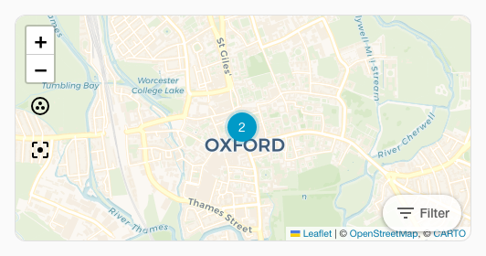
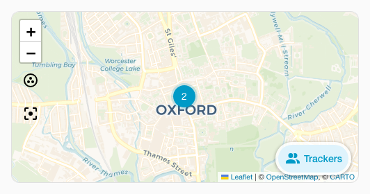

# :material-map: Spark Map

Le spark `map` ajoute une gestion avancée de la vue à une carte Map utilisée dans un élément créé avec [UIX Forge](../index.md). Il propose cinq modes :

- **Mode mémoire** (`memory: true`) : enregistre le zoom et le centre actuels de la carte avant chaque mise à jour, puis les restaure pour conserver la vue choisie. Sans ce mode, chaque mise à jour du modèle Forge réinitialise la carte à son zoom et à son centre par défaut.
- **Mode ajustement de la carte** (`fit_map: true`) : ajuste la carte lorsque celle-ci ne s'adapte pas automatiquement au chargement, par exemple dans une carte personnalisée qui masque d'abord la carte, comme `custom:auto-entities`.
- **Mode visite** (`tour: true | object`) : déplace automatiquement la carte entre une liste de points d'intérêt. Un bouton pause/lecture est ajouté. Avec `tour: true`, les valeurs par défaut sont utilisées ; indiquez un objet pour personnaliser le comportement.
- **Mode curseur de période** (`hours_to_show: true | object`) : ajoute un curseur `ha-slider` interactif à la carte afin de régler en temps réel la durée de l'historique chargé et affiché.
- **Mode filtre d'entités** (`entity_filter: true | object`) : ajoute à la carte un menu déroulant avec cases à cocher pour afficher ou masquer les entités en temps réel.

## Utilisation de base

```yaml
type: custom:uix-forge
forge:
  mold: card
  sparks:
    - type: map
      memory: true
element:
  type: map
  entities:
    - device_tracker.phone
```

## Configuration

| Clé | Type | Valeur par défaut | Description |
| --- | --- | --- | --- |
| `type` | string | — | Doit être défini sur `map`. |
| `memory` | booléen | `false` | Enregistre puis restaure le zoom et le centre avant et après chaque mise à jour. |
| `fit_map` | booléen | `false` | Ajuste la vue à toutes les entités dès que la carte est visible, utile pour les cartes masquées au chargement. |
| `tour` | booléen ou objet | `false` | Active le mode visite. `true` utilise toutes les valeurs par défaut ; indiquez un objet pour personnaliser les options (voir ci-dessous). |
| `hours_to_show` | booléen ou objet | `false` | Active le curseur de période. `true` utilise les valeurs par défaut ; indiquez un objet pour les personnaliser (voir ci-dessous). |
| `entity_filter` | booléen ou objet | `false` | Active le menu de filtrage des entités. `true` utilise les valeurs par défaut ; indiquez un objet pour les personnaliser (voir ci-dessous). |

### Sous-clés du mode visite

| Clé | Type | Valeur par défaut | Description |
| --- | --- | --- | --- |
| `period` | chaîne ou nombre | `10s` | Durée d'arrêt sur chaque point d'intérêt. Accepte une durée lisible, par exemple `"30s"` ou `"2m"`, ou un nombre en millisecondes. |
| `zoom` | nombre | `14` | Niveau de zoom par défaut lors du déplacement vers un point d'intérêt. |
| `icon_pause` | string | `mdi:pause` | Icône du bouton superposé pendant la lecture de la visite. |
| `icon_play` | string | `mdi:play` | Icône du bouton superposé lorsque la visite est en pause. |
| `icon_position` | objet | `{bottom: 40px, right: 10px}` | Position CSS du bouton pause/lecture. Accepte les clés `top`, `bottom`, `left` et `right` ; les nombres sont interprétés en pixels. |
| `poi` | liste | *(non défini)* | Liste de points d'intérêt. Si elle est absente, les entités déclarées dans la carte `ha-map` sont utilisées. |

Chaque entrée de la liste `poi` peut contenir :

| Clé | Type | Description |
| --- | --- | --- |
| `entity` | string | ID d'entité. Doit figurer dans la liste `entities` de `ha-map`. La latitude et la longitude sont lues dans les attributs d'état hass. |
| `latitude` | nombre | Latitude, obligatoire si `entity` n'est pas défini. |
| `longitude` | nombre | Longitude, obligatoire si `entity` n'est pas défini. |
| `zoom` | nombre | Remplacement du zoom pour ce point d'intérêt. |

### Sous-clés du curseur de période

| Clé | Type | Valeur par défaut | Description |
| --- | --- | --- | --- |
| `min` | nombre | `0` | Nombre minimal d'heures affiché sur le curseur. |
| `max` | nombre | `24` | Nombre maximal d'heures affiché sur le curseur. |
| `step` | nombre | `1` | Pas d'incrémentation du curseur. |
| `position` | objet | `{bottom: 40px, right: 10px}` | Position CSS de la capsule du curseur. Accepte `top`, `bottom`, `left` et `right` ; les nombres sont interprétés en pixels. |
| `tooltip_distance` | nombre | `20` | Distance en pixels entre l'infobulle du curseur et sa poignée. |

Les commandes sans position configurée, ou avec la position explicite `{bottom: 40px, right: 10px}`, sont alignées sur une rangée horizontale au-dessus de l'attribution de la carte. Les autres positions, y compris `{bottom: 10px, right: 10px}`, utilisent indépendamment les décalages configurés.

### Sous-clés du filtre d'entités

| Clé | Type | Valeur par défaut | Description |
| --- | --- | --- | --- |
| `position` | objet | `{bottom: 40px, right: 10px}` | Position CSS de la capsule du bouton de filtre. Accepte `top`, `bottom`, `left` et `right` ; les nombres sont interprétés en pixels. |
| `size` | string | `s` | Taille du bouton, par exemple `s`, `m` ou `l`. |
| `variant` | string | `neutral` | Variante de couleur du bouton, par exemple `brand`, `neutral`, `danger`, `warning` ou `success`. |
| `appearance` | string | `filled` | Apparence du bouton, par exemple `accent`, `filled` ou `plain`. |
| `icon` | string | `mdi:filter-variant` | Icône de début du bouton déclencheur. |
| `label` | string | `Filter` | Libellé du bouton déclencheur. Définissez une chaîne vide pour le masquer. |
| `group` | booléen ou objet | `false` | Regroupe les entités par domaine. Utilisez `true` pour les valeurs par défaut ou un objet pour définir le libellé de chaque groupe de domaine. |

#### Sous-clés des groupes du filtre d'entités

| Clé | Type | Valeur par défaut | Description |
| --- | --- | --- | --- |
| `persons` | string | `Persons` | Libellé du groupe d'entités du domaine `person`. |
| `trackers` | string | `Trackers` | Libellé du groupe d'entités du domaine `device_tracker`. |
| `zones` | string | `Zones` | Libellé du groupe d'entités du domaine `zone`. |

### Variables CSS du mode visite

Le bouton pause/lecture peut être stylisé avec des variables CSS définies sur `ha-card` ou l'un de ses ancêtres :

| Variable | Valeur par défaut | Description |
| --- | --- | --- |
| `--uix-map-tour-icon-color` | `var(--primary-color)` | Couleur de l'icône. |
| `--uix-map-tour-icon-ring-color` | `var(--uix-map-tour-icon-color)` | Couleur de l'anneau de compte à rebours ; par défaut, celle de l'icône. |
| `--uix-map-tour-icon-background` | `rgba(255,255,255,0.8)` | Arrière-plan du bouton. |
| `--uix-map-tour-icon-box-shadow` | `0 1px 5px rgba(0,0,0,0.4)` | Ombre portée du conteneur de l'icône. |
| `--uix-map-tour-icon-width` | `auto` | Largeur du bouton. |
| `--uix-map-tour-icon-height` | `auto` | Hauteur du bouton. |
| `--uix-map-tour-icon-border-radius` | `9999px` | Rayon de bordure du bouton, en forme de pilule par défaut. |
| `--uix-map-tour-icon-z-index` | `1000` | Niveau d'empilement du bouton ; les contrôles Leaflet utilisent `1000`. |

### Variables CSS du curseur de période

Le curseur de durée de l'historique peut être stylisé avec des variables CSS définies sur `ha-card` ou l'un de ses ancêtres :

| Variable | Valeur par défaut | Description |
| --- | --- | --- |
| `--uix-map-slider-background` | `rgba(255,255,255,0.8)` | Couleur d'arrière-plan du conteneur du curseur. |
| `--uix-map-slider-text-color` | `var(--primary-text-color, #212121)` | Couleur du libellé de durée affiché à côté du curseur. |
| `--uix-map-slider-width` | `100px` | Largeur explicite du curseur. |
| `--uix-map-slider-border-radius` | `9999px` | Rayon de bordure du conteneur, en forme de pilule par défaut. |
| `--uix-map-slider-padding` | `4px 12px` | Marge intérieure du conteneur en forme de capsule. |
| `--uix-map-slider-box-shadow` | `0 1px 5px rgba(0,0,0,0.4)` | Ombre portée du conteneur. |
| `--uix-map-slider-z-index` | `1000` | Niveau d'empilement de la capsule du curseur. |
| `--uix-map-slider-label-min-width` | `28px` | Largeur minimale du libellé de durée. |
| `--uix-map-slider-thumb-size` | *(non défini)* | Hauteur et largeur de la poignée du curseur. |
| `--uix-map-slider-thumb-height` | `16px` | Hauteur de la poignée ; utilise `thumb-size` si cette option est définie. |
| `--uix-map-slider-thumb-width` | `16px` | Largeur de la poignée ; utilise `thumb-size` si cette option est définie. |
| `--uix-map-slider-track-size` | `4px` | Épaisseur de la piste du curseur. |
| `--uix-map-slider-track-color` | `var(--disabled-color)` | Couleur de fond de la piste. |
| `--uix-map-slider-indicator-color` | `var(--primary-color)` | Couleur de la barre de progression active. |
| `--uix-map-slider-thumb-color` | `var(--uix-map-slider-indicator-color)` | Couleur de la poignée circulaire. |
| `--uix-map-slider-thumb-hover-opacity` | `0.08` | Opacité du halo autour de la poignée au survol. |
| `--uix-map-slider-thumb-pressed-opacity` | `0.12` | Opacité du halo lorsque la poignée est active ou pressée. |
| `--uix-map-slider-thumb-box-shadow` | `inherit` | Ombre personnalisée de la poignée interactive. |
| `--uix-map-slider-tooltip-color` | `var(--primary-text-color)` | Couleur du texte dans l'infobulle de la poignée. |
| `--uix-map-slider-tooltip-font-size` | `var(--ha-font-size-s)` | Taille du texte de l'infobulle. |
| `--uix-map-slider-tooltip-font-weight` | `var(--ha-font-weight-normal)` | Graisse du texte de l'infobulle. |
| `--uix-map-slider-tooltip-background-color` | `var(--secondary-background-color)` | Arrière-plan de l'infobulle. |
| `--uix-map-slider-tooltip-border-radius` | `var(--ha-border-radius-sm)` | Rayon de bordure de l'infobulle. |
| `--uix-map-slider-tooltip-border-width` | `0px` | Épaisseur de la bordure de l'infobulle. |
| `--uix-map-slider-tooltip-border-color` | `currentColor` | Couleur de la bordure de l'infobulle. |
| `--uix-map-slider-tooltip-border-style` | `none` | Style de la bordure de l'infobulle. |

### Variables CSS du filtre d'entités

Le menu déroulant du filtre d'entités peut être stylisé avec des variables CSS définies sur `ha-card` ou l'un de ses ancêtres :

| Variable | Valeur par défaut | Description |
| --- | --- | --- |
| `--uix-map-entity-filter-background` | `rgba(255,255,255,0.8)` | Couleur d'arrière-plan du conteneur du filtre. |
| `--uix-map-entity-filter-padding` | `4px` | Marge intérieure de la capsule du filtre. |
| `--uix-map-entity-filter-border-radius` | `9999px` | Rayon de bordure du conteneur, en forme de pilule par défaut. |
| `--uix-map-entity-filter-box-shadow` | `0 1px 5px rgba(0,0,0,0.4)` | Ombre portée du conteneur. |
| `--uix-map-entity-filter-z-index` | `1000` | Niveau d'empilement de la capsule du filtre. |
| `--uix-map-entity-filter-dropdown-min-width` | `180px` | Largeur minimale du menu déroulant ouvert. |
| `--uix-map-entity-filter-item-icon-color` | `var(--ha-color-fill-neutral-loud-resting)` | Couleur de l'icône de case à cocher des éléments de la liste. |
| `--uix-map-entity-filter-item-icon-checked-color` | `var(--uix-map-entity-filter-item-icon-color, var(--primary-color))` | Couleur de l'icône lorsque l'élément de la liste est coché. |

## Fonctionnement

**Mode mémoire :**

Chaque fois que l'élément Forge est sur le point d'être actualisé à la suite d'une mise à jour du modèle, le spark :

1. lit les valeurs `zoom` et `center` actuelles du moteur de rendu de la carte dans `ha-map` ;
2. attend la fin du cycle de mise à jour de l'élément Forge, puis de `ha-map` ;
3. restaure la position enregistrée via le moteur cartographique de Home Assistant, sans animation.

Si le moteur de rendu de la carte n'est pas encore initialisé au moment de l'actualisation, par exemple au premier rendu, l'enregistrement est ignoré et aucune restauration n'est tentée. La carte affiche alors sa vue par défaut au premier chargement.

**Mode d'ajustement de la carte :**

Lorsque l'élément Forge et `ha-map` ont terminé leur mise à jour et que le moteur cartographique dispose d'une taille exploitable, le spark appelle `fitMap()` sur `ha-map`.

**Mode visite :**

Lorsque la carte est prête — et après la fin de `fit_map` si les deux options sont activées — le spark :

1. résout la liste des points d'intérêt à partir de la configuration `poi` ou des attributs d'état hass `latitude` et `longitude` des entités de `ha-map` ;
2. ajoute au conteneur du moteur cartographique un bouton `ha-icon-button` entouré d'un anneau SVG de compte à rebours ;
3. déplace immédiatement la carte vers le premier point, puis lance un minuteur qui passe au point suivant toutes les `period` secondes via le moteur cartographique ;
4. anime l'anneau de compte à rebours de complet à vide pendant chaque période afin d'indiquer le temps restant sur le point actuel ;
5. arrête ou redémarre le minuteur lorsque l'utilisateur appuie sur le bouton pause/lecture, et masque ou relance l'anneau.

Lorsque `memory: true` et `tour` sont activés ensemble, la restauration liée aux mises à jour hass est suspendue pendant la visite afin de ne pas interrompre son animation.

**Mode curseur de période :**

Lorsque ce mode est actif, le spark :

1. affiche un curseur horizontal `ha-slider` dans un conteneur superposé en forme de capsule ;
2. si `tour` est également actif à sa position par défaut, décale automatiquement le curseur vers la gauche pour éviter le chevauchement ;
3. définit, limite et met à jour automatiquement `_config.hours_to_show` de `hui-map-card` lors du déplacement ou du relâchement du curseur, afin de charger l'historique en temps réel ;
4. conserve la valeur choisie par l'utilisateur lors des nouveaux rendus Forge déclenchés par les modèles.

**Mode filtre d'entités :**

Lorsque ce mode est actif, le spark :

1. affiche un menu déroulant superposé avec `ha-dropdown` et un bouton déclencheur `ha-button` ;
2. résout chaque entité de la carte et l'affiche sous forme de case à cocher avec son nom convivial ;
3. filtre directement les entités visibles. Comme une carte Map renvoie une erreur sans entité, il est impossible de décocher la dernière entité sélectionnée ;
4. si `show_all: true` est défini dans la configuration de la carte Forge, l'option `Show All` apparaît aussi dans le menu. Tant qu'un filtre est actif, les nouvelles entités ne s'affichent pas avant la sélection de `Show All` ;
5. si `tour` ou `hours_to_show` est également actif à sa position par défaut, le curseur est décalé vers la gauche pour éviter tout chevauchement ;
6. si `tour` est actif, toute modification du filtre redémarre la visite.

!!! note
    Le spark cible l'élément `hui-map-card` de l'élément Forge ainsi que l'élément `ha-map` dans son shadowRoot. Il prend en charge le moteur cartographique de Home Assistant (MapLibre lorsqu'il est disponible, avec Leaflet comme solution de repli) ainsi que les anciennes interfaces basées sur Leaflet. Si l'élément Forge n'est pas une carte Map ou s'il est enveloppé dans un élément qui n'expose pas `hui-map-card`, aucun mode ne fonctionnera.

## Exemples

### Utiliser le mode d'ajustement avec auto-entities

Avec une carte Map dans `custom:auto-entities`, la façon dont auto-entities masque la carte l'empêche de s'ajuster au chargement. Le mode d'ajustement garantit alors que la carte s'adapte dès son premier affichage.

Les filtres `include` sont omis pour raccourcir l'exemple.

```yaml
type: custom:auto-entities
entities:
  - zone.london
filter:
  include: []
  exclude: []
card:
  type: custom:uix-forge
  forge:
    mold: card
    sparks:
      - type: map
        fit_map: true
  element:
    type: map
    fit_zones: true
    uix:
      style: |
        :host {
          display: block;
          height: 400px;
        }
```

Sans `fit_map: true` :


Avec `fit_map: true` :


### Mode visite avec les paramètres par défaut

Parcourez automatiquement toutes les entités de la carte avec les valeurs par défaut (10 s par arrêt, bouton pause/lecture en bas à droite) :

```yaml
type: custom:uix-forge
forge:
  mold: card
  sparks:
    - type: map
      tour: true
element:
  type: map
  entities:
    - device_tracker.my_phone
    - device_tracker.my_tablet
```

:material-movie: [Animation du mode visite du spark Map (mp4)](../../assets/page-assets/forge/sparks/map-tour.mp4){ data-type="video" class="glightbox" }

### Mode visite avec une liste de points personnalisée

Naviguez entre des coordonnées fixes et des entités précises, avec un niveau de zoom pour chacune :

```yaml
type: custom:uix-forge
forge:
  mold: card
  sparks:
    - type: map
      tour:
        period: 15s
        zoom: 13
        icon_pause: mdi:pause-circle
        icon_play: mdi:play-circle
        icon_position:
          bottom: 16px
          left: 16px
        poi:
          - latitude: 51.614387 
            longitude: -0.731585
            zoom: 11
          - entity: device_tracker.my_tablet
            zoom: 14
element:
  type: map
  entities:
    - device_tracker.my_phone
    - device_tracker.my_tablet
```

:material-movie: [Animation du mode visite avec points personnalisés (mp4)](../../assets/page-assets/forge/sparks/map-tour-pois.mp4){ data-type="video" class="glightbox" }

### Styliser le bouton de visite

Remplacez la forme de pilule par défaut par des coins arrondis et un arrière-plan sombre :

```yaml
type: custom:uix-forge
forge:
  mold: card
  sparks:
    - type: map
      tour: true
element:
  type: map
  entities:
    - device_tracker.phone
  uix:
    style: |
      ha-card {
        --uix-map-tour-icon-color: white;
        --uix-map-tour-icon-background: rgba(255,0,0,0.5);
        --uix-map-tour-icon-border-radius: 4px;
      }
```


### Curseur de durée de l'historique

Activez un curseur personnalisable pour charger entre 1 et 48 heures d'historique des traceurs sur la carte :

```yaml
type: custom:uix-forge
forge:
  mold: card
  sparks:
    - type: map
      hours_to_show:
        min: 1
        max: 48
        step: 2
        position:
          bottom: 15px
          left: 15px
element:
  type: map
  hours_to_show: 3
  default_zoom: 8
  entities:
    - device_tracker.phone
```


### Menu déroulant de filtrage des entités

Activez un menu déroulant interactif pour afficher ou masquer les trajets des entités en temps réel :

```yaml
type: custom:uix-forge
forge:
  mold: card
  sparks:
    - type: map
      entity_filter: true
element:
  type: map
  entities:
    - device_tracker.phone
    - device_tracker.tablet
```



Personnalisez le texte, la taille, la couleur et l'icône du bouton déclencheur :

```yaml
type: custom:uix-forge
forge:
  mold: card
  sparks:
    - type: map
      entity_filter:
        label: "Trackers"
        icon: "mdi:account-multiple"
        size: "m"
        variant: "brand"
        appearance: "filled"
element:
  type: map
  entities:
    - device_tracker.phone
    - device_tracker.tablet
```



Affichez les entités regroupées par domaine avec des libellés personnalisés.

```yaml
type: custom:uix-forge
forge:
  mold: card
  sparks:
    - type: map
      entity_filter:
        group:
          persons: Household
          trackers: Phones
          zones: Places
element:
  type: map
  entities:
    - zone.london
    - device_tracker.phone
    - device_tracker.tablet
```


