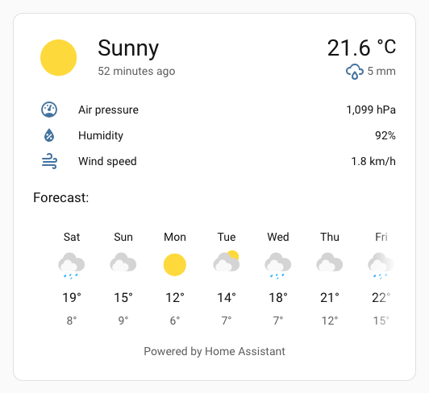
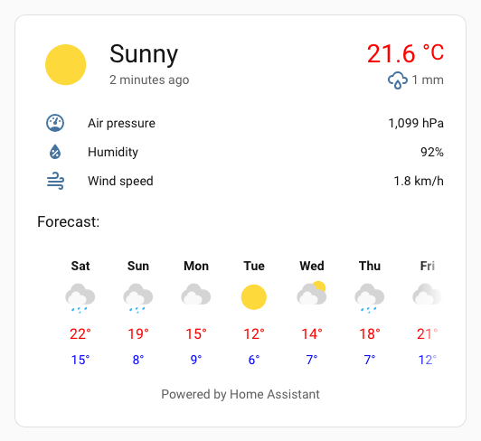
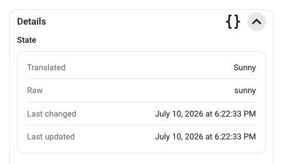

# :material-information-outline: Spark More-info

Le spark `more-info` insère l'élément Home Assistant `ha-more-info-info` avant ou après un élément cible dans un élément UIX Forge.

Il est particulièrement utile avec la [configuration de carte vide](../forge.md#blank-card-config) : la carte Forge ne possède alors pas de configuration `element`, et le spark insère son contenu dans la carte vide par défaut.

!!! note
    Lorsqu'une action nécessite une vue « Plus d'informations » enfant, comme la sélection des zones à nettoyer d'un aspirateur, une boîte de dialogue « Plus d'informations » classique s'ouvre sur cette vue.

## Utilisation de base

```yaml
type: custom:uix-forge
forge:
  mold: card
  grid_options:
    columns: full
  sparks:
    - type: more-info
      entity: weather.demo_weather_south
```



## Avec les détails

Définissez `details: true` pour ajouter une section de détails repliable sous le contenu principal. Son en-tête comprend :

- le sous-titre `Détails`
- un bouton de code qui active ou désactive le mode YAML de la vue détaillée ; il apparaît uniquement lorsque la section est déployée
- un chevron pour déployer ou replier la section

Le contenu détaillé repliable est placé dans un `ha-card` et reprend donc le style habituel des cartes Home Assistant, notamment la bordure, l'arrière-plan et l'ombre.

```yaml
type: custom:uix-forge
forge:
  mold: card
  grid_options:
    columns: full
  sparks:
    - type: more-info
      entity: weather.demo_weather_south
      details: true
```


## Configuration

| Clé | Type | Obligatoire | Valeur par défaut | Description |
| --- | ---- | -------- | ------- | ----------- |
| `type` | `string` | ✅ | — | Doit être défini sur `more-info`. |
| `after` | `string` | | voir la description | Sélecteur UIX de l'élément de référence. Le contenu « Plus d'informations » est inséré comme élément frère **après** l'élément correspondant. Avec la [configuration de carte vide](../forge.md#blank-card-config), la valeur par défaut est `uix-forge-blank-card $ div.content`. Sinon, la valeur par défaut est `""`. |
| `before` | `string` | | — | Sélecteur UIX de l'élément de référence. Le contenu « Plus d'informations » est inséré comme élément frère **avant** l'élément correspondant. |
| `entity` | `string` | | `element.entity` | ID de l'entité affichée dans le contenu intégré. Si cette option est omise, le spark utilise la configuration `entity` de l'élément UIX Forge lorsqu'elle est disponible. |
| `info` | `boolean` | | `true` | Si cette option vaut `false`, le contenu principal (`ha-more-info-info`) n'est pas affiché. Avec `details: true`, seule la section des détails peut ainsi être affichée. |
| `details` | `boolean` | | `false` | Ajoute une section repliable `ha-more-info-details` sous le contenu principal. |

!!! note
    Le spark cible le **premier** élément correspondant à `after` ou `before`.

## Styles de thème

Le spark applique les styles UIX `more-info` au conteneur de `ha-more-info-info`. Les chemins de thème `uix-more-info-yaml` peuvent donc cibler le contenu intégré comme ils ciblent la boîte de dialogue « Plus d'informations ».

Cet exemple colore en rouge les températures maximales actuelles et prévues, et met en gras les noms des jours de prévision. Le sélecteur de recherche abrégée [`ha-more-info-info $$ more-info-weather $`](../../concepts/dom.md#express-search-selector) remplace `ha-more-info-info $ more-info-content $ more-info-weather $`.

```yaml
my-theme:
  uix-theme: my-theme
  uix-more-info-yaml: |
    ha-more-info-info $$ more-info-weather $: |
      div.forecast-item-label {
        font-weight: bold;
      }
      div.temp,
      div.forecast-item div.temp {
        color: red;
      }
      div.forecast-item div.templow {
        color: blue;
      }
```



## Variables CSS

| Variable | Valeur par défaut | Description |
| --- | --- | --- |
| `--uix-more-info-details-head-height` | `40px` | Hauteur de la ligne d'en-tête de la section repliable. |
| `--uix-more-info-details-head-padding` | `0 var(--ha-space-4, 16px)` | Marge intérieure de la ligne d'en-tête. |
| `--uix-more-info-details-head-gap` | `var(--ha-space-2, 8px)` | Espace entre les boutons d'action des détails. |
| `--uix-more-info-details-outer-padding` | `0 var(--ha-space-6, 24px) var(--ha-space-6, 24px)` | Marge intérieure autour de la carte de détails. |
| `--uix-more-info-details-no-info-outer-padding` | `var(--ha-space-6, 24px)` | Marge intérieure autour de la carte lorsque le contenu principal est masqué (`info: false`). Un espace supérieur est ajouté si les détails sont affichés seuls. |
| `--uix-more-info-details-toggle-width` | `32px` | Taille des boutons d'action de la section de détails. |
| `--uix-more-info-details-transition-duration` | `350ms` | Durée des transitions de la liste déroulante, de l'icône et de l'apparition du bouton YAML. |
| `--uix-more-info-details-toggle-color` | `var(--primary-text-color)` | Couleur du bouton d'action des détails. |
| `--uix-more-info-details-max-height` | `unset` | Hauteur maximale des détails déployés. Définissez une valeur CSS pour limiter leur hauteur ; le contenu excédentaire peut défiler. |

## Fonctionnement et considérations de style

Le spark `more-info` utilise les éléments Home Assistant intégrés `<ha-more-info-info>` et `<ha-more-info-details>`, conçus à l'origine pour la boîte de dialogue « Plus d'informations ». Leur utilisation dans une mise en page UIX Forge demande de tenir compte de leur fonctionnement et de leur style.

### Bouton plein écran des détails YAML

Dans la boîte de dialogue, le bouton plein écran du mode YAML est limité par la largeur de la fenêtre. Dans le spark `more-info`, il resterait confiné à la liste déroulante. Pour éviter cela, le spark définit l'indicateur interne `inDialog` sur `<ha-more-info-details>` après son rendu.

### Marge intérieure du contenu principal

La marge intérieure par défaut du contenu principal « Plus d'informations » est généreuse : `--ha-space-6` (24 px). La marge extérieure des détails reprend cette valeur. C'est souvent trop important dans le spark `more-info`. Comme cette marge est appliquée dans la racine Shadow DOM, le plus simple est de la remplacer avec UIX Styling dans un thème, en ajustant aussi la marge des détails.

Réduisez la marge intérieure à `--ha-space-3` (8 px) :

```yaml
my-theme:
  uix-theme: my-theme
  uix-more-info-yaml: |
    .: |
      :host {
        --uix-more-info-details-outer-padding: 0 var(--ha-space-3) var(--ha-space-3);
      }
    ha-more-info-info $: |
      div.content {
        padding: var(--ha-space-3);
      }
```


### Marge intérieure du contenu détaillé

La marge intérieure intégrée au contenu détaillé est également généreuse : `--ha-space-6` (24 px). Elle est probablement trop importante dans la section de détails du spark `more-info`, surtout en haut. Comme elle est appliquée dans la racine Shadow DOM, remplacez-la avec UIX Styling dans un thème via `uix-more-info-yaml`.

Cet exemple réduit la marge intérieure du contenu détaillé avec `uix-more-info-yaml` et ajuste également celle de son en-tête :

```yaml
my-theme:
  uix-theme: my-theme
  uix-more-info-yaml: |
    .: |
      :host {
        --uix-more-info-details-head-padding: 0 var(--ha-space-3);
      }
    ha-more-info-details $: |
      div.content {
        padding: 0 var(--ha-space-3) var(--ha-space-3);
      }
```



## Utilisation avec des cartes standard

Tous les exemples précédents utilisent la carte vide UIX Forge. En raison du fonctionnement et du contenu du spark `more-info`, il est préférable d'utiliser une carte vide UIX Forge dans une pile de cartes.

L'exemple suivant place une carte de raccourci dans une pile. UIX Styling masque les bordures des cartes de la pile, puis applique à la pile verticale le style habituel d'un `ha-card`.

### Carte de raccourci dans une pile verticale

```yaml
type: vertical-stack
cards:
  - type: shortcut
    label: Weather Details
    icon: mdi:weather-sunny
    tap_action:
      action: navigate
      navigation_path: /weather-details
    uix:
      style: |
        ha-card {
          border-width: 0;
        }
  - type: custom:uix-forge
    forge:
      mold: card
      sparks:
        - type: more-info
          entity: weather.carlingford
          details: true
      grid_options:
        columns: full
    element:
      uix:
        style: |
          ha-card:has(.uix-forge-more-info) {
            border-width: 0px;
          }
uix:
  style: |
    :host {
      background: var(
        --ha-card-background,
        var(--card-background-color, white)
      );
      -webkit-backdrop-filter: var(--ha-card-backdrop-filter, none);
      backdrop-filter: var(--ha-card-backdrop-filter, none);
      box-shadow: var(--ha-card-box-shadow, none);
      box-sizing: border-box;
      border-radius: var(--ha-card-border-radius, var(--ha-border-radius-lg));
      border-width: var(--ha-card-border-width, 1px);
      border-style: solid;
      border-color: var(--ha-card-border-color, var(--divider-color, #e0e0e0));
      color: var(--primary-text-color);
      display: block;
      transition: all 0.3s ease-out;
      position: relative;
    }
```


