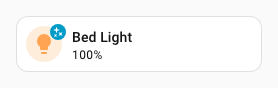
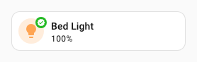
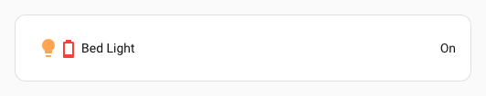

# :material-star-four-points-outline: Spark Overlay Icon

Le spark `overlay-icon` superpose une icône à n'importe quel élément créé avec [UIX Forge](../index.md).

- Si `entity` est défini, le spark affiche une `ha-state-icon`.
- Si `image_url` est défini, il affiche une `div` dont l'image est définie avec `background-image`.
- Sinon, il affiche une `ha-icon`.

L'icône peut provenir :

- d'une icône MDI ou personnalisée (`icon`)
- d'une URL d'image (`image_url`)
- de l'icône d'état d'une entité (`entity`)

## Utilisation de base

```yaml
type: custom:uix-forge
forge:
  mold: card
  sparks:
    - type: overlay-icon
      for: hui-tile-card $ ha-tile-icon
      icon: mdi:shimmer
element:
  type: tile
  entity: light.bed_light
```



## Référence de configuration

### Clés principales

| Clé | Type | Valeur par défaut | Description |
|---|---|---|---|
| `type` | string | — | Doit être défini sur `overlay-icon`. |
| `for` | string | `element` | Sélecteur UIX de l'élément à recouvrir. Avec la [configuration de carte vide](../forge.md#blank-card-config), la valeur par défaut est `uix-forge-blank-card $ div.content`. Sinon, `element` désigne la racine de l'élément créé avec Forge. |
| `icon` | string | — | Icône MDI ou personnalisée à afficher. Utilisez `icon` ou `image_url`. |
| `image_url` | string | — | Image statique superposée. Les URI `media-source://` sont prises en charge. Utilisez `icon` ou `image_url`. |
| `entity` | string | — | Affiche une icône d'état (`ha-state-icon`). Si `entity` est défini, `icon` et `image_url` sont ignorés. |
| `value` | string | — | Permet de remplacer la valeur d'état utilisée pour générer l'icône de l'entité. |
| `color` | string | `state` | Avec `entity`, définit la couleur de l'icône lorsque l'entité est active. Par défaut, elle dépend de l'état, du domaine et de la classe d'appareil. Utilisez `none` pour conserver la couleur par défaut. Valeurs acceptées : `state`, `none`, un [jeton de couleur Home Assistant](https://www.home-assistant.io/dashboards/tile/#available-colors) ou un code hexadécimal. Avec `none`, la couleur par défaut est `var(--white-color)` pour une cible `ha-tile-icon`, sinon `var(--primary-color)`. |
| `icon_color` | string | `var(--white-color)` pour `ha-tile-icon`, sinon `var(--primary-color)` | Couleur CSS de l'icône. Remplace `color` si cette option est définie. |
| `icon_position` | object | Pour `hui-generic-entity-row` : `{top: '8px', left: '30px'}` ; pour `ha-tile-icon` : `{top: '2px', left: '30px'}` ; sinon non définie | Décalages en pixels de l'icône dans la superposition. Accepte `top`, `bottom`, `left` et `right`. Les nombres sont interprétés en pixels ; les chaînes acceptent toute valeur CSS. `left` est prioritaire sur `right`, et `top` sur `bottom`. En raison du mécanisme de superposition, `right` est converti en `left: calc(100% - var(--uix-overlay-icon-size, <icon_size>) - <icon_position.right>)` et `bottom` en `top: calc(100% - var(--uix-overlay-icon-size, <icon_size>) - <icon_position.bottom>)`. |
| `icon_size` | nombre ou chaîne | `12px` pour `ha-tile-icon`, sinon `24px` | Taille de l'icône. Les nombres sont interprétés en pixels ; les chaînes sont transmises telles quelles. |
| `icon_background` | arrière-plan CSS | `var(--primary-color)` pour `ha-tile-icon`, sinon non défini | Arrière-plan explicite de l'icône ; remplace le comportement par défaut de `background-color`. |

## Personnaliser l'apparence de la superposition

L'icône superposée utilise les propriétés CSS personnalisées suivantes. Définissez-les dans `uix.style` de l'élément Forge ou dans un thème :

| Variable CSS | Valeur par défaut | Description |
|---|---|---|
| `--uix-overlay-icon-z-index` | `1` | Ordre de superposition. |
| `--uix-overlay-icon-display` | `block` | Valeur CSS `display` de la superposition. |
| `--uix-overlay-icon-opacity` | `1` pour `ha-tile-icon`, sinon `0.5` | Opacité de l'ensemble icône et arrière-plan. |
| `--uix-overlay-icon-border-radius` | `inherit` | Rayon de bordure de la superposition, hérité de la cible. |
| `--uix-overlay-icon-row-border-radius` | `--uix-overlay-icon-border-radius` | Rayon de bordure lorsque le moule Forge est `row`. |
| `--uix-overlay-icon-border` | `unset` | Style CSS de la bordure. |
| `--uix-overlay-icon-size` | `24px` ; `12px` pour `ha-tile-icon` | Taille de l'icône. Remplace `icon_size` dans la configuration du spark. |
| `--uix-overlay-icon-color` | `var(--primary-color)` ; `var(--white-color)` pour `ha-tile-icon` | Couleur de l'icône. |
| `--uix-overlay-icon-background` | `transparent` ; `var(--primary-color)` pour `ha-tile-icon` | Arrière-plan de l'élément icône si `icon_background` n'est pas défini. |
| `--uix-overlay-icon-border-radius` | `none` ; `50%` pour `ha-tile-icon` | Rayon de bordure de l'élément icône. |
| `--uix-overlay-icon-padding` | `0` ; `2px` pour `ha-tile-icon` | Marge intérieure autour de l'icône. |
| `--uix-overlay-icon-position` | `none` | Valeur CSS `translate` appliquée à l'icône, par exemple `30px 6px`. Elle se combine avec `icon_position` si cette option est définie. |

!!! warning
    Les lignes des cartes Entities sont affichées en ligne (`display: inline`). Il n'est donc pas possible de cibler un élément plus profond, car les superpositions ne fonctionnent pas sur les éléments en ligne. Le spark `overlay-icon` ne peut s'appliquer qu'à une ligne entière.

!!! note
    Si la position calculée de l'élément cible est `static`, les sparks de superposition lui appliquent `position: relative` afin d'ancrer correctement la superposition absolue.

## Exemples

### Badge superposé à l'icône d'une tuile

```yaml
type: custom:uix-forge
forge:
  mold: card
  sparks:
    - type: overlay-icon
      for: hui-tile-card $ ha-tile-icon
      icon: mdi:check-decagram
      icon_color: white
      icon_background: "#22b922"
element:
  type: tile
  entity: light.bed_light
```



!!! note
    Pour les superpositions sans entité, si plusieurs sources d'icône sont définies, le spark applique cet ordre de priorité :
    `image_url` → `icon`.

### Icône superposée liée à une entité avec remplacement de valeur

```yaml
type: entities
entities:
  - type: custom:uix-forge
    forge:
      mold: row
      sparks:
        - type: overlay-icon
          for: $ hui-generic-entity-row
          entity: sensor.outside_temperature_battery
          state_color: true
          value: "10"
      uix:
        style: |
          :host {
            --uix-overlay-icon-opacity: 1;
          }
    element:
      entity: light.bed_light
```


### Icône superposée sur un bouton indiquant le nombre de lumières allumées (maximum 9)

Une macro convertit le nombre de lumières allumées en icône numérique circulaire.

*Un bouton supplémentaire change l'état d'une lumière dans l'exemple animé.*

```yaml
type: custom:uix-forge
forge:
  macros:
    icon:
      params:
        - group_id
      template: |
        
        
        
        {{ icons[iconIndex] }}
  mold: card
  sparks:
    - type: overlay-icon
      icon: |
        {{ icon(config.element.entity) }}
      icon_size: 36px
      icon_color: |
        {{ "var(--state-active-color)" if is_state(config.element.entity, "on")  else "var(--state-inactive-color)" }}
      icon_position:
        left: calc(100% - 36px - 6px)
        top: 6px
element:
  show_name: true
  show_icon: true
  type: button
  entity: light.all_lights
```


### Icône superposée à partir d'une image media-source, stylée comme un badge contextuel

```yaml
type: custom:uix-forge
forge:
  mold: card
  sparks:
    - type: overlay-icon
      for: hui-button-card $ ha-card $
      icon_size: 36
      image_url: media-source://media_source/local/daniel_craig_cropped.jpg
  uix:
    style: |
      :host {
        --uix-overlay-icon-opacity: 1;
        --uix-overlay-icon-border-radius: 50%;
        --uix-overlay-icon-position: 0px -16px;
      }
element:
  type: button
  entity: light.bed_light
  uix:
    style: |
      ha-card {
        overflow: visible !important;
      }
```


### Icône superposée à l'icône d'un bouton

!!! tip
    Si l'icône ne s'affiche pas, vérifiez si elle doit être ajoutée au shadowRoot de la cible. Par exemple, elle ne sera pas visible avec `for: hui-button-card $ ha-state-icon`, mais le sera avec `for: hui-button-card $ ha-state-icon $`. Dans le premier cas, elle est ajoutée au DOM, mais la structure de celui-ci empêche son affichage.

```yaml
type: custom:uix-forge
  forge:
    mold: card
    sparks:
      - type: overlay-icon
        for: hui-button-card $ ha-state-icon $
        icon: mdi:shimmer
        icon_color: white
        icon_background: "#22b922"
    uix:
      style: |
        :host {
          --uix-overlay-icon-border-radius: 50%;
          --uix-overlay-icon-position: 20px;
          --uix-overlay-icon-opacity: 0.9;
        }
  element:
    show_name: true
    show_icon: true
    type: button
    entity: light.bed_light
```


### Icône superposée dans custom:template-entity-row

!!! tip
    La cible peut être le shadowRoot de l'élément ou une `div` qui s'y trouve. Pour ajouter une icône superposée dans `custom:template-entity-row`, utilisez `for: $ #wrapper`. Ajustez sa position pour correspondre à celle appliquée automatiquement par l'adaptateur de cible `hui-generic-entity-row`.

```yaml
type: entities
  entities:
    - type: custom:uix-forge
      forge:
        mold: row
        sparks:
          - type: overlay-icon
            for: "$ #wrapper"
            entity: sensor.outside_temperature_battery
            state_color: true
            value: "10"
            icon_position:
              top: 8px
              left: 30px
        uix:
          style: |
            :host {
              --uix-overlay-icon-opacity: 1;
            }
      element:
        type: custom:template-entity-row
        entity: light.bed_light
```


