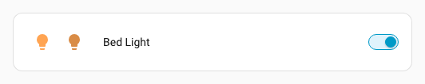
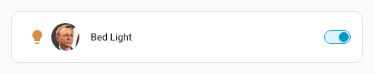

# :shield: Spark de badge d'état

Le spark `state-badge` insère un élément Home Assistant [`state-badge`](https://github.com/home-assistant/frontend/blob/dev/src/components/entity/state-badge.ts) dans le DOM, immédiatement **avant** ou **après** un élément cible de l'élément créé avec UIX Forge.

Le badge peut afficher :

- l'icône d'état, l'image ou le flux de caméra d'une entité (avec `entity`)
- une icône de remplacement fixe (avec `override_icon`)
- l'URL fixe d'une image de remplacement (avec `override_image`)

## Utilisation de base

Ajoutez une entrée `state-badge` à `forge.sparks`. Utilisez `after` ou `before` pour désigner l'élément cible, puis `entity`, `override_icon` ou `override_image` pour définir le contenu du badge.

La valeur de `after` ou `before` est un sélecteur qui repère l'élément cible dans l'élément créé. Elle accepte la même [syntaxe de navigation dans le DOM](../../concepts/dom.md) que les styles UIX, y compris `$` pour traverser les limites d'une racine Shadow DOM.

Comme `state-badge` se trouve le plus souvent dans une ligne d'entité, le cas d'usage habituel utilise `mold: row`. L'élément de ligne possède sa propre racine Shadow DOM : utilisez `$` pour y accéder et cibler le `state-badge` qu'elle contient.

!!! tip
    Si vous insérez un badge d'état **avant** un autre badge d'état, précisez le sélecteur afin qu'il ne cible pas l'icône ajoutée lors des mises à jour. Les badges créés par ce spark possèdent l'attribut `data-uix-forge-state-badge-id`, que vous pouvez exclure avec le sélecteur, par exemple `hui-tile-card $ ha-tile-icon:not([data-uix-forge-state-badge-id])`.

```yaml
type: entities
entities:
  - type: custom:uix-forge
    forge:
      mold: row
      sparks:
        - type: state-badge
          before: $ hui-generic-entity-row $ state-badge:not([data-uix-forge-state-badge-id])
          entity: light.ceiling_lights
    element:
      entity: light.bed_light
```



## Configuration

| Clé | Type | Obligatoire | Valeur par défaut | Description |
| --- | ---- | -------- | ------- | ----------- |
| `type` | `string` | ✅ | — | Doit être défini sur `state-badge`. |
| `after` | `string` | l'un de `after`/`before` ✅ | — | Sélecteur UIX de l'élément de référence. Le badge est inséré comme élément frère **après** l'élément correspondant. Avec la [configuration de carte vide](../forge.md#blank-card-config), la valeur par défaut est `uix-forge-blank-card $ div.content`. Sinon, elle est `""`. Pour cibler un élément avec `before` dans cette configuration, définissez explicitement `after: ""`. |
| `before` | `string` | l'un de `after`/`before` ✅ | — | Sélecteur UIX de l'élément de référence. Le badge est inséré comme élément frère **avant** l'élément correspondant. |
| `entity` | `string` | ✅ | — | ID de l'entité dont l'objet d'état actuel est transmis à `state-badge`. Le badge affiche ainsi son icône d'état native, son image ou son flux de caméra. |
| `override_icon` | `string` | | — | Icône MDI, par exemple `mdi:star`, qui remplace l'icône par défaut de l'entité. Peut être utilisée avec `entity`. |
| `override_image` | `string` | | — | URL d'une image qui remplace entièrement l'icône. Peut être utilisée avec `entity`. |
| `color` | string | | — | Couleur de l'icône lorsque le badge représente une entité active. Par défaut, elle dépend de `state`, `domain` et `device_class`. Définissez `none` pour désactiver la coloration. Valeurs acceptées : `state`, `none`, un [jeton de couleur Home Assistant](https://www.home-assistant.io/dashboards/tile/#available-colors) ou un code couleur hexadécimal. |

!!! note
    - Définissez exactement l'une des options `after` ou `before`.
    - Le spark cible le **premier** élément correspondant à `after` ou `before`.
    - L'élément `state-badge` inséré est placé dans le même parent que la cible : c'est un élément frère, pas un enfant.
    - Pour insérer un badge d'état **avant** un autre badge, précisez le sélecteur afin de ne pas sélectionner à nouveau le badge inséré lors des mises à jour. Les badges ajoutés par ce spark possèdent l'attribut `data-uix-forge-state-badge-id`, que vous pouvez exclure, par exemple avec `state-badge:not([data-uix-forge-state-badge-id])`.
  
!!! tip
    Le helper DOM [`uix_forge_path()`](../../concepts/dom.md#uix_forge_path0-forge-helper) vous aide à déterminer le chemin à utiliser pour `before` ou `after`.

## Exemples

??? example "Insérer le badge d'état d'une entité après le badge existant"
    ```yaml
    type: entities
    entities:
      - type: custom:uix-forge
        forge:
          mold: row
          sparks:
            - type: state-badge
              after: $ hui-generic-entity-row $ state-badge
              entity: light.ceiling_lights
        element:
          entity: light.bed_light
    ```

    

??? example "Insérer un badge d'état avec une couleur fixe"
    ```yaml
    type: entities
    entities:
      - type: custom:uix-forge
        forge:
          mold: row
          sparks:
            - type: state-badge
              before: $ hui-generic-entity-row $ state-badge:not([data-uix-forge-state-badge-id])
              entity: light.ceiling_lights
              color: teal
        element:
          entity: light.bed_light
    ```

    

??? example "Insérer un badge avec une icône de remplacement et sans coloration d'état"
    ```yaml
    type: entities
    entities:
      - type: custom:uix-forge
        forge:
          mold: row
          sparks:
            - type: state-badge
              after: $ hui-generic-entity-row $ state-badge
              entity: light.ceiling_lights
              override_icon: mdi:star
              color: none
        element:
          entity: light.bed_light
    ```

    

??? example "Insérer un badge avec une image de remplacement"
    ```yaml
    type: entities
    entities:
      - type: custom:uix-forge
        forge:
          mold: row
          sparks:
            - type: state-badge
              after: $ hui-generic-entity-row $ state-badge
              override_image: /local/my-icon.png
        element:
          entity: light.bed_light
    ```

    

??? example "Ajouter une infobulle au badge d'état inséré"
    Le spark `tooltip` réessaie d'ajouter l'infobulle et trouve ainsi le badge d'état lors d'une nouvelle tentative.
    ```yaml
    type: entities
    entities:
      - type: custom:uix-forge
        forge:
          mold: row
          sparks:
            - type: tooltip
              for: >-
                $ hui-generic-entity-row $
                state-badge[data-uix-forge-state-badge-id]
              content: Ceiling lights badge
            - type: state-badge
              after: $ hui-generic-entity-row $ state-badge
              entity: light.ceiling_lights
              override_icon: mdi:star
              color: none
        element:
          entity: light.bed_light
    ```

    
