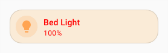

# :material-palette: Spark de thème

Le spark `theme` applique un thème frontend à un élément cible.

Utilisez-le pour appliquer à un élément créé avec UIX Forge un thème existant, sans ajouter de configuration de style UIX.

## Configuration

| Clé | Type | Obligatoire | Valeur par défaut | Description |
|-----|------|-------------|-------------------|-------------|
| `type` | string | ✅ | — | Doit être défini sur `theme`. |
| `for` | string | | `element` | Chemin de sélection UIX de l'élément auquel appliquer le thème. Lorsque l'élément UIX Forge utilise la [configuration de carte vide](../forge.md#blank-card-config), la valeur par défaut est `uix-forge-blank-card $ div.content`. Sinon, `element` désigne la racine de l'élément créé avec UIX Forge. |
| `theme` | string | | — | Nom du thème à appliquer. Les modèles sont pris en charge. |

!!! tip
    La configuration `theme` accepte les modèles. Pour rétablir le thème principal, faites renvoyer une chaîne vide (`""`) par le modèle. Le thème principal sera alors appliqué à `for`. Les thèmes sont appliqués en définissant des propriétés de style en ligne sur l'élément. Le thème de remplacement doit donc reprendre les mêmes propriétés que le thème principal, ou n'en définir qu'un sous-ensemble. Lorsque des sparks de thème sont appliqués à plusieurs éléments UIX Forge imbriqués, veillez à ce que chaque remplacement soit un sous-ensemble du précédent afin d'éviter des résultats inattendus.

## Exemple simple

Thème :

```yaml
my-theme:
  primary-text-color: red
  ha-card-border-radius: 20px
  ha-card-background: antiquewhite
```

Configuration UIX Forge :

```yaml
type: custom:uix-forge
forge:
  mold: card
  sparks:
    - type: theme
      for: element
      theme: my-theme
element:
  type: tile
  entity: light.bed_light
```


## Exemple avec un modèle

Thèmes :

```yaml
my-blue-theme:
  primary-text-color: blue
  ha-card-border-radius: 20px
  ha-card-background: lightpink
  
my-red-theme:
  primary-text-color: red
  ha-card-border-radius: 20px
  ha-card-background: antiquewhite
```

Configuration UIX Forge :

```yaml
type: "custom:uix-forge"
forge:
  mold: card
  sparks:
    - type: theme
      for: element
      theme: "{{ 'uix-doc-spark-theme-template-red' if is_state(config.element.entity, 'on') else 'uix-doc-spark-theme-template-blue' }}"
element:
  type: tile
  entity: light.bed_light
```



!!! tip
    Le helper DOM [`uix_forge_path()`](../../concepts/dom.md#uix_forge_path0-forge-helper) vous aide à déterminer le chemin à utiliser pour `for`.
