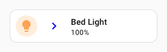
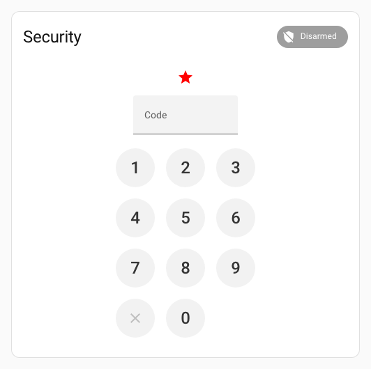

# :star: Spark d'icône de tuile

Le spark `tile-icon` insère un élément `ha-tile-icon` dans le DOM, immédiatement **avant** ou **après** un élément cible créé avec UIX Forge.

L'icône peut provenir :

- d'une icône MDI fixe (`icon`)
- d'un chemin SVG (`icon_path`)
- de l'URL d'une image (`image_url`)
- d'une entité dont l'icône d'état est affichée dans l'emplacement `icon` du tile icon au moyen de `ha-state-icon` (`entity`)

Vous pouvez aussi rendre l'icône de tuile interactive avec des [actions](#actions) au toucher, à l'appui prolongé ou au double toucher.

## Utilisation de base

Ajoutez une entrée `tile-icon` à `forge.sparks`. Utilisez `after` ou `before` pour désigner l'élément cible, puis `icon`, `icon_path`, `image_url` ou `entity` pour définir l'icône.

La valeur de `after` ou `before` est un sélecteur qui repère la cible dans l'élément créé. Elle accepte la même [syntaxe de navigation dans le DOM](../../concepts/dom.md) que les styles UIX, y compris `$` pour traverser les limites d'une racine Shadow DOM.

!!! tip
    Si vous insérez une icône de tuile **avant** une autre icône, précisez le sélecteur afin qu'il ne cible pas l'icône ajoutée lors des mises à jour. Les icônes créées par ce spark possèdent l'attribut `data-uix-forge-tile-icon-id`, que vous pouvez exclure avec le sélecteur, par exemple `hui-tile-card $ ha-tile-icon:not([data-uix-forge-tile-icon-id])`.

```yaml
type: custom:uix-forge
forge:
  mold: card
  sparks:
    - type: tile-icon
      before: hui-tile-card $ ha-tile-icon:not([data-uix-forge-tile-icon-id])
      icon: mdi:star
      color: red
element:
  type: tile
  entity: light.bed_light
```


## Configuration

| Clé | Type | Obligatoire | Valeur par défaut | Description |
| --- | ---- | -------- | ------- | ----------- |
| `type` | `string` | ✅ | — | Doit être défini sur `tile-icon`. |
| `after` | `string` | l'un de `after`/`before` ✅ | — | Sélecteur UIX de l'élément de référence. L'icône est insérée comme élément frère **après** l'élément correspondant. Avec la [configuration de carte vide](../forge.md#blank-card-config), la valeur par défaut est `uix-forge-blank-card $ div.content`. Sinon, elle est `""`. Pour cibler un élément avec `before` dans cette configuration, définissez explicitement `after: ""`. |
| `before` | `string` | l'un de `after`/`before` ✅ | — | Sélecteur UIX de l'élément de référence. L'icône est insérée comme élément frère **avant** l'élément correspondant. |
| `icon` | `string` | l'un de `icon`/`icon_path`/`image_url`/`entity` ✅ | — | Nom d'une icône MDI, par exemple `mdi:star`. Si `entity` est défini, `icon` peut remplacer l'icône par défaut de l'entité. |
| `icon_path` | `string` | l'un de `icon`/`icon_path`/`image_url`/`entity` ✅ | — | Chemin SVG transmis à `ha-tile-icon` comme propriété `iconPath` et rendu avec `ha-svg-icon`. |
| `image_url` | `string` | l'un de `icon`/`icon_path`/`image_url`/`entity` ✅ | — | URL de l'image à afficher dans l'icône de tuile. |
| `entity` | `string` | l'un de `icon`/`icon_path`/`image_url`/`entity` ✅ | — | ID de l'entité dont l'objet d'état actuel est transmis à un `ha-state-icon` placé dans l'emplacement `icon` du tile icon. L'icône d'état native de l'entité est ainsi affichée. |
| `color` | CSS color | | — | Couleur appliquée à l'icône de tuile. Elle remplace la couleur d'état de l'entité. |
| `tap_action` | action | | — | Action exécutée au toucher. |
| `hold_action` | action | | — | Action exécutée lors d'un appui prolongé. |
| `double_tap_action` | action | — | — | Action exécutée lors d'un double toucher. |

!!! note
    Définissez exactement l'une des options `after` ou `before`, ainsi qu'une seule source d'icône parmi `icon`, `icon_path`, `image_url` et `entity`.

!!! tip
    Le helper DOM [`uix_forge_path()`](../../concepts/dom.md#uix_forge_path0-forge-helper) vous aide à déterminer le chemin à utiliser pour `before` ou `after`.

## Actions

Lorsque vous définissez une ou plusieurs clés d'action (`tap_action`, `hold_action`, `double_tap_action`), l'icône de tuile devient automatiquement interactive.

```yaml
type: custom:uix-forge
forge:
  mold: card
  sparks:
    - type: tile-icon
      after: hui-tile-card $ ha-tile-icon
      entity: light.ceiling_lights
      tap_action:
        action: toggle
      hold_action:
        action: more-info
element:
  type: tile
  entity: light.bed_light
```


!!! note
    - Le spark cible le **premier** élément correspondant à `after` ou `before`.
    - L'élément `ha-tile-icon` inséré est placé dans le même parent que la cible : c'est un élément frère, pas un enfant.
    - Pour insérer une icône de tuile **avant** une autre icône, précisez le sélecteur afin de ne pas sélectionner à nouveau l'icône insérée lors des mises à jour. Les icônes créées par ce spark possèdent l'attribut `data-uix-forge-tile-icon-id`, que vous pouvez exclure, par exemple avec `hui-tile-card $ ha-tile-icon:not([data-uix-forge-tile-icon-id])`.

## Exemples

??? example "Insérer après un élément une icône fixe de couleur bleue"
    ```yaml
    type: custom:uix-forge
    forge:
      mold: card
      sparks:
        - type: tile-icon
          after: hui-tile-card $ ha-tile-icon
          icon: mdi:chevron-right
          color: blue
    element:
      type: tile
      entity: light.bed_light
    ```

    

??? example "Insérer l'icône d'état d'une entité avant un élément"
    ```yaml
    type: custom:uix-forge
    forge:
      mold: card
      sparks:
        - type: tile-icon
          before: hui-tile-card $ ha-tile-icon:not([data-uix-forge-tile-icon-id])
          entity: light.ceiling_lights
    element:
      type: tile
      entity: light.bed_light
    ```

    

??? example "Insérer une icône à partir d'un chemin SVG"
    Le chemin dessine un cercle plein.
    ```yaml
    type: custom:uix-forge
    forge:
      mold: card
      sparks:
        - type: tile-icon
          after: hui-tile-card $ ha-tile-icon
          icon_path: "M12 2C6.48 2 2 6.48 2 12s4.48 10 10 10 10-4.48 10-10S17.52 2 12 2z"
          color: red
    element:
      type: tile
      entity: light.bed_light
    ```

    

??? example "Insérer une image comme icône"
    ```yaml
    type: custom:uix-forge
    forge:
      mold: card
      sparks:
        - type: tile-icon
          after: hui-tile-card $ ha-tile-icon
          image_url: /local/media/daniel_craig_cropped.png
    element:
      type: tile
      entity: light.bed_light
    ```

    

??? example "Traverser une racine Shadow DOM pour atteindre un élément imbriqué"
    ```yaml
    type: custom:uix-forge
    forge:
      mold: card
      sparks:
        - type: tile-icon
          before: hui-alarm-panel-card $$ ha-input
          icon: mdi:star
          color: red
    element:
      type: alarm-panel
      states: []
      entity: alarm_control_panel.security
    ```

    
