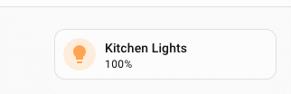
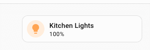
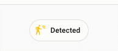

# :speech_balloon: Spark d'infobulle

Le spark `tooltip` ajoute une infobulle personnalisée à n'importe quel élément d'un élément créé avec [UIX Forge](../index.md). Il utilise le composant Home Assistant `wa-tooltip`, également employé dans l'interface frontend de Home Assistant. Il respecte ainsi son système de design, propose 12 positions et s'affiche au-dessus des autres couches de l'interface grâce à l'API Popover du navigateur.

## Utilisation de base

Ajoutez une entrée `tooltip` à `forge.sparks` :

```yaml
type: custom:uix-forge
forge:
  mold: card
  sparks:
    - type: tooltip
      for: hui-tile-card
      content: Turn on the lights
element:
  type: tile
  entity: light.kitchen_lights
```


La valeur de `for` est un sélecteur qui repère l'élément cible à l'intérieur de l'élément créé. Elle accepte la même [syntaxe de navigation dans le DOM](../../concepts/dom.md) que les styles UIX, y compris `$` pour traverser les limites d'une racine Shadow DOM.

```yaml
type: custom:uix-forge
forge:
  mold: card
  sparks:
    - type: tooltip
      for: hui-tile-card $ ha-tile-icon
      content: Toggle the living room light
element:
  type: tile
  entity: light.kitchen_lights
```



L'infobulle est ajoutée uniquement au **premier** élément correspondant à `for`.

## Configuration

| Clé | Type | Obligatoire | Valeur par défaut | Description |
| --- | ---- | -------- | ------- | ----------- |
| `type` | `string` | ✅ | — | Doit être défini sur `tooltip`. |
| `for` | string | | `element` | Sélecteur UIX de l'élément cible. Si l'élément UIX Forge utilise la [configuration de carte vide](../forge.md#blank-card-config), la valeur par défaut est `uix-forge-blank-card $ div.content`. Sinon, `element` désigne la racine de l'élément créé avec UIX Forge. |
| `content` | string | | `""` | Contenu HTML de l'infobulle. |
| `placement` | string | | `"top"` | Position de l'infobulle par rapport à la cible. Valeurs possibles : `top`, `top-start`, `top-end`, `bottom`, `bottom-start`, `bottom-end`, `left`, `left-start`, `left-end`, `right`, `right-start` et `right-end`. |
| `distance` | number | | `8` | Espace, en pixels, entre l'infobulle et l'élément cible. |
| `skidding` | number | | `0` | Décalage, en pixels, le long de l'axe de l'élément cible. |
| `show_delay` | number | | `150` | Délai en millisecondes avant l'affichage de l'infobulle. |
| `hide_delay` | number | | `150` | Délai en millisecondes avant le masquage de l'infobulle. |
| `without_arrow` | boolean | | `false` | Définissez cette option sur `true` pour masquer la flèche directionnelle. |

!!! tip
    Le helper DOM [`uix_forge_path()`](../../concepts/dom.md#uix_forge_path0-forge-helper) vous aide à déterminer le chemin à utiliser pour `for`.

## Modèles dans le contenu

La valeur de `content` fait partie de la configuration `forge` et est donc traitée comme un modèle. Vous pouvez accéder aux états des entités, à l'objet `config` et aux autres [variables de modèle UIX](../../using/templates.md) :

```yaml
type: custom:uix-forge
forge:
  mold: card
  sparks:
    - type: tooltip
      for: "hui-tile-card $ ha-tile-icon"
      content: >-
        {{ state_attr(config.element.entity, 'friendly_name') }} is
        {{ states(config.element.entity) }}
element:
  type: tile
  entity: light.kitchen_lights
```



## Infobulle sur un badge

Dans cet exemple, l'infobulle s'applique à `hui-badge`, l'élément créé par UIX Forge. Il n'est donc pas nécessaire de définir `for` : sa valeur par défaut, `element`, sélectionne `hui-badge`. En général, cette valeur par défaut suffit ; précisez un sélecteur uniquement si votre cas d'usage le demande.

```yaml
# Badge placé dans l'en-tête du tableau de bord
    badges:
      - type: custom:uix-forge
        forge:
          mold: badge
          sparks:
            - type: tooltip
              content: >-
                {{ state_attr(config.element.entity, 'friendly_name') }} is
                {{ states(config.element.entity) }}
        element:
          type: entity
          entity: binary_sensor.movement_backyard
```



## Personnaliser l'apparence de l'infobulle

Le spark `tooltip` ajoute des variables CSS à l'élément `wa-tooltip`. Pour les remplacer, définissez des variables `--uix-tooltip-*` dans `uix.style` de l'élément créé ou dans un thème.

!!! note
    L'infobulle étant ajoutée comme élément frère de la cible `for`, l'élément auquel vous appliquez le style doit être son parent. Dans l'exemple ci-dessous, les styles sont appliqués à `:host` et l'infobulle est ajoutée à `ha-card` dans la racine Shadow DOM de l'hôte.

```yaml
type: custom:uix-forge
forge:
  mold: card
  sparks:
    - type: tooltip
      for: hui-tile-card $ ha-card
      content: Custom styled tooltip
element:
  type: tile
  entity: light.kitchen_lights
  uix:
    style: |
      :host {
        --uix-tooltip-background-color: #333;
        --uix-tooltip-content-color: #fff;
        --uix-tooltip-border-radius: 999px;
      }
```


### CSS variables reference

| Variable CSS | Valeur par défaut | Description |
| ------------ | ------- | ----------- |
| `--uix-tooltip-background-color` | `--secondary-background-color` | Couleur d'arrière-plan de l'infobulle. |
| `--uix-tooltip-content-color` | `--primary-text-color` | Couleur du texte de l'infobulle. |
| `--uix-tooltip-font-family` | `--ha-font-family-body` | Famille de polices. |
| `--uix-tooltip-font-size` | `--ha-font-size-s` | Taille de police. |
| `--uix-tooltip-font-weight` | `--ha-font-weight-normal` | Graisse de police. |
| `--uix-tooltip-line-height` | `--ha-line-height-condensed` | Hauteur de ligne. |
| `--uix-tooltip-padding` | `8px` | Marge intérieure de l'infobulle. |
| `--uix-tooltip-border-radius` | `--ha-border-radius-sm` | Rayon des angles. |
| `--uix-tooltip-arrow-size` | `8px` | Taille de la flèche directionnelle. |
| `--uix-tooltip-border-width` | — | Épaisseur de la bordure (non définie par défaut). |
| `--uix-tooltip-border-color` | — | Couleur de la bordure (non définie par défaut). |
| `--uix-tooltip-border-style` | — | Style de la bordure (non défini par défaut). |
| `--uix-tooltip-max-width` | `30ch` | Largeur maximale de l'infobulle. |
| `--uix-tooltip-show-duration` | `100ms` | Durée de l'animation d'apparition. |
| `--uix-tooltip-hide-duration` | `100ms` | Durée de l'animation de disparition. |
| `--uix-tooltip-opacity` | `1` | Opacité de l'infobulle. |
| `--uix-tooltip-box-shadow` | `--ha-card-box-shadow` | Ombre portée. |
| `--uix-tooltip-text-align` | `center` | Alignement du texte. |
| `--uix-tooltip-text-decoration` | `none` | Décoration du texte. |
| `--uix-tooltip-text-transform` | `none` | Transformation du texte. |
| `--uix-tooltip-overflow-wrap` | `normal` | Comportement de retour à la ligne du texte. |
