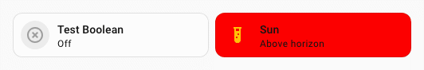

# Démarrage rapide

!!! note inline end "Utilisateurs de Card-mod"
    Si vous migrez depuis Card-mod, consultez la [FAQ](./faq.md), qui répond à la plupart des questions. Pour toute autre question, utilisez les [discussions GitHub](https://github.com/Lint-Free-Technology/uix/discussions).

## Installation

### HACS

[](https://my.home-assistant.io/redirect/hacs_repository/?owner=Lint-Free-Technology&repository=uix&category=integration)

Installez UI eXtension avec [HACS](https://hacs.xyz/). Cliquez sur le bouton ci-dessus pour effectuer l'installation en quelques étapes.

!!! hint "Télécharger dans HACS"
    Si vous utilisez HACS pour la première fois, n'oubliez pas de télécharger réellement l'intégration. Recherchez le bouton Télécharger ou utilisez le menu `...`.

### Installation manuelle

Utilisez votre méthode habituelle pour accéder aux fichiers de configuration Home Assistant. Ajoutez le dossier `uix` à `custom_components`, puis copiez dans ce dossier tous les fichiers de [custom_components/uix](https://github.com/Lint-Free-Technology/uix/tree/master/custom_components/uix).

## Ajouter l'intégration UI eXtension

[](https://my.home-assistant.io/redirect/integration/?domain=uix)

Une fois l'intégration téléchargée et disponible dans Home Assistant, ajoutez UI eXtension dans la section `Appareils et services` des `Paramètres`. Le bouton ci-dessus vous guide à travers les étapes nécessaires.

Une fois UI eXtension ajouté, actualisez la page pour rendre la ressource Frontend disponible.

!!! question "UIX est introuvable ?"
    Vérifiez que Home Assistant a été redémarré après une installation via HACS ou manuelle. Avec HACS, une notification de réparation permet de redémarrer Home Assistant.

## Votre premier style UIX

- Ouvrez votre carte dans l'éditeur graphique Home Assistant.
- Cliquez sur `Afficher l'éditeur de code` au bas de la boîte de dialogue.
- Ajoutez ce code à la fin de la configuration YAML :

```yaml
type: tile
entity: light.bed_light
uix:
  style: |
    ha-card {
      background: red;
    }
```

Le fond de la carte devrait devenir rouge pendant la saisie. Une petite icône de pinceau apparaît aussi près du bouton `Afficher l'éditeur visuel`. Elle indique que la carte contient du code UIX, qui n'est pas affiché dans l'éditeur visuel.


## Votre premier UIX Forge

Utilisez le YAML suivant, en l'adaptant à votre entité, pour créer une carte Tile masquée lorsque `input_boolean.test_boolean` est à `on`. Les autres options de `forge` et `element` utilisent ici des valeurs simples, mais montrent que toute la configuration de l'élément, ainsi que `hidden`, `grid_options` et les `sparks`, peuvent être construits avec des modèles.

```yaml
type: custom:uix-forge
forge:
  mold: card
  show_error: false
  hidden: "{{ is_state('input_boolean.test_boolean', 'on') }}"
  grid_options:
    columns: "{{ 6 }}"
    rows: 1
element:
  type: tile
  icon: "{{ 'mdi:test-tube' }}"
  entity: "{{ 'sun.sun' }}"
  uix:
    style: |
      ha-card {
        background: red;
      }
```


