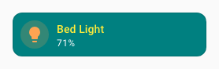

# Styliser les cartes

Les cartes se stylisent en ajoutant le bloc suivant à leur configuration :

```yaml
uix:
  style: <styles>
```

Dans sa forme la plus simple, `<styles>` est une chaîne de [CSS](https://www.w3schools.com/css/) injectée dans l'élément adapté au type de carte. Consultez [Concepts - application](../concepts/application.md) pour savoir précisément où UI eXtension est appliqué.

!!! note
    UI eXtension fonctionne uniquement avec les cartes contenues dans un élément `<hui-card>` ou qui contiennent un élément `<ha-card>`. Cela couvre presque toutes les cartes standard de l'interface Home Assistant et la plupart des cartes personnalisées.

Pour une carte contenue dans `<hui-card>`, ce qui est le cas de presque toutes les cartes standard Home Assistant, les styles sont injectés dans un shadowRoot et l'élément le plus bas est `:host`, même si le premier élément du shadowRoot est généralement `<ha-card>`. Pour de nombreuses cartes personnalisées qui n'utilisent pas le conteneur moderne `<hui-root>` mais contiennent un élément `<ha-card>`, les styles sont injectés dans ha-card et l'élément le plus bas est `<ha-card>`. Consultez [Concepts - application](../concepts/application.md) pour plus de détails.

!!! tip
    Les thèmes Home Assistant utilisent des [variables CSS](https://www.w3schools.com/css/css3_variables.asp). Vous pouvez les définir et les utiliser dans UIX ; elles commencent par deux tirets :
    ```yaml
    type: tile
    entity: light.bed_light
    vertical: false
    features_position: bottom
    uix:
      style: |
        ha-card {
          --ha-card-background: teal;
          --ha-tile-info-primary-color: var(--yellow-color);
          --ha-tile-info-secondary-color: var(--white-color);
        }
    ```
    

Vous pouvez aussi définir un thème Home Assistant local uniquement pour cet élément stylisé. Ce thème peut contenir des [thèmes UIX](./themes.md).

```yaml
uix:
  theme: my-awesome-theme
  style: |
    ha-card {
      color: var(--primary-color);
    }
```

`uix.theme` remplace le thème hérité ou courant pour ce nœud UIX et ses chemins enfants UIX, sauf si un enfant définit son propre `theme`. Consultez [Thèmes UIX - Remplacer avec `uix.theme`](./themes.md#local-theme-override-with-uixtheme) pour un exemple complet.

### Variables CSS personnalisées
Les thèmes UIX peuvent exploiter des [variables CSS personnalisées](https://uix-guides.lf.technology/elements/2026/03/02/css-vars-entities.html), en les déclarant haut dans la hiérarchie de l'interface, par exemple dans `uix-drawer`, `uix-view` ou `uix-root` :

```yaml
uix-drawer: |

    :host {
      
      --darkslateblue-if-dark: {{ 'darkslateblue' if isDark else 'red' }};
      --slategrey-if-dark: {{ 'slategrey' if isDark else 'green' }};
      --yellow-if-not-dark: {{ 'yellow' if not isDark else 'pink' }};
      --orange-if-not-dark: {{ 'orange' if not isDark else 'purple' }};
    }
```

Utilisez ensuite ces variables CSS personnalisées plus bas dans la hiérarchie de l'interface, par exemple dans `uix-card` ou `uix-dialog`, ou directement dans le style UIX d'une carte :

```yaml
type: entities
entities:
  - entity: sun.sun
    uix:
      style: |
        hui-generic-entity-row {
          background: var(--darkslateblue-if-dark);
          color: var(--slategrey-if-dark);
          --state-icon-color: var(--slategrey-if-dark);
        }
  - entity: sun.sun
    uix:
      style: |
        hui-generic-entity-row {
          background: var(--yellow-if-not-dark);
          color: var(--orange-if-not-dark);
          --state-icon-color: var(--orange-if-not-dark);
        }
  - entity: sun.sun
```


