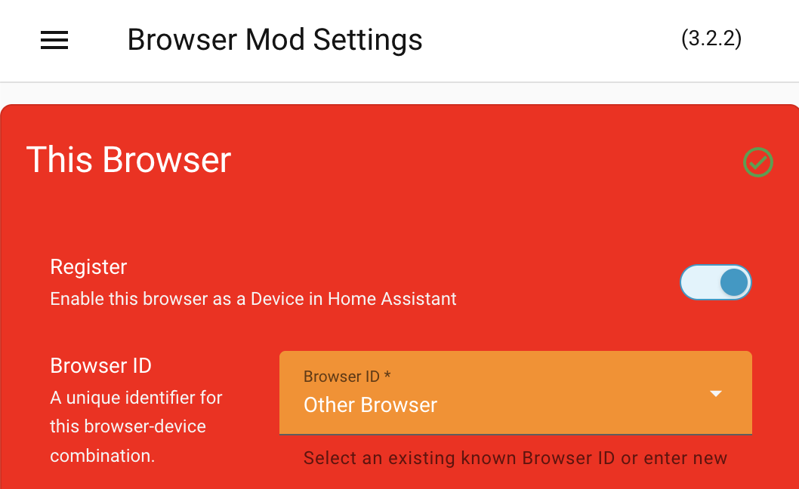

# Styling custom panels

UIX styles custom panels not loaded by iframe directly. UIX can also style custom panels loaded as iframe. Currently this is an experimental feature which you need to enable. See [Extras - Styling custom panels](../extras/style-custom-panels.md).

!!! info "Custom panel loaded by iframe - How it works"
    1. Custom panels loaded as iframe are styled by a patch in `ha-panel-custom` to create a patched Home Assistant Frontend `customPanelJS` file to be used by the custom panel iframe, running standard Home Assistant Frontend `customPanelJS` and then a condensed UIX javascript module.
    2. If UIX detects a theme is not applied, UIX Styling is applied with the currently loaded Home Assistant Frontend theme. Some custom panels like [HACS](https://hacs.xyz) apply the theme, and in this case UIX styling will inherit the applied theme.
    3. [Home Assistant custom panels](https://www.home-assistant.io/integrations/panel_custom/) are set by config that includes `name:`. UIX Styling uses this `name` to create the UIX theme variable for styling custom panels loaded by iframe.

## Examples

### Styling custom panels loaded directly

Use the direct custom theme variable `uix-panel-custom(-yaml)`.

Example styling Browser Mod panel specifically:

```yaml
UIX Test:

  uix-theme: UIX Test

  uix-panel-custom-yaml: |
    browser-mod-browser-panel $: |
      browser-mod-browser-settings-card {
        --card-background-color: red;
        --primary-text-color: white;
        --secondary-text-color: whitesmoke;
        --ha-color-form-background: darkorange;
      }
```

Example styling all directly loaded custom panels:

```yaml
UIX Test:

  uix-theme: UIX Test

  uix-panel-custom: |
    ha-panel-custom > * {
      --card-background-color: red;
      --primary-text-color: white;
      --secondary-text-color: whitesmoke;
      --ha-color-form-background: darkorange;
    }
```

The result for both of the above is the same when the Browser Mod browser panel is viewed.

??? example "Browser Mod browser panel styling"
    

!!! info
    Custom panels DOM structure may not use shadowRoots or Home Assistant elements so you will need to inspect the custom panel to understand what you can theme.

### Styling custom panels loaded by iframe

Use the theme variable `uix-<name>(-yaml)` where `name` is the [custom panel](https://www.home-assistant.io/integrations/panel_custom/) name. If you are not sure of the custom panel name, use a desktop Browser's inspector tools to see what the first element is in the DOM of the iframe. The element's tag is the custom panel name.

Example styling of [HACS](https://hacs.xyz) custom panel loaded by iframe:

For HACS, the custom panel name is `hacs-frontend` so the UIX Styling theme variable is `uix-hacs-frontend(-yaml)`. The theme below styles the toolbar of the HACS custom panel to a rainbow effect, and sets some card styling variables.

```yaml
UIX Test:

  uix-theme: UIX Test

  uix-hacs-frontend-yaml: |
    hacs-dashboard $ hass-tabs-subpage-data-table $ hass-tabs-subpage $: |
      .toolbar {
        background: linear-gradient(90deg, red, orange, yellow, green, blue, indigo, violet);
      }
    hacs-repository-dashboard $:
      .: |
        ha-card {
          background-color: orange;
        }
      hass-subpage $: |
        .toolbar {
          background: linear-gradient(90deg, red, orange, yellow, green, blue, indigo, violet);
        }
      hass-loading-screen $: |
        .toolbar {
          background: linear-gradient(90deg, red, orange, yellow, green, blue, indigo, violet);
        }
```

??? example "HACS panel styling"
    

!!! warning "Theme updates"
    Theme updates to the currently selected theme for user will be applied while viewing the custom panel. However, if you change the theme for the user viewing the custom panel you will need to refresh the panel to have the new theme applied.
